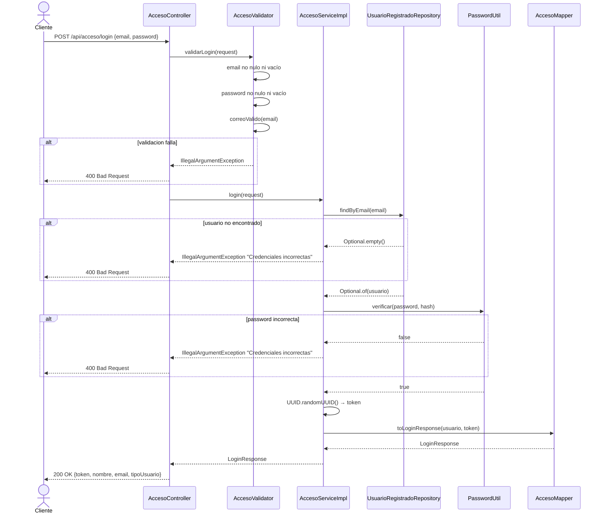

# Diagrama de Secuencia — Login

```mermaid
sequenceDiagram
    actor Cliente
    participant AccesoController
    participant AccesoValidator
    participant AccesoServiceImpl
    participant UsuarioRegistradoRepository
    participant PasswordUtil
    participant AccesoMapper

    Cliente->>AccesoController: POST /api/acceso/login {email, password}
    AccesoController->>AccesoValidator: validarLogin(request)
    AccesoValidator->>AccesoValidator: email no nulo ni vacío
    AccesoValidator->>AccesoValidator: password no nulo ni vacío
    AccesoValidator->>AccesoValidator: correoValido(email)
    alt validacion falla
        AccesoValidator-->>AccesoController: IllegalArgumentException
        AccesoController-->>Cliente: 400 Bad Request
    end
    AccesoController->>AccesoServiceImpl: login(request)
    AccesoServiceImpl->>UsuarioRegistradoRepository: findByEmail(email)
    alt usuario no encontrado
        UsuarioRegistradoRepository-->>AccesoServiceImpl: Optional.empty()
        AccesoServiceImpl-->>AccesoController: IllegalArgumentException "Credenciales incorrectas"
        AccesoController-->>Cliente: 400 Bad Request
    end
    UsuarioRegistradoRepository-->>AccesoServiceImpl: Optional.of(usuario)
    AccesoServiceImpl->>PasswordUtil: verificar(password, hash)
    alt password incorrecta
        PasswordUtil-->>AccesoServiceImpl: false
        AccesoServiceImpl-->>AccesoController: IllegalArgumentException "Credenciales incorrectas"
        AccesoController-->>Cliente: 400 Bad Request
    end
    PasswordUtil-->>AccesoServiceImpl: true
    AccesoServiceImpl->>AccesoServiceImpl: UUID.randomUUID() → token
    AccesoServiceImpl->>AccesoMapper: toLoginResponse(usuario, token)
    AccesoMapper-->>AccesoServiceImpl: LoginResponse
    AccesoServiceImpl-->>AccesoController: LoginResponse
    AccesoController-->>Cliente: 200 OK {token, nombre, email, tipoUsuario}
```
