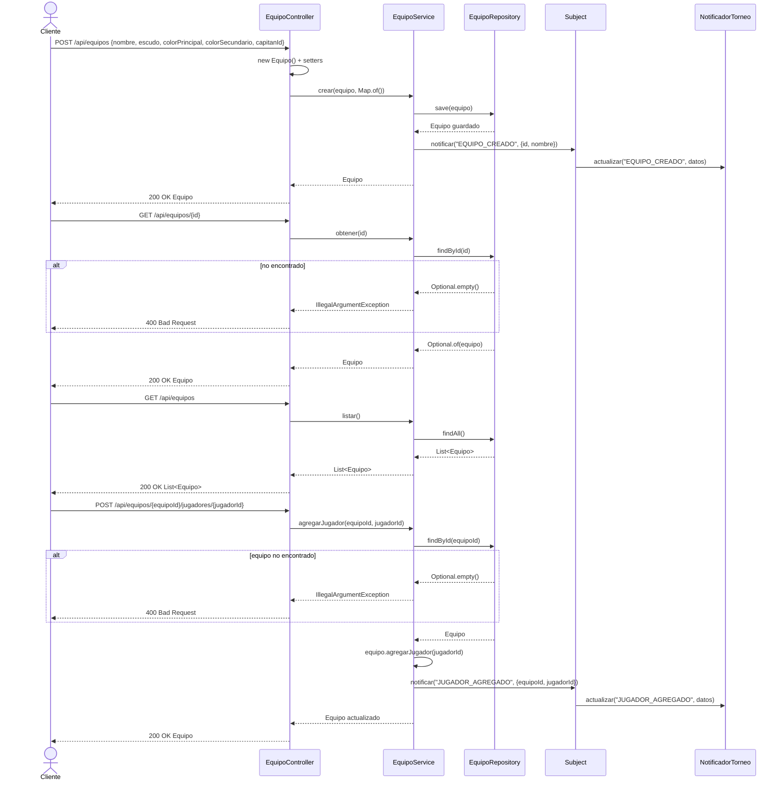

# Diagrama de Secuencia — Equipos

```mermaid
sequenceDiagram
    actor Cliente
    participant EquipoController
    participant EquipoService
    participant EquipoRepository
    participant Subject
    participant NotificadorTorneo

    %% Crear equipo
    Cliente->>EquipoController: POST /api/equipos {nombre, escudo, colorPrincipal, colorSecundario, capitanId}
    EquipoController->>EquipoController: new Equipo() + setters
    EquipoController->>EquipoService: crear(equipo, Map.of())
    EquipoService->>EquipoRepository: save(equipo)
    EquipoRepository-->>EquipoService: Equipo guardado
    EquipoService->>Subject: notificar("EQUIPO_CREADO", {id, nombre})
    Subject->>NotificadorTorneo: actualizar("EQUIPO_CREADO", datos)
    EquipoService-->>EquipoController: Equipo
    EquipoController-->>Cliente: 200 OK Equipo

    %% Obtener equipo
    Cliente->>EquipoController: GET /api/equipos/{id}
    EquipoController->>EquipoService: obtener(id)
    EquipoService->>EquipoRepository: findById(id)
    alt no encontrado
        EquipoRepository-->>EquipoService: Optional.empty()
        EquipoService-->>EquipoController: IllegalArgumentException
        EquipoController-->>Cliente: 400 Bad Request
    end
    EquipoRepository-->>EquipoService: Optional.of(equipo)
    EquipoService-->>EquipoController: Equipo
    EquipoController-->>Cliente: 200 OK Equipo

    %% Listar equipos
    Cliente->>EquipoController: GET /api/equipos
    EquipoController->>EquipoService: listar()
    EquipoService->>EquipoRepository: findAll()
    EquipoRepository-->>EquipoService: List<Equipo>
    EquipoService-->>EquipoController: List<Equipo>
    EquipoController-->>Cliente: 200 OK List<Equipo>

    %% Agregar jugador a equipo
    Cliente->>EquipoController: POST /api/equipos/{equipoId}/jugadores/{jugadorId}
    EquipoController->>EquipoService: agregarJugador(equipoId, jugadorId)
    EquipoService->>EquipoRepository: findById(equipoId)
    alt equipo no encontrado
        EquipoRepository-->>EquipoService: Optional.empty()
        EquipoService-->>EquipoController: IllegalArgumentException
        EquipoController-->>Cliente: 400 Bad Request
    end
    EquipoRepository-->>EquipoService: Equipo
    EquipoService->>EquipoService: equipo.agregarJugador(jugadorId)
    EquipoService->>Subject: notificar("JUGADOR_AGREGADO", {equipoId, jugadorId})
    Subject->>NotificadorTorneo: actualizar("JUGADOR_AGREGADO", datos)
    EquipoService-->>EquipoController: Equipo actualizado
    EquipoController-->>Cliente: 200 OK Equipo
```
