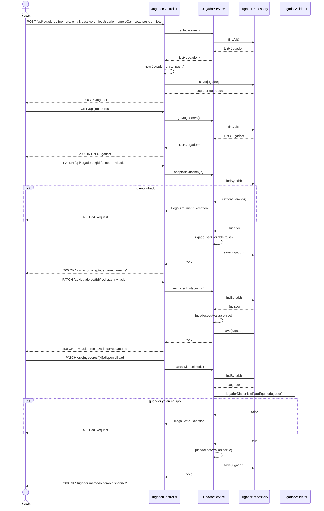

# Diagrama de Secuencia — Jugadores

```mermaid
sequenceDiagram
    actor Cliente
    participant JugadorController
    participant JugadorService
    participant JugadorRepository
    participant JugadorValidator

    %% Crear jugador
    Cliente->>JugadorController: POST /api/jugadores {nombre, email, password, tipoUsuario, numeroCamiseta, posicion, foto}
    JugadorController->>JugadorService: getJugadores()
    JugadorService->>JugadorRepository: findAll()
    JugadorRepository-->>JugadorService: List<Jugador>
    JugadorService-->>JugadorController: List<Jugador>
    JugadorController->>JugadorController: new Jugador(id, campos...)
    JugadorController->>JugadorRepository: save(jugador)
    JugadorRepository-->>JugadorController: Jugador guardado
    JugadorController-->>Cliente: 200 OK Jugador

    %% Listar jugadores
    Cliente->>JugadorController: GET /api/jugadores
    JugadorController->>JugadorService: getJugadores()
    JugadorService->>JugadorRepository: findAll()
    JugadorRepository-->>JugadorService: List<Jugador>
    JugadorService-->>JugadorController: List<Jugador>
    JugadorController-->>Cliente: 200 OK List<Jugador>

    %% Aceptar invitacion
    Cliente->>JugadorController: PATCH /api/jugadores/{id}/aceptarInvitacion
    JugadorController->>JugadorService: aceptarInvitacion(id)
    JugadorService->>JugadorRepository: findById(id)
    alt no encontrado
        JugadorRepository-->>JugadorService: Optional.empty()
        JugadorService-->>JugadorController: IllegalArgumentException
        JugadorController-->>Cliente: 400 Bad Request
    end
    JugadorRepository-->>JugadorService: Jugador
    JugadorService->>JugadorService: jugador.setAvailable(false)
    JugadorService->>JugadorRepository: save(jugador)
    JugadorService-->>JugadorController: void
    JugadorController-->>Cliente: 200 OK "Invitacion aceptada correctamente"

    %% Rechazar invitacion
    Cliente->>JugadorController: PATCH /api/jugadores/{id}/rechazarInvitacion
    JugadorController->>JugadorService: rechazarInvitacion(id)
    JugadorService->>JugadorRepository: findById(id)
    JugadorRepository-->>JugadorService: Jugador
    JugadorService->>JugadorService: jugador.setAvailable(true)
    JugadorService->>JugadorRepository: save(jugador)
    JugadorService-->>JugadorController: void
    JugadorController-->>Cliente: 200 OK "Invitacion rechazada correctamente"

    %% Marcar disponible
    Cliente->>JugadorController: PATCH /api/jugadores/{id}/disponibilidad
    JugadorController->>JugadorService: marcarDisponible(id)
    JugadorService->>JugadorRepository: findById(id)
    JugadorRepository-->>JugadorService: Jugador
    JugadorService->>JugadorValidator: jugadorDisponibleParaEquipo(jugador)
    alt jugador ya en equipo
        JugadorValidator-->>JugadorService: false
        JugadorService-->>JugadorController: IllegalStateException
        JugadorController-->>Cliente: 400 Bad Request
    end
    JugadorValidator-->>JugadorService: true
    JugadorService->>JugadorService: jugador.setAvailable(true)
    JugadorService->>JugadorRepository: save(jugador)
    JugadorService-->>JugadorController: void
    JugadorController-->>Cliente: 200 OK "Jugador marcado como disponible"
```
