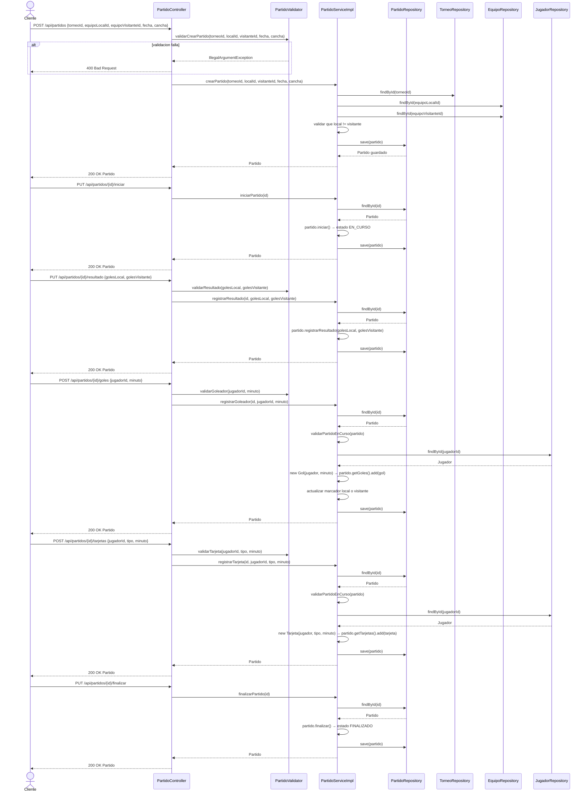

# Diagrama de Secuencia — Partidos

```mermaid
sequenceDiagram
    actor Cliente
    participant PartidoController
    participant PartidoValidator
    participant PartidoServiceImpl
    participant PartidoRepository
    participant TorneoRepository
    participant EquipoRepository
    participant JugadorRepository

    %% Crear partido
    Cliente->>PartidoController: POST /api/partidos {torneoId, equipoLocalId, equipoVisitanteId, fecha, cancha}
    PartidoController->>PartidoValidator: validarCrearPartido(torneoId, localId, visitanteId, fecha, cancha)
    alt validacion falla
        PartidoValidator-->>PartidoController: IllegalArgumentException
        PartidoController-->>Cliente: 400 Bad Request
    end
    PartidoController->>PartidoServiceImpl: crearPartido(torneoId, localId, visitanteId, fecha, cancha)
    PartidoServiceImpl->>TorneoRepository: findById(torneoId)
    PartidoServiceImpl->>EquipoRepository: findById(equipoLocalId)
    PartidoServiceImpl->>EquipoRepository: findById(equipoVisitanteId)
    PartidoServiceImpl->>PartidoServiceImpl: validar que local != visitante
    PartidoServiceImpl->>PartidoRepository: save(partido)
    PartidoRepository-->>PartidoServiceImpl: Partido guardado
    PartidoServiceImpl-->>PartidoController: Partido
    PartidoController-->>Cliente: 200 OK Partido

    %% Iniciar partido
    Cliente->>PartidoController: PUT /api/partidos/{id}/iniciar
    PartidoController->>PartidoServiceImpl: iniciarPartido(id)
    PartidoServiceImpl->>PartidoRepository: findById(id)
    PartidoRepository-->>PartidoServiceImpl: Partido
    PartidoServiceImpl->>PartidoServiceImpl: partido.iniciar() → estado EN_CURSO
    PartidoServiceImpl->>PartidoRepository: save(partido)
    PartidoServiceImpl-->>PartidoController: Partido
    PartidoController-->>Cliente: 200 OK Partido

    %% Registrar resultado
    Cliente->>PartidoController: PUT /api/partidos/{id}/resultado {golesLocal, golesVisitante}
    PartidoController->>PartidoValidator: validarResultado(golesLocal, golesVisitante)
    PartidoController->>PartidoServiceImpl: registrarResultado(id, golesLocal, golesVisitante)
    PartidoServiceImpl->>PartidoRepository: findById(id)
    PartidoRepository-->>PartidoServiceImpl: Partido
    PartidoServiceImpl->>PartidoServiceImpl: partido.registrarResultado(golesLocal, golesVisitante)
    PartidoServiceImpl->>PartidoRepository: save(partido)
    PartidoServiceImpl-->>PartidoController: Partido
    PartidoController-->>Cliente: 200 OK Partido

    %% Registrar goleador
    Cliente->>PartidoController: POST /api/partidos/{id}/goles {jugadorId, minuto}
    PartidoController->>PartidoValidator: validarGoleador(jugadorId, minuto)
    PartidoController->>PartidoServiceImpl: registrarGoleador(id, jugadorId, minuto)
    PartidoServiceImpl->>PartidoRepository: findById(id)
    PartidoRepository-->>PartidoServiceImpl: Partido
    PartidoServiceImpl->>PartidoServiceImpl: validarPartidoEnCurso(partido)
    PartidoServiceImpl->>JugadorRepository: findById(jugadorId)
    JugadorRepository-->>PartidoServiceImpl: Jugador
    PartidoServiceImpl->>PartidoServiceImpl: new Gol(jugador, minuto) → partido.getGoles().add(gol)
    PartidoServiceImpl->>PartidoServiceImpl: actualizar marcador local o visitante
    PartidoServiceImpl->>PartidoRepository: save(partido)
    PartidoServiceImpl-->>PartidoController: Partido
    PartidoController-->>Cliente: 200 OK Partido

    %% Registrar tarjeta
    Cliente->>PartidoController: POST /api/partidos/{id}/tarjetas {jugadorId, tipo, minuto}
    PartidoController->>PartidoValidator: validarTarjeta(jugadorId, tipo, minuto)
    PartidoController->>PartidoServiceImpl: registrarTarjeta(id, jugadorId, tipo, minuto)
    PartidoServiceImpl->>PartidoRepository: findById(id)
    PartidoRepository-->>PartidoServiceImpl: Partido
    PartidoServiceImpl->>PartidoServiceImpl: validarPartidoEnCurso(partido)
    PartidoServiceImpl->>JugadorRepository: findById(jugadorId)
    JugadorRepository-->>PartidoServiceImpl: Jugador
    PartidoServiceImpl->>PartidoServiceImpl: new Tarjeta(jugador, tipo, minuto) → partido.getTarjetas().add(tarjeta)
    PartidoServiceImpl->>PartidoRepository: save(partido)
    PartidoServiceImpl-->>PartidoController: Partido
    PartidoController-->>Cliente: 200 OK Partido

    %% Finalizar partido
    Cliente->>PartidoController: PUT /api/partidos/{id}/finalizar
    PartidoController->>PartidoServiceImpl: finalizarPartido(id)
    PartidoServiceImpl->>PartidoRepository: findById(id)
    PartidoRepository-->>PartidoServiceImpl: Partido
    PartidoServiceImpl->>PartidoServiceImpl: partido.finalizar() → estado FINALIZADO
    PartidoServiceImpl->>PartidoRepository: save(partido)
    PartidoServiceImpl-->>PartidoController: Partido
    PartidoController-->>Cliente: 200 OK Partido
```
