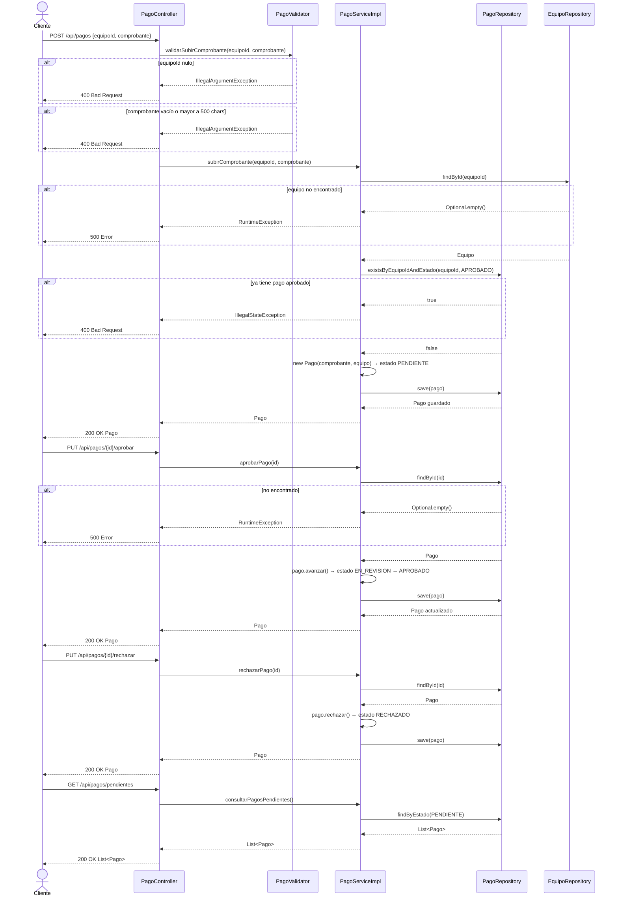

# Diagrama de Secuencia — Pagos

```mermaid
sequenceDiagram
    actor Cliente
    participant PagoController
    participant PagoValidator
    participant PagoServiceImpl
    participant PagoRepository
    participant EquipoRepository

    %% Subir comprobante
    Cliente->>PagoController: POST /api/pagos {equipoId, comprobante}
    PagoController->>PagoValidator: validarSubirComprobante(equipoId, comprobante)
    alt equipoId nulo
        PagoValidator-->>PagoController: IllegalArgumentException
        PagoController-->>Cliente: 400 Bad Request
    end
    alt comprobante vacío o mayor a 500 chars
        PagoValidator-->>PagoController: IllegalArgumentException
        PagoController-->>Cliente: 400 Bad Request
    end
    PagoController->>PagoServiceImpl: subirComprobante(equipoId, comprobante)
    PagoServiceImpl->>EquipoRepository: findById(equipoId)
    alt equipo no encontrado
        EquipoRepository-->>PagoServiceImpl: Optional.empty()
        PagoServiceImpl-->>PagoController: RuntimeException
        PagoController-->>Cliente: 500 Error
    end
    EquipoRepository-->>PagoServiceImpl: Equipo
    PagoServiceImpl->>PagoRepository: existsByEquipoIdAndEstado(equipoId, APROBADO)
    alt ya tiene pago aprobado
        PagoRepository-->>PagoServiceImpl: true
        PagoServiceImpl-->>PagoController: IllegalStateException
        PagoController-->>Cliente: 400 Bad Request
    end
    PagoRepository-->>PagoServiceImpl: false
    PagoServiceImpl->>PagoServiceImpl: new Pago(comprobante, equipo) → estado PENDIENTE
    PagoServiceImpl->>PagoRepository: save(pago)
    PagoRepository-->>PagoServiceImpl: Pago guardado
    PagoServiceImpl-->>PagoController: Pago
    PagoController-->>Cliente: 200 OK Pago

    %% Aprobar pago
    Cliente->>PagoController: PUT /api/pagos/{id}/aprobar
    PagoController->>PagoServiceImpl: aprobarPago(id)
    PagoServiceImpl->>PagoRepository: findById(id)
    alt no encontrado
        PagoRepository-->>PagoServiceImpl: Optional.empty()
        PagoServiceImpl-->>PagoController: RuntimeException
        PagoController-->>Cliente: 500 Error
    end
    PagoRepository-->>PagoServiceImpl: Pago
    PagoServiceImpl->>PagoServiceImpl: pago.avanzar() → estado EN_REVISION → APROBADO
    PagoServiceImpl->>PagoRepository: save(pago)
    PagoRepository-->>PagoServiceImpl: Pago actualizado
    PagoServiceImpl-->>PagoController: Pago
    PagoController-->>Cliente: 200 OK Pago

    %% Rechazar pago
    Cliente->>PagoController: PUT /api/pagos/{id}/rechazar
    PagoController->>PagoServiceImpl: rechazarPago(id)
    PagoServiceImpl->>PagoRepository: findById(id)
    PagoRepository-->>PagoServiceImpl: Pago
    PagoServiceImpl->>PagoServiceImpl: pago.rechazar() → estado RECHAZADO
    PagoServiceImpl->>PagoRepository: save(pago)
    PagoServiceImpl-->>PagoController: Pago
    PagoController-->>Cliente: 200 OK Pago

    %% Consultar pagos pendientes
    Cliente->>PagoController: GET /api/pagos/pendientes
    PagoController->>PagoServiceImpl: consultarPagosPendientes()
    PagoServiceImpl->>PagoRepository: findByEstado(PENDIENTE)
    PagoRepository-->>PagoServiceImpl: List<Pago>
    PagoServiceImpl-->>PagoController: List<Pago>
    PagoController-->>Cliente: 200 OK List<Pago>
```
