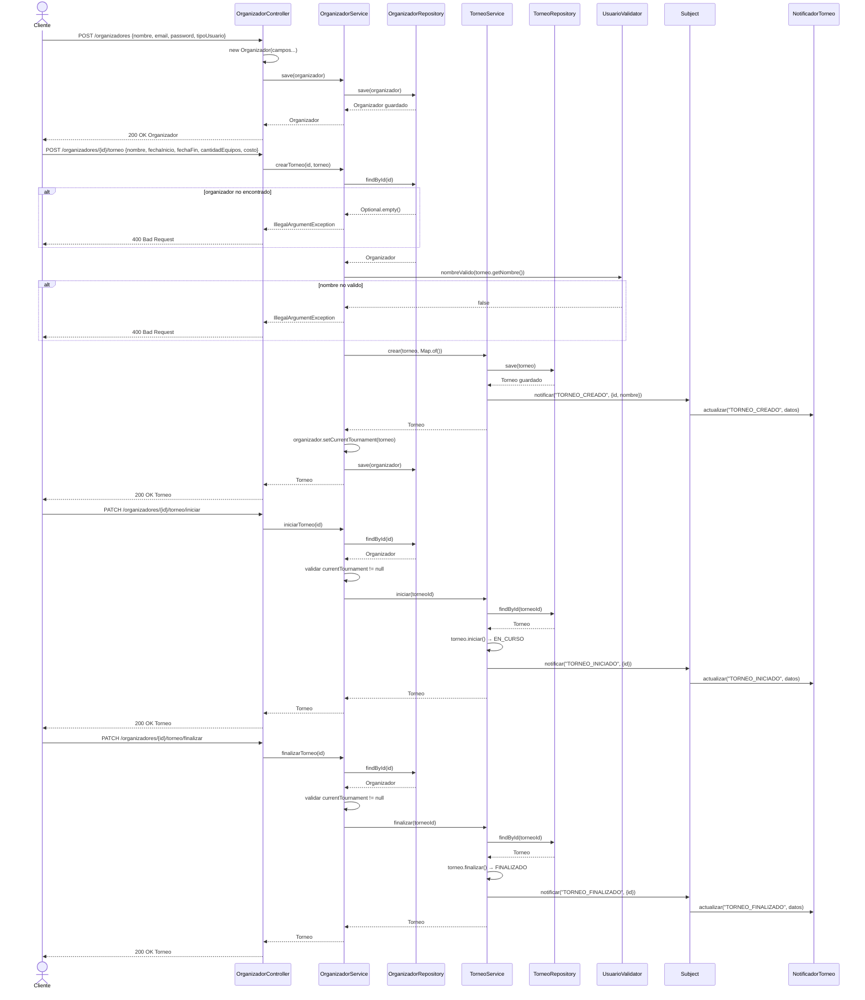

# Diagrama de Secuencia — Organizadores

```mermaid
sequenceDiagram
    actor Cliente
    participant OrganizadorController
    participant OrganizadorService
    participant OrganizadorRepository
    participant TorneoService
    participant TorneoRepository
    participant UsuarioValidator
    participant Subject
    participant NotificadorTorneo

    %% Crear organizador
    Cliente->>OrganizadorController: POST /organizadores {nombre, email, password, tipoUsuario}
    OrganizadorController->>OrganizadorController: new Organizador(campos...)
    OrganizadorController->>OrganizadorService: save(organizador)
    OrganizadorService->>OrganizadorRepository: save(organizador)
    OrganizadorRepository-->>OrganizadorService: Organizador guardado
    OrganizadorService-->>OrganizadorController: Organizador
    OrganizadorController-->>Cliente: 200 OK Organizador

    %% Crear torneo
    Cliente->>OrganizadorController: POST /organizadores/{id}/torneo {nombre, fechaInicio, fechaFin, cantidadEquipos, costo}
    OrganizadorController->>OrganizadorService: crearTorneo(id, torneo)
    OrganizadorService->>OrganizadorRepository: findById(id)
    alt organizador no encontrado
        OrganizadorRepository-->>OrganizadorService: Optional.empty()
        OrganizadorService-->>OrganizadorController: IllegalArgumentException
        OrganizadorController-->>Cliente: 400 Bad Request
    end
    OrganizadorRepository-->>OrganizadorService: Organizador
    OrganizadorService->>UsuarioValidator: nombreValido(torneo.getNombre())
    alt nombre no valido
        UsuarioValidator-->>OrganizadorService: false
        OrganizadorService-->>OrganizadorController: IllegalArgumentException
        OrganizadorController-->>Cliente: 400 Bad Request
    end
    OrganizadorService->>TorneoService: crear(torneo, Map.of())
    TorneoService->>TorneoRepository: save(torneo)
    TorneoRepository-->>TorneoService: Torneo guardado
    TorneoService->>Subject: notificar("TORNEO_CREADO", {id, nombre})
    Subject->>NotificadorTorneo: actualizar("TORNEO_CREADO", datos)
    TorneoService-->>OrganizadorService: Torneo
    OrganizadorService->>OrganizadorService: organizador.setCurrentTournament(torneo)
    OrganizadorService->>OrganizadorRepository: save(organizador)
    OrganizadorService-->>OrganizadorController: Torneo
    OrganizadorController-->>Cliente: 200 OK Torneo

    %% Iniciar torneo
    Cliente->>OrganizadorController: PATCH /organizadores/{id}/torneo/iniciar
    OrganizadorController->>OrganizadorService: iniciarTorneo(id)
    OrganizadorService->>OrganizadorRepository: findById(id)
    OrganizadorRepository-->>OrganizadorService: Organizador
    OrganizadorService->>OrganizadorService: validar currentTournament != null
    OrganizadorService->>TorneoService: iniciar(torneoId)
    TorneoService->>TorneoRepository: findById(torneoId)
    TorneoRepository-->>TorneoService: Torneo
    TorneoService->>TorneoService: torneo.iniciar() → EN_CURSO
    TorneoService->>Subject: notificar("TORNEO_INICIADO", {id})
    Subject->>NotificadorTorneo: actualizar("TORNEO_INICIADO", datos)
    TorneoService-->>OrganizadorService: Torneo
    OrganizadorService-->>OrganizadorController: Torneo
    OrganizadorController-->>Cliente: 200 OK Torneo

    %% Finalizar torneo
    Cliente->>OrganizadorController: PATCH /organizadores/{id}/torneo/finalizar
    OrganizadorController->>OrganizadorService: finalizarTorneo(id)
    OrganizadorService->>OrganizadorRepository: findById(id)
    OrganizadorRepository-->>OrganizadorService: Organizador
    OrganizadorService->>OrganizadorService: validar currentTournament != null
    OrganizadorService->>TorneoService: finalizar(torneoId)
    TorneoService->>TorneoRepository: findById(torneoId)
    TorneoRepository-->>TorneoService: Torneo
    TorneoService->>TorneoService: torneo.finalizar() → FINALIZADO
    TorneoService->>Subject: notificar("TORNEO_FINALIZADO", {id})
    Subject->>NotificadorTorneo: actualizar("TORNEO_FINALIZADO", datos)
    TorneoService-->>OrganizadorService: Torneo
    OrganizadorService-->>OrganizadorController: Torneo
    OrganizadorController-->>Cliente: 200 OK Torneo
```
