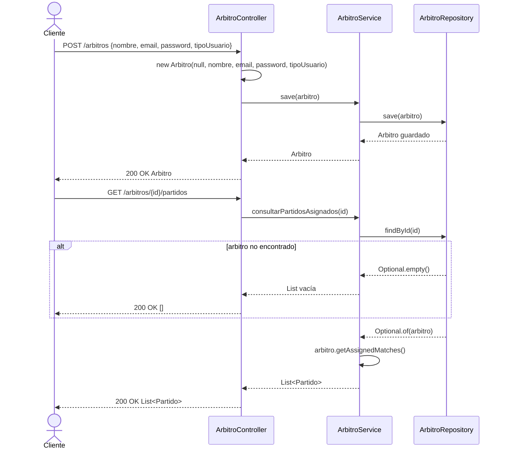

# Diagrama de Secuencia — Árbitros

```mermaid
sequenceDiagram
    actor Cliente
    participant ArbitroController
    participant ArbitroService
    participant ArbitroRepository

    %% Crear arbitro
    Cliente->>ArbitroController: POST /arbitros {nombre, email, password, tipoUsuario}
    ArbitroController->>ArbitroController: new Arbitro(null, nombre, email, password, tipoUsuario)
    ArbitroController->>ArbitroService: save(arbitro)
    ArbitroService->>ArbitroRepository: save(arbitro)
    ArbitroRepository-->>ArbitroService: Arbitro guardado
    ArbitroService-->>ArbitroController: Arbitro
    ArbitroController-->>Cliente: 200 OK Arbitro

    %% Consultar partidos asignados
    Cliente->>ArbitroController: GET /arbitros/{id}/partidos
    ArbitroController->>ArbitroService: consultarPartidosAsignados(id)
    ArbitroService->>ArbitroRepository: findById(id)
    alt arbitro no encontrado
        ArbitroRepository-->>ArbitroService: Optional.empty()
        ArbitroService-->>ArbitroController: List vacía
        ArbitroController-->>Cliente: 200 OK []
    end
    ArbitroRepository-->>ArbitroService: Optional.of(arbitro)
    ArbitroService->>ArbitroService: arbitro.getAssignedMatches()
    ArbitroService-->>ArbitroController: List<Partido>
    ArbitroController-->>Cliente: 200 OK List<Partido>
```
