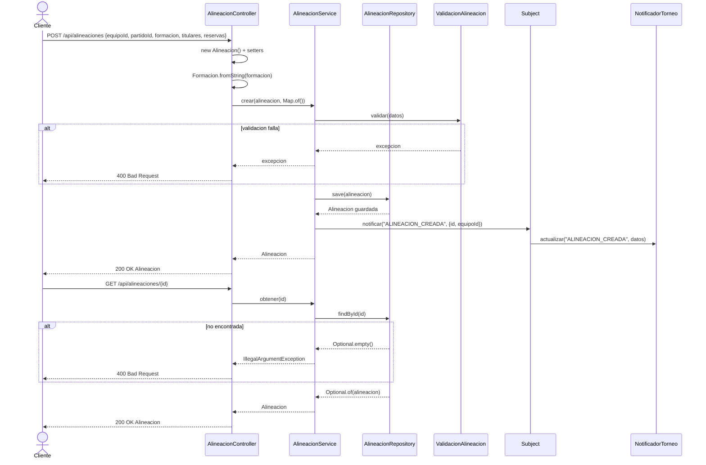

# Diagrama de Secuencia — Alineaciones

```mermaid
sequenceDiagram
    actor Cliente
    participant AlineacionController
    participant AlineacionService
    participant AlineacionRepository
    participant ValidacionAlineacion
    participant Subject
    participant NotificadorTorneo

    %% Crear alineacion
    Cliente->>AlineacionController: POST /api/alineaciones {equipoId, partidoId, formacion, titulares, reservas}
    AlineacionController->>AlineacionController: new Alineacion() + setters
    AlineacionController->>AlineacionController: Formacion.fromString(formacion)
    AlineacionController->>AlineacionService: crear(alineacion, Map.of())
    AlineacionService->>ValidacionAlineacion: validar(datos)
    alt validacion falla
        ValidacionAlineacion-->>AlineacionService: excepcion
        AlineacionService-->>AlineacionController: excepcion
        AlineacionController-->>Cliente: 400 Bad Request
    end
    AlineacionService->>AlineacionRepository: save(alineacion)
    AlineacionRepository-->>AlineacionService: Alineacion guardada
    AlineacionService->>Subject: notificar("ALINEACION_CREADA", {id, equipoId})
    Subject->>NotificadorTorneo: actualizar("ALINEACION_CREADA", datos)
    AlineacionService-->>AlineacionController: Alineacion
    AlineacionController-->>Cliente: 200 OK Alineacion

    %% Obtener alineacion
    Cliente->>AlineacionController: GET /api/alineaciones/{id}
    AlineacionController->>AlineacionService: obtener(id)
    AlineacionService->>AlineacionRepository: findById(id)
    alt no encontrada
        AlineacionRepository-->>AlineacionService: Optional.empty()
        AlineacionService-->>AlineacionController: IllegalArgumentException
        AlineacionController-->>Cliente: 400 Bad Request
    end
    AlineacionRepository-->>AlineacionService: Optional.of(alineacion)
    AlineacionService-->>AlineacionController: Alineacion
    AlineacionController-->>Cliente: 200 OK Alineacion
```
