Requirements · MD
Copiar

# Requerimientos — TechCup Fútbol

| Código | Nombre | Tipo        |
|--------|--------|-------------|
| RF_01  | Crear torneo | Funcional   |
| RF_02  | Gestionar torneo | Funcional   |
| RF_03  | Consultar torneo | Funcional   |
| RF_04  | Registro de jugadores | Funcional   |
| RF_05  | Perfil deportivo | Funcional   |
| RF_06  | Disponibilidad de jugador | Funcional   |
| RF_07  | Invitaciones a equipo | Funcional   |
| RF_08  | Crear equipo | Funcional   |
| RF_09  | Gestionar equipo | Funcional   |
| RF_10  | Validar equipo | Funcional   |
| RF_11  | Buscar jugadores | Funcional   |
| RF_12  | Subir comprobante de pago | Funcional   |
| RF_13  | Verificar pago | Funcional   |
| RF_14  | Configurar torneo | Funcional   |
| RF_15  | Gestionar alineación | Funcional   |
| RF_16  | Consultar alineación rival | Funcional   |
| RF_17  | Registrar partido | Funcional   |
| RF_18  | Consultar partido (árbitro) | Funcional   |
| RF_19  | Tabla de posiciones | Funcional   |
| RF_20  | Llaves eliminatorias | Funcional   |
| RF_21  | Estadísticas | Funcional   |
| RF_22  | Registrar organizadores y árbitros | Funcional   |
| RF_23  | Consulta Auditoría | Funcional |
| RNF_01 | Paleta de colores | No Funcional |
| RNF_02 | Diseño responsive | No Funcional |
| RNF_03 | Tiempo de respuesta | No Funcional |
| RNF_04 | Cifrado de contraseñas | No Funcional |
| RNF_05 | Límite de archivos | No Funcional |
| RNF_06 | Disponibilidad del sistema | No Funcional |
| RNF_07 | Compatibilidad de navegadores | No Funcional |
 
---

## RF_01 — Crear torneo

| | |
|---|---|
| **FUNCIONALIDAD:** | |
| **Código:** | RF_01 |
| **Nombre:** | Crear torneo |

| | |
|---|---|
| **Descripción:** | El organizador crea un nuevo torneo ingresando la información básica definida por el backend. |
| **Cómo se ejecutará:** | Mediante el envío de un objeto de torneo al servicio de creación asociado al organizador. |
| **Actor principal:** | Organizador |
| **Precondiciones:** | El usuario debe estar autenticado, tener rol de Organizador y existir en el sistema. |

**DATOS DE ENTRADA**

| Nombre | Descripción | Tipo de campo | Reglas / Aplicación | Obligatorio |
|--------|------------|---------------|---------------------|-------------|
| Nombre | Nombre del torneo | String        | No puede estar vacío | Sí |
| Fecha inicial | Fecha de inicio del torneo | LocalDateTime | Se envía en el cuerpo del torneo | Sí |
| Fecha final | Fecha de finalización del torneo | LocalDateTime | Se envía en el cuerpo del torneo | Sí |
| Cantidad de equipos | Número de equipos que participarán | Int           | Se envía en el cuerpo del torneo | Sí |
| Costo por equipo | Valor de inscripción por equipo | Double        | Se envía en el cuerpo del torneo | Sí |

**DATOS DE SALIDA**

| Nombre | Descripción | Tipo de campo | Reglas / Aplicación | Obligatorio |
|--------|------------|---------------|---------------------|-------------|
| Torneo creado | El sistema retorna el torneo creado con su identificador y estado inicial | Objeto Torneo | Estado inicial: CREADO | Sí |

**FLUJO BÁSICO:**

| Paso | Actor | Descripción | Excepciones |
|------|-------|-------------|-------------|
| 1 | Organizador | Invoca la operación de creación de torneo asociada a su identificador | |
| 2 | Organizador | Envía nombre, fechas, cantidad de equipos y costo en el cuerpo del torneo | |
| 3 | Sistema | Valida que el organizador exista y que el nombre del torneo sea válido | Organizador no encontrado o nombre no válido |
| 4 | Sistema | Crea el torneo, lo asocia como torneo actual del organizador y lo retorna | |

**FLUJO ALTERNO:**

| Paso | Actor | Descripción | Excepciones |
|------|-------|-------------|-------------|
| 3 | Sistema | Si el organizador no existe o el nombre no es válido, responde con error y no crea el torneo | |

| | |
|---|---|
| **Notas y comentarios:** | Los estados expuestos por el backend para el torneo son: CREADO, EN_CURSO y FINALIZADO. |

**Diagrama casos de uso**

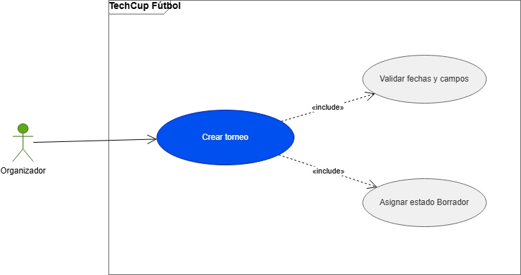

**Prototipo**

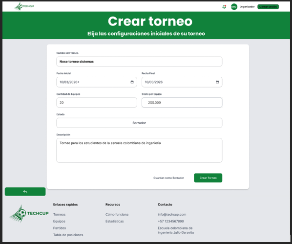

**REGLAS DE NEGOCIO**

| No. | Descripción |
|-----|------------|
| 1 | El nombre del torneo debe ser válido y no puede estar vacío. |
| 2 | El torneo se crea con estado inicial `CREADO`. |

**HISTORIAL DE REVISIÓN**

| Elaborado por | Aprobado por | Fecha | Descripción y Justificación de Cambios |
|--------------|-------------|-------|----------------------------------------|
| Shawarma FC | Juan Manuel Lopez Barrera | 23/03/2026 | Adición de prototipo e historia de usuario a cada requerimiento |
| Shawarma FC | Jeyder Nicolay Leon Lancheros | 02/04/2026 | Ajuste de entradas, salidas y reglas para reflejar la creación real del torneo y su estado inicial CREADO. |
 
---

## RF_02 — Gestionar torneo

| | |
|---|---|
| **FUNCIONALIDAD:** | |
| **Código:** | RF_02 |
| **Nombre:** | Gestionar torneo |

| | |
|---|---|
| **Descripción:** | El organizador puede iniciar o finalizar el torneo actual que tiene asociado en el backend. |
| **Cómo se ejecutará:** | Mediante las operaciones de inicio o finalización expuestas para el organizador. |
| **Actor principal:** | Organizador |
| **Precondiciones:** | El usuario debe estar autenticado, tener rol de Organizador y contar con un torneo actual asociado. |

**DATOS DE ENTRADA**

| Nombre | Descripción | Tipo de campo | Reglas / Aplicación | Obligatorio |
|--------|------------|--------------|---------------------|-------------|
| Acción | Iniciar o finalizar el torneo | Enum         | La acción se determina por el endpoint invocado (start o end) | Sí |

**DATOS DE SALIDA**

| Nombre | Descripción | Tipo de campo | Reglas / Aplicación | Obligatorio |
|--------|------------|---------------|---------------------|-------------|
| Torneo actualizado | El sistema retorna el torneo con su estado actualizado | Objeto Torneo | Estados usados por el backend: CREADO, EN_CURSO, FINALIZADO | Sí |

**FLUJO BÁSICO:**

| Paso | Actor | Descripción | Excepciones |
|------|-------|-------------|-------------|
| 1 | Organizador | Invoca la operación de iniciar o finalizar sobre su torneo actual | |
| 2 | Sistema | Recupera el organizador y el torneo actualmente asociado | Organizador no encontrado o sin torneo actual |
| 3 | Sistema | Ejecuta la transición de estado correspondiente sobre el torneo | |
| 4 | Sistema | Retorna el torneo con el estado resultante | |

**FLUJO ALTERNO:**

| Paso | Actor | Descripción | Excepciones |
|------|-------|-------------|-------------|
| 2 | Sistema | Si el organizador no tiene torneo actual, responde con error y no ejecuta la operación | |

| | |
|---|---|
| **Notas y comentarios:** | La transición implementada para iniciar cambia CREADO a EN_CURSO; la finalización cambia EN_CURSO a FINALIZADO. |

**Diagrama casos de uso**

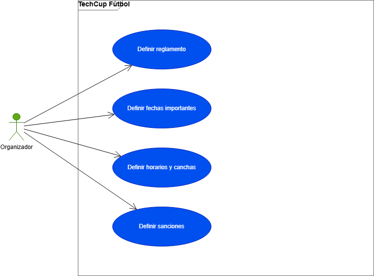

**Prototipo**

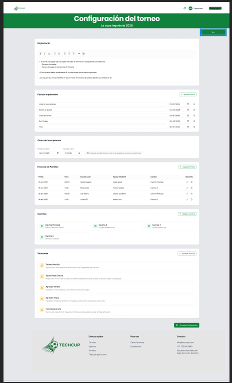

**REGLAS DE NEGOCIO**

| No. | Descripción |
|-----|------------|
| 1 | La operación start trabaja sobre el torneo actual del organizador. |
| 2 | La operación end trabaja sobre el torneo actual del organizador. |

**HISTORIAL DE REVISIÓN**

| Elaborado por | Aprobado por | Fecha | Descripción y Justificación de Cambios |
|--------------|-------------|-------|----------------------------------------|
| Shawarma FC | Juan Manuel Lopez Barrera | 23/03/2026 | Adición de prototipo e historia de usuario a cada requerimiento |
| Shawarma FC | Jeyder Nicolay Leon Lancheros | 02/04/2026 | Ajuste del flujo de gestión para reflejar inicio y finalización del torneo actual del organizador y sus estados reales. |
 
---

## RF_03 — Consultar torneo

| | |
|---|---|
| **FUNCIONALIDAD:** | |
| **Código:** | RF_03 |
| **Nombre:** | Consultar torneo |

| | |
|---|---|
| **Descripción:** | Cualquier usuario autenticado puede consultar un torneo específico o listar los torneos registrados. |
| **Cómo se ejecutará:** | Mediante la consulta por identificador del torneo o el listado general de torneos. |
| **Actor principal:** | Estudiante, Graduado, Profesor, Personal Administrativo, Familiares, Capitán, Organizador, Árbitro, Administrador |
| **Precondiciones:** | El usuario debe estar autenticado. El torneo debe existir. |

**DATOS DE ENTRADA**

| Nombre | Descripción | Tipo de campo     | Reglas / Aplicación | Obligatorio |
|--------|------------|-------------------|---------------------|-------------|
| ID del torneo | Identificador del torneo a consultar | String (automático) | Requerido para consulta individual | Sí |

**DATOS DE SALIDA**

| Nombre | Descripción | Tipo de campo  | Reglas / Aplicación | Obligatorio |
|--------|------------|----------------|---------------------|-------------|
| Información del torneo | Nombre, fechas, cantidad de equipos, costo, estado y configuración asociada | Objeto Torneo | Incluye reglamento, cierre de inscripciones, canchas, horarios y sanciones cuando existan | Sí |

**FLUJO BÁSICO:**

| Paso | Actor | Descripción | Excepciones |
|------|-------|-------------|-------------|
| 1 | Usuario | Consulta un torneo por su identificador o solicita el listado general | |
| 2 | Sistema | Recupera y retorna la información almacenada del torneo | Torneo no encontrado |

**FLUJO ALTERNO:**

| Paso | Actor | Descripción | Excepciones |
|------|-------|-------------|-------------|
| 2 | Sistema | Si el torneo no existe, responde con error; si se consulta el listado general, retorna la colección disponible | |

| | |
|---|---|
| **Notas y comentarios:** | El backend no diferencia la información visible del torneo según el rol del usuario autenticado. |

**Diagrama casos de uso**

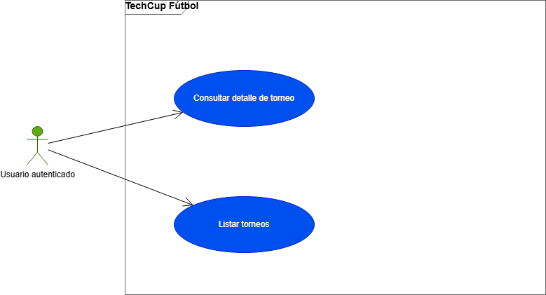

**Prototipo**

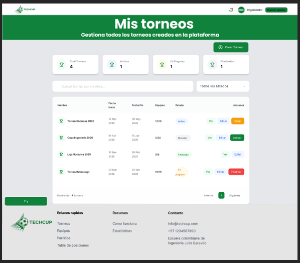

**REGLAS DE NEGOCIO**

| No. | Descripción |
|-----|------------|
| 1 | La consulta individual requiere que el torneo exista en el sistema. |

**HISTORIAL DE REVISIÓN**

| Elaborado por | Aprobado por | Fecha | Descripción y Justificación de Cambios |
|--------------|-------------|-------|----------------------------------------|
| Shawarma FC | Juan Manuel Lopez Barrera | 23/03/2026 | Adición de prototipo e historia de usuario a cada requerimiento |
| Shawarma FC | Jeyder Nicolay Leon Lancheros | 02/04/2026 | Ajuste de la consulta para documentar búsqueda por identificador, listado general y datos efectivamente retornados. |
 
---

## RF_04 — Registro de jugadores

| | |
|---|---|
| **FUNCIONALIDAD:** | |
| **Código:** | RF_04 |
| **Nombre:** | Registro de jugadores |

| | |
|---|---|
| **Descripción:** | Un participante se registra en la plataforma mediante el servicio general de acceso usando nombre, correo, contraseña y tipo de usuario. |
| **Cómo se ejecutará:** | Mediante el servicio de registro de acceso del backend. |
| **Actor principal:** | Estudiante, Graduado, Profesor, Personal Administrativo, Familiares |
| **Precondiciones:** | El usuario no debe tener una cuenta previa registrada con el mismo correo en el repositorio de usuarios registrados. |

**DATOS DE ENTRADA**

| Nombre                 | Descripción                                        | Tipo de campo | Reglas / Aplicación | Obligatorio |
|------------------------|----------------------------------------------------|---------------|---------------------|-------------|
| Correo electrónico     | Correo institucional o Gmail según el tipo de participante | String        | Institucional para todos los tipos excepto `FAMILIAR`; Gmail para `FAMILIAR` | Sí          |
| Contraseña             | Contraseña de acceso                               | String        | Mínimo 8 caracteres | Sí          |
| Nombre                 | Nombre del usuario                                 | String        | No puede estar vacío | Sí          |
| Apellido               | Dato no gestionado por el backend en el registro general | No aplica     | No se recibe en la solicitud de registro | No          |
| IdInstitucional/celuda | Dato no gestionado por el backend en el registro general | No aplica     | No se recibe en la solicitud de registro | No          |
| Carrera                | Dato no gestionado por el backend en el registro general | No aplica     | No se recibe en la solicitud de registro | No          |

**DATOS DE SALIDA**

| Nombre | Descripción | Tipo de campo | Reglas / Aplicación | Obligatorio |
|--------|------------|---------------|---------------------|-------------|
| Cuenta creada | El sistema confirma el registro del usuario | String        | Mensaje: `Usuario registrado correctamente.` | Sí |

**FLUJO BÁSICO:**

| Paso | Actor | Descripción | Excepciones |
|------|-------|-------------|-------------|
| 1 | Participante | Invoca el servicio de registro | |
| 2 | Participante | Envía nombre, correo, contraseña y tipo de usuario | |
| 3 | Sistema | Valida formato del correo, longitud mínima de la contraseña y dominio permitido según el tipo de usuario | Correo inválido, contraseña inválida o dominio no permitido |
| 4 | Sistema | Registra la cuenta y retorna confirmación | Correo ya registrado |

**FLUJO ALTERNO:**

| Paso | Actor | Descripción | Excepciones |
|------|-------|-------------|-------------|
| 3 | Sistema | Si la validación falla o el correo ya existe, responde con error y no crea la cuenta | |

| | |
|---|---|
| **Notas y comentarios:** | El backend también soporta autenticación OAuth2 con Google para usuarios `FAMILIAR`, registrándolos automáticamente si no existen. |

**Diagrama casos de uso**

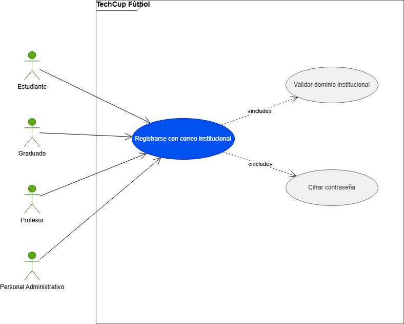

**Prototipo**

**REGLAS DE NEGOCIO**

| No. | Descripción |
|-----|------------|
| 1 | El correo institucional es obligatorio para estudiantes, graduados, profesores y personal administrativo. |
| 2 | Los familiares se registran con correo personal de Gmail. |
| 3 | La contraseña debe tener mínimo 8 caracteres. |
| 4 | No se permiten cuentas duplicadas con el mismo correo dentro del registro general de usuarios. |

**HISTORIAL DE REVISIÓN**

| Elaborado por | Aprobado por | Fecha | Descripción y Justificación de Cambios |
|--------------|-------------|-------|----------------------------------------|
| Shawarma FC | Juan Manuel Lopez Barrera | 23/03/2026 | Adición de prototipo e historia de usuario a cada requerimiento |
| Shawarma FC | Jeyder Nicolay Leon Lancheros | 02/04/2026 | Ajuste del registro de jugadores a los campos reales del backend, validación de dominio por tipo y restricción de correo duplicado. |
 
---

## RF_05 — Perfil deportivo

| | |
|---|---|
| **FUNCIONALIDAD:** | |
| **Código:** | RF_05 |
| **Nombre:** | Perfil deportivo |

| | |
|---|---|
| **Descripción:** | El jugador registrado crea y consulta su perfil deportivo; adicionalmente, el backend permite actualizar datos básicos del jugador desde el mismo recurso. |
| **Cómo se ejecutará:** | Mediante las operaciones de creación, consulta y actualización parcial expuestas para jugadores. |
| **Actor principal:** | Estudiante, Graduado, Profesor, Personal Administrativo, Familiares |
| **Precondiciones:** | El jugador debe existir en el sistema. Para crear el perfil deportivo no debe existir un perfil previo asociado al jugador. |

**DATOS DE ENTRADA**

| Nombre                 | Descripción | Tipo de campo | Reglas / Aplicación | Obligatorio |
|------------------------|------------|---------------|---------------------|-------------|
| Posiciones de juego    | Posiciones de juego del perfil deportivo | List(Enum)    | Debe enviarse al menos una posición | Sí |
| Número dorsal          | Dorsal del perfil deportivo | Int           | Debe ser mayor que 0 | Sí |
| Foto                   | Ruta o referencia de la foto del jugador | String        | Opcional en la creación del perfil; también puede actualizarse en la edición parcial del jugador | No |
| Semestre               | Semestre actual (si aplica) | Int           | Si se envía, debe ser mayor que 0 | Condicional |
| Edad                   | Edad del jugador | Int           | Debe estar entre 1 y 100 | Sí |
| Género                 | Género del jugador | Enum          | Valores del backend: MASCULINO, FEMENINO, OTRO | Sí |
| IdInstitucional/cedula | Número de identificación | String        | No puede estar vacío | Sí |

**DATOS DE SALIDA**

| Nombre | Descripción | Tipo de campo  | Reglas / Aplicación | Obligatorio |
|--------|------------|----------------|---------------------|-------------|
| Perfil actualizado | El sistema retorna el perfil deportivo creado o consultado; la edición parcial retorna los datos básicos del jugador | Objeto PerfilDeportivo / Objeto Jugador | Depende de la operación invocada | Sí |

**FLUJO BÁSICO:**

| Paso | Actor | Descripción | Excepciones |
|------|-------|-------------|-------------|
| 1 | Jugador | Invoca la creación, consulta o actualización parcial de su recurso de perfil | |
| 2 | Jugador | Envía los datos del perfil deportivo o consulta el perfil existente | |
| 3 | Sistema | Valida posiciones, dorsal, edad, género, identificación y semestre cuando corresponda | Datos inválidos o perfil ya existente |
| 4 | Sistema | Guarda o retorna la información solicitada | Jugador no encontrado o perfil no registrado |

**FLUJO ALTERNO:**

| Paso | Actor | Descripción | Excepciones |
|------|-------|-------------|-------------|
| 3 | Sistema | Si los datos son inválidos o el jugador ya tiene perfil creado, responde con error | |

| | |
|---|---|
| **Notas y comentarios:** | La actualización parcial del recurso del jugador permite modificar nombre, número de camiseta, posición principal y foto. |

**Diagrama casos de uso**

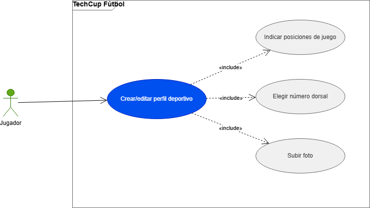

**Prototipo**

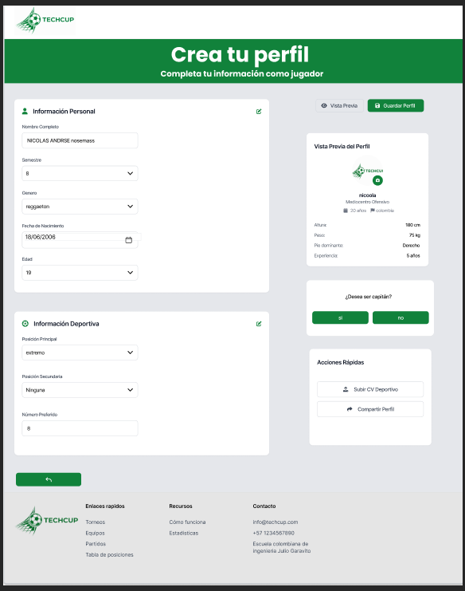

**REGLAS DE NEGOCIO**

| No. | Descripción |
|-----|------------|
| 1 | Cada jugador puede tener un único perfil deportivo registrado. |
| 2 | Debe seleccionarse al menos una posición de juego. |
| 3 | El dorsal debe ser un número positivo. |

**HISTORIAL DE REVISIÓN**

| Elaborado por | Aprobado por | Fecha | Descripción y Justificación de Cambios |
|--------------|-------------|-------|----------------------------------------|
| Shawarma FC | Juan Manuel Lopez Barrera | 23/03/2026 | Adición de prototipo e historia de usuario a cada requerimiento |
| Shawarma FC | Jeyder Nicolay Leon Lancheros | 02/04/2026 | Ajuste del requerimiento al modelo real de perfil deportivo, sus validaciones y la actualización parcial del jugador. |
 
---

## RF_06 — Disponibilidad de jugador

| | |
|---|---|
| **FUNCIONALIDAD:** | |
| **Código:** | RF_06 |
| **Nombre:** | Disponibilidad de jugador |

| | |
|---|---|
| **Descripción:** | Un jugador puede ejecutar la operación de marcado como disponible para aparecer como elegible en la lógica de invitaciones. |
| **Cómo se ejecutará:** | Mediante la operación de disponibilidad expuesta para jugadores. |
| **Actor principal:** | Estudiante, Graduado, Profesor, Personal Administrativo, Familiares |
| **Precondiciones:** | El jugador debe existir en el sistema. |

**DATOS DE ENTRADA**

| Nombre | Descripción | Tipo de campo | Reglas / Aplicación | Obligatorio |
|--------|------------|---------------|---------------------|-------------|
| Acción de disponibilidad | Marcado de disponibilidad del jugador | Operación      | La operación del backend solo marca disponibilidad en `true` | Sí |

**DATOS DE SALIDA**

| Nombre | Descripción | Tipo de campo | Reglas / Aplicación | Obligatorio |
|--------|------------|---------------|---------------------|-------------|
| Estado actualizado | El sistema confirma que el jugador quedó marcado como disponible | String        | Mensaje: `Jugador marcado como disponible` | Sí |

**FLUJO BÁSICO:**

| Paso | Actor | Descripción | Excepciones |
|------|-------|-------------|-------------|
| 1 | Jugador | Invoca la operación para marcarse como disponible | |
| 2 | Sistema | Verifica el estado actual del jugador | Jugador no encontrado |
| 3 | Sistema | Marca la disponibilidad en true y retorna confirmación | |

**FLUJO ALTERNO:**

| Paso | Actor | Descripción | Excepciones |
|------|-------|-------------|-------------|
| 2 | Sistema | Si el jugador no cumple la condición validada por el backend, responde con error y no modifica el estado | |

| | |
|---|---|
| **Notas y comentarios:** | El backend no expone una operación específica para marcar manualmente al jugador como no disponible; esa condición cambia al aceptar una invitación. |

**Diagrama casos de uso**

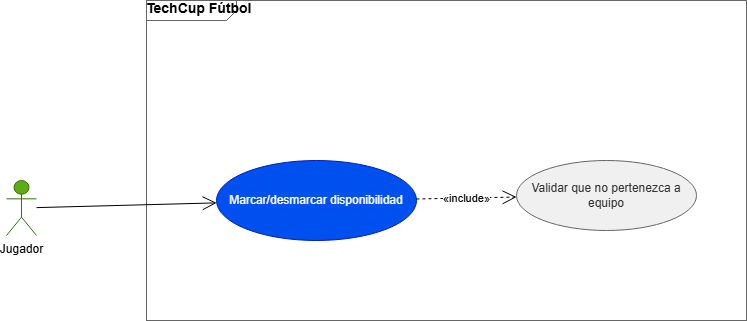

**Prototipo**

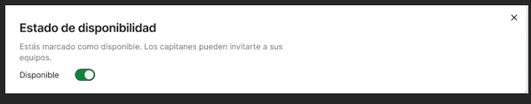

**REGLAS DE NEGOCIO**

| No. | Descripción |
|-----|------------|
| 1 | Un jugador que ya pertenece a un equipo no puede marcarse como disponible. |

**HISTORIAL DE REVISIÓN**

| Elaborado por | Aprobado por | Fecha | Descripción y Justificación de Cambios |
|--------------|-------------|-------|----------------------------------------|
| Shawarma FC | Juan Manuel Lopez Barrera | 23/03/2026 | Adición de prototipo e historia de usuario a cada requerimiento |
| Shawarma FC | Jeyder Nicolay Leon Lancheros | 02/04/2026 | Ajuste de la disponibilidad para documentar la operación real de marcado como disponible y su restricción de uso. |
 
---

## RF_07 — Invitaciones a equipo

| | |
|---|---|
| **FUNCIONALIDAD:** | |
| **Código:** | RF_07 |
| **Nombre:** | Invitaciones a equipo |

| | |
|---|---|
| **Descripción:** | El jugador puede registrar la aceptación o el rechazo de una invitación mediante las operaciones expuestas para responder invitaciones. |
| **Cómo se ejecutará:** | Mediante las operaciones de aceptar o rechazar invitación disponibles para jugadores. |
| **Actor principal:** | Estudiante, Graduado, Profesor, Personal Administrativo, Familiares |
| **Precondiciones:** | El jugador debe existir en el sistema. |

**DATOS DE ENTRADA**

| Nombre | Descripción | Tipo de campo | Reglas / Aplicación | Obligatorio |
|--------|------------|---------------|---------------------|-------------|
| Respuesta a invitación | Aceptar o rechazar la invitación | Enum          | Se ejecuta mediante dos operaciones distintas del backend | Sí |

**DATOS DE SALIDA**

| Nombre | Descripción | Tipo de campo | Reglas / Aplicación | Obligatorio |
|--------|------------|---------------|---------------------|-------------|
| Estado de invitación | El sistema confirma la respuesta del jugador y ajusta su disponibilidad | String        | Aceptar: Invitacion aceptada correctamente; Rechazar: Invitacion rechazada correctamente | Sí |

**FLUJO BÁSICO:**

| Paso | Actor | Descripción | Excepciones |
|------|-------|-------------|-------------|
| 1 | Jugador | Invoca la operación de aceptar o rechazar invitación | |
| 2 | Sistema | Recupera el jugador asociado al identificador enviado | Jugador no encontrado |
| 3 | Sistema | Si acepta, marca al jugador como no disponible; si rechaza, lo marca como disponible | |
| 4 | Sistema | Retorna el mensaje de confirmación correspondiente | |

**FLUJO ALTERNO:**

| Paso | Actor | Descripción | Excepciones |
|------|-------|-------------|-------------|
| 2 | Sistema | Si el jugador no existe, responde con error y no procesa la operación | |

| | |
|---|---|
| **Notas y comentarios:** | El backend actual no persiste el detalle de la invitación ni agrega automáticamente al jugador a un equipo al aceptar. |

**Diagrama casos de uso**

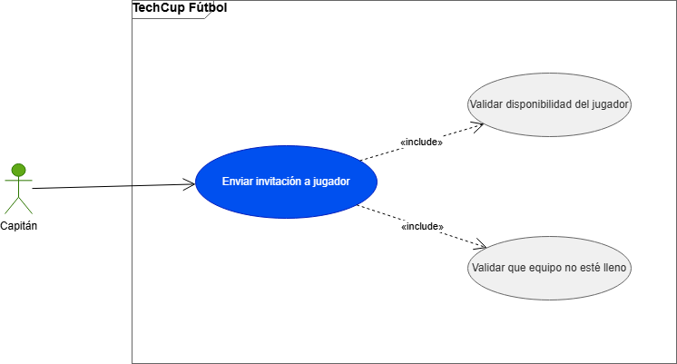

**Prototipo**

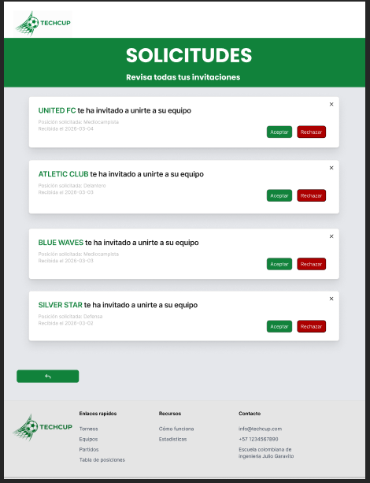

**REGLAS DE NEGOCIO**

| No. | Descripción |
|-----|------------|
| 1 | Aceptar una invitación marca al jugador como no disponible. |
| 2 | Rechazar una invitación marca al jugador como disponible. |

**HISTORIAL DE REVISIÓN**

| Elaborado por | Aprobado por | Fecha | Descripción y Justificación de Cambios |
|--------------|-------------|-------|----------------------------------------|
| Shawarma FC | Juan Manuel Lopez Barrera | 23/03/2026 | Adición de prototipo e historia de usuario a cada requerimiento |
| Shawarma FC | Jeyder Nicolay Leon Lancheros | 02/04/2026 | Ajuste de aceptación y rechazo de invitaciones al comportamiento real del backend sobre disponibilidad del jugador. |
 
---

## RF_08 — Crear equipo

| | |
|---|---|
| **FUNCIONALIDAD:** | |
| **Código:** | RF_08 |
| **Nombre:** | Crear equipo |

| | |
|---|---|
| **Descripción:** | Un capitán crea un equipo mediante la operación de creación expuesta para su identificador. |
| **Cómo se ejecutará:** | Mediante el envío del nombre del equipo al servicio del capitán. |
| **Actor principal:** | Capitán |
| **Precondiciones:** | El usuario debe existir como capitán en el sistema. |

**DATOS DE ENTRADA**

| Nombre | Descripción | Tipo de campo    | Reglas / Aplicación | Obligatorio |
|--------|------------|------------------|---------------------|-------------|
| Nombre del equipo | Nombre que identifica al equipo | String           | No puede estar vacío | Sí |
| Escudo | Dato no gestionado por la operación de creación implementada | No aplica       | No se recibe en la solicitud | No |
| Colores del uniforme | Dato no gestionado por la operación de creación implementada | No aplica       | No se recibe en la solicitud | No |

**DATOS DE SALIDA**

| Nombre | Descripción | Tipo de campo | Reglas / Aplicación | Obligatorio |
|--------|------------|--------------|---------------------|-------------|
| Equipo creado | El sistema retorna una confirmación textual de la operación | String       | Mensaje de confirmación asociado al capitán | Sí |

**FLUJO BÁSICO:**

| Paso | Actor | Descripción | Excepciones |
|------|-------|-------------|-------------|
| 1 | Capitán | Invoca la operación de crear equipo | |
| 2 | Capitán | Envía el nombre del equipo | |
| 3 | Sistema | Valida que el capitán exista y que el nombre sea válido | Capitán no encontrado o nombre no válido |
| 4 | Sistema | Retorna la confirmación textual de creación | |

**FLUJO ALTERNO:**

| Paso | Actor | Descripción | Excepciones |
|------|-------|-------------|-------------|
| 3 | Sistema | Si el capitán no existe o el nombre no es válido, responde con error | |

| | |
|---|---|
| **Notas y comentarios:** | La operación implementada recibe únicamente el nombre del equipo; no registra escudo ni colores en este flujo. |

**Diagrama casos de uso**

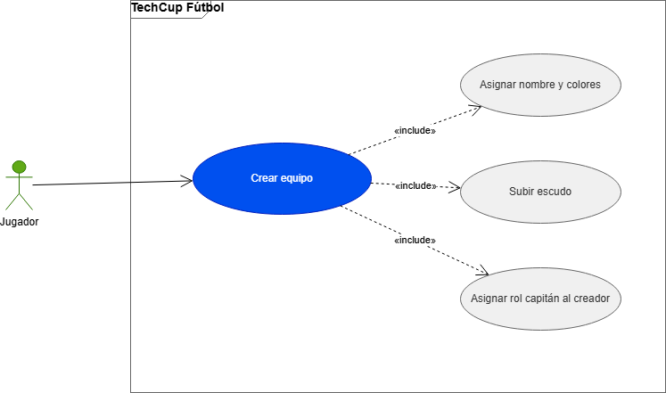

**Prototipo**

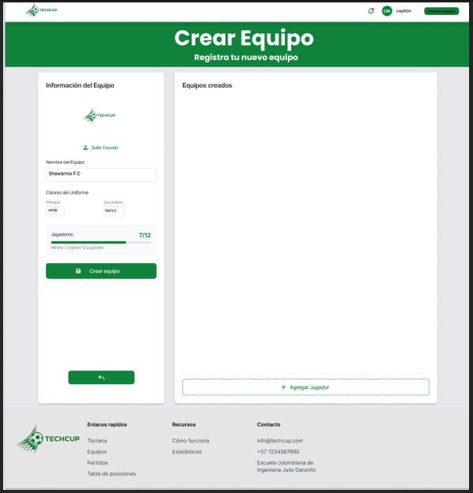

**REGLAS DE NEGOCIO**

| No. | Descripción |
|-----|------------|
| 1 | El nombre del equipo debe ser válido y no puede estar vacío. |

**HISTORIAL DE REVISIÓN**

| Elaborado por | Aprobado por | Fecha | Descripción y Justificación de Cambios |
|--------------|-------------|-------|----------------------------------------|
| Shawarma FC | Juan Manuel Lopez Barrera | 23/03/2026 | Adición de prototipo e historia de usuario a cada requerimiento |
| Shawarma FC | Jeyder Nicolay Leon Lancheros | 02/04/2026 | Ajuste de creación de equipo a la operación real basada en nombre de equipo y validación del capitán. |
 
---

## RF_09 — Gestionar equipo

| | |
|---|---|
| **FUNCIONALIDAD:** | |
| **Código:** | RF_09 |
| **Nombre:** | Gestionar equipo |

| | |
|---|---|
| **Descripción:** | La gestión de equipo implementada en el backend corresponde al envío de invitaciones a jugadores desde la cuenta del capitán. |
| **Cómo se ejecutará:** | Mediante la operación de invitación expuesta para capitanes. |
| **Actor principal:** | Capitán |
| **Precondiciones:** | El usuario debe existir como capitán y el jugador a invitar debe existir en el sistema. |

**DATOS DE ENTRADA**

| Nombre | Descripción | Tipo de campo | Reglas / Aplicación | Obligatorio |
|--------|------------|---------------|---------------------|-------------|
| Jugador a invitar | Identificador del jugador a invitar | String / Selector | El jugador debe encontrarse disponible | Sí |

**DATOS DE SALIDA**

| Nombre | Descripción | Tipo de campo | Reglas / Aplicación | Obligatorio |
|--------|------------|---------------|---------------------|-------------|
| Invitación enviada | El sistema retorna la confirmación del envío de la invitación | String | Mensaje: `Invitacion enviada correctamente` | Sí |

**FLUJO BÁSICO:**

| Paso | Actor | Descripción | Excepciones |
|------|-------|-------------|-------------|
| 1 | Capitán | Invoca la operación de invitación indicando el jugador objetivo | |
| 2 | Sistema | Recupera al capitán y al jugador | Capitán no encontrado o jugador no encontrado |
| 3 | Sistema | Verifica que el jugador se encuentre disponible | Jugador no disponible |
| 4 | Sistema | Retorna la confirmación del envío de la invitación | |

**FLUJO ALTERNO:**

| Paso | Actor | Descripción | Excepciones |
|------|-------|-------------|-------------|
| 3 | Sistema | Si el jugador no existe o no está disponible, responde con error y no envía la invitación | |

| | |
|---|---|
| **Notas y comentarios:** | Esta operación no edita información del equipo ni administra la plantilla persistida; únicamente valida disponibilidad y confirma el envío de la invitación. |

**Diagrama casos de uso**

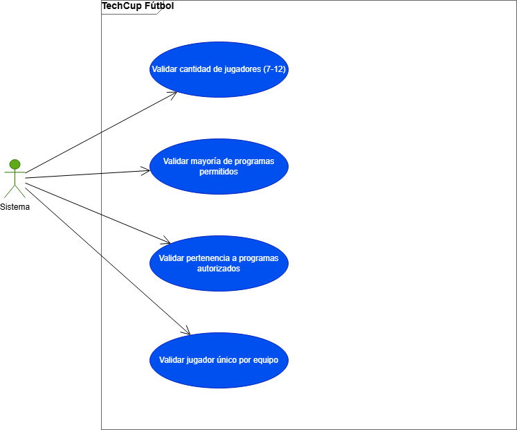

**Prototipo**

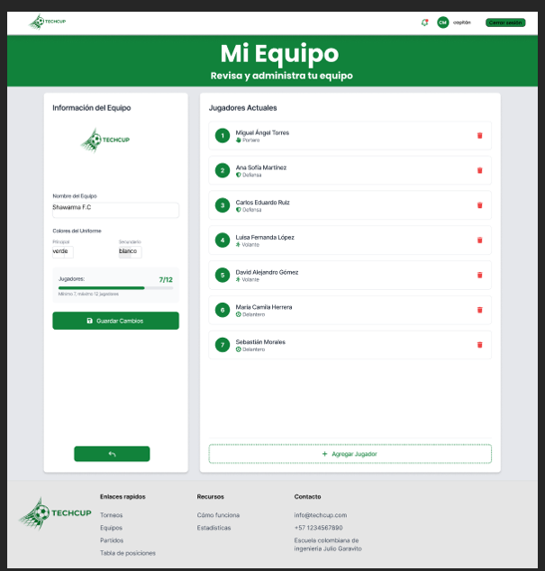

**REGLAS DE NEGOCIO**

| No. | Descripción |
|-----|------------|
| 1 | Solo se puede invitar a jugadores que estén disponibles. |

**HISTORIAL DE REVISIÓN**

| Elaborado por | Aprobado por | Fecha | Descripción y Justificación de Cambios |
|--------------|-------------|-------|----------------------------------------|
| Shawarma FC | Juan Manuel Lopez Barrera | 23/03/2026 | Adición de prototipo e historia de usuario a cada requerimiento |
| Shawarma FC | Jeyder Nicolay Leon Lancheros | 02/04/2026 | Ajuste del alcance para documentar que la gestión implementada corresponde al envío de invitaciones a jugadores disponibles. |
 
---

## RF_10 — Validar equipo

| | |
|---|---|
| **FUNCIONALIDAD:** | |
| **Código:** | RF_10 |
| **Nombre:** | Validar equipo |

| | |
|---|---|
| **Descripción:** | El capitán consulta la validación de composición de su equipo según la cantidad de jugadores registrada. |
| **Cómo se ejecutará:** | Mediante la operación de validación del equipo asociada al capitán. |
| **Actor principal:** | Capitán |
| **Precondiciones:** | El capitán debe existir y tener un equipo asociado registrado en el sistema. |

**DATOS DE ENTRADA**

| Nombre | Descripción | Tipo de campo            | Reglas / Aplicación | Obligatorio |
|--------|------------|--------------------------|---------------------|-------------|
| Equipo | Equipo del capitán a validar | Objeto Equipo Automático | Se obtiene a partir del capitán autenticado/consultado | Sí |

**DATOS DE SALIDA**

| Nombre | Descripción | Tipo de campo | Reglas / Aplicación | Obligatorio |
|--------|------------|---------------|---------------------|-------------|
| Resultado de validación | Resumen de validación con total de jugadores y estado | Objeto | Incluye `equipoId`, `nombre`, `totalJugadores`, `valido` y `error` cuando aplica | Sí |

**FLUJO BÁSICO:**

| Paso | Actor | Descripción | Excepciones |
|------|-------|-------------|-------------|
| 1 | Capitán | Invoca la operación de validación de su equipo | |
| 2 | Sistema | Recupera al capitán y el equipo asociado | Capitán no encontrado o sin equipo registrado |
| 3 | Sistema | Cuenta el total de jugadores registrados en el equipo | |
| 4 | Sistema | Determina si el total está entre 7 y 12 jugadores y retorna el resultado | |

**FLUJO ALTERNO:**

| Paso | Actor | Descripción | Excepciones |
|------|-------|-------------|-------------|
| 4 | Sistema | Si el equipo tiene menos de 7 o más de 12 jugadores, retorna el mensaje de error correspondiente | |

| | |
|---|---|
| **Notas y comentarios:** | La validación implementada por el backend se limita al número total de jugadores registrados en el equipo. |

**Diagrama casos de uso**

**Prototipo**

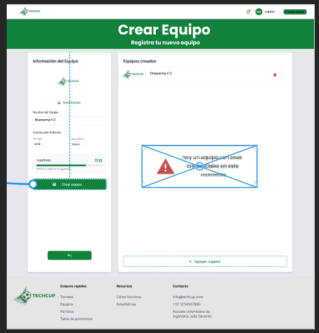

**REGLAS DE NEGOCIO**

| No. | Descripción |
|-----|------------|
| 1 | Mínimo 7, máximo 12 jugadores por equipo. |

**HISTORIAL DE REVISIÓN**

| Elaborado por | Aprobado por | Fecha | Descripción y Justificación de Cambios |
|--------------|-------------|-------|----------------------------------------|
| Shawarma FC | Juan Manuel Lopez Barrera | 23/03/2026 | Adición de prototipo e historia de usuario a cada requerimiento |
| Shawarma FC | Jeyder Nicolay Leon Lancheros | 02/04/2026 | Ajuste de la validación de equipo a la comprobación real de cantidad mínima y máxima de jugadores. |
 
---

## RF_11 — Buscar jugadores

| | |
|---|---|
| **FUNCIONALIDAD:** | |
| **Código:** | RF_11 |
| **Nombre:** | Buscar jugadores |

| | |
|---|---|
| **Descripción:** | Los capitanes buscan jugadores por posición de juego mediante la operación de búsqueda disponible en el backend. |
| **Cómo se ejecutará:** | Mediante una consulta que recibe la posición como parámetro obligatorio. |
| **Actor principal:** | Capitán |
| **Precondiciones:** | El usuario debe estar autenticado. |

**DATOS DE ENTRADA**

| Nombre | Descripción | Tipo de campo | Reglas / Aplicación | Obligatorio |
|--------|------------|---------------|---------------------|-------------|
| Posición | Filtrar por posición de juego | String / Enum  | Parámetro obligatorio de la búsqueda | Sí |
| Semestre | Filtro no implementado en la búsqueda actual | No aplica     | No se utiliza en la operación actual | No |
| Edad | Filtro no implementado en la búsqueda actual | No aplica     | No se utiliza en la operación actual | No |
| Género | Filtro no implementado en la búsqueda actual | No aplica     | No se utiliza en la operación actual | No |
| Nombre | Filtro no implementado en la búsqueda actual | No aplica     | No se utiliza en la operación actual | No |
| Identificación | Filtro no implementado en la búsqueda actual | No aplica     | No se utiliza en la operación actual | No |

**DATOS DE SALIDA**

| Nombre | Descripción | Tipo de campo | Reglas / Aplicación | Obligatorio |
|--------|------------|---------------|---------------------|-------------|
| Lista de jugadores | Jugadores cuya posición coincide con el parámetro enviado | List(JugadorResponse) | El backend actual no aplica filtros adicionales en esta operación | Sí |

**FLUJO BÁSICO:**

| Paso | Actor | Descripción | Excepciones |
|------|-------|-------------|-------------|
| 1 | Capitán | Invoca la búsqueda de jugadores | |
| 2 | Capitán | Envía la posición de juego que desea consultar | |
| 3 | Sistema | Filtra los jugadores registrados por posición y retorna la lista resultante | Sin resultados |
| 4 | Capitán | Usa el resultado para seleccionar un posible jugador a invitar | |

**FLUJO ALTERNO:**

| Paso | Actor | Descripción | Excepciones |
|------|-------|-------------|-------------|
| 2 | Sistema | Si no se envía la posición, responde con error y no ejecuta la búsqueda | |
| 3 | Sistema | Si no hay resultados, retorna una lista vacía | |

| | |
|---|---|
| **Notas y comentarios:** | La búsqueda implementada por el backend filtra únicamente por posición. |

**Diagrama casos de uso**

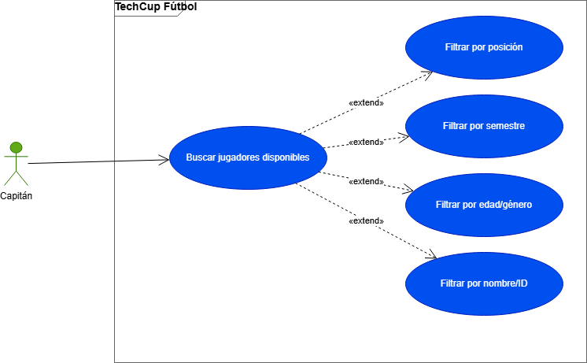

**Prototipo**

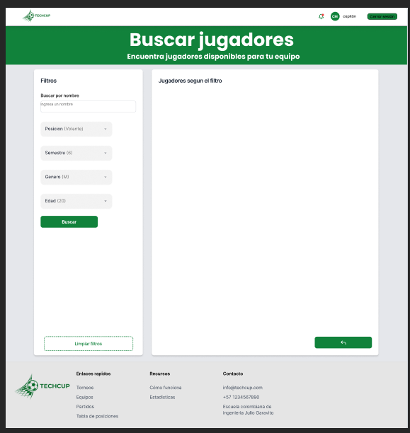

**REGLAS DE NEGOCIO**

| No. | Descripción |
|-----|------------|
| 1 | La posición es obligatoria para realizar la búsqueda. |

**HISTORIAL DE REVISIÓN**

| Elaborado por | Aprobado por | Fecha | Descripción y Justificación de Cambios |
|--------------|-------------|-------|----------------------------------------|
| Shawarma FC | Juan Manuel Lopez Barrera | 23/03/2026 | Adición de prototipo e historia de usuario a cada requerimiento |
| Shawarma FC | Jeyder Nicolay Leon Lancheros | 02/04/2026 | Ajuste de búsqueda para reflejar el filtro real por posición y eliminar filtros no implementados. |
 
---

## RF_12 — Subir comprobante de pago

| | |
|---|---|
| **FUNCIONALIDAD:** | |
| **Código:** | RF_12 |
| **Nombre:** | Subir comprobante de pago |

| | |
|---|---|
| **Descripción:** | El capitán registra el comprobante de pago asociado a un equipo mediante el servicio de pagos del backend. |
| **Cómo se ejecutará:** | Mediante el envío del identificador del equipo y una referencia textual del comprobante. |
| **Actor principal:** | Capitán |
| **Precondiciones:** | El equipo debe existir y no debe tener un pago aprobado previamente. |

**DATOS DE ENTRADA**

| Nombre | Descripción | Tipo de campo | Reglas / Aplicación | Obligatorio |
|--------|------------|---------------|---------------------|-------------|
| Comprobante de pago | Referencia textual o URL del comprobante | String        | No puede estar vacío y no debe superar 500 caracteres | Sí |

**DATOS DE SALIDA**

| Nombre | Descripción | Tipo de campo | Reglas / Aplicación | Obligatorio |
|--------|------------|---------------|---------------------|-------------|
| Estado del pago | El sistema crea el pago con fecha de subida y estado inicial pendiente | Objeto Pago   | Estado inicial: `PENDIENTE` | Sí |

**FLUJO BÁSICO:**

| Paso | Actor | Descripción | Excepciones |
|------|-------|-------------|-------------|
| 1 | Capitán | Invoca el servicio de registro de comprobante para un equipo | |
| 2 | Capitán | Envía el identificador del equipo y la referencia del comprobante | |
| 3 | Sistema | Valida la referencia recibida y verifica que el equipo exista y no tenga un pago aprobado | Equipo no encontrado, comprobante inválido o pago aprobado existente |
| 4 | Sistema | Crea el pago con estado `PENDIENTE` y retorna el objeto creado | |

**FLUJO ALTERNO:**

| Paso | Actor | Descripción | Excepciones |
|------|-------|-------------|-------------|
| 3 | Sistema | Si la validación falla, responde con error y no registra el pago | |

| | |
|---|---|
| **Notas y comentarios:** | El backend almacena el comprobante como una referencia textual; no procesa archivos binarios en esta operación. |

**Diagrama casos de uso**

**Prototipo**

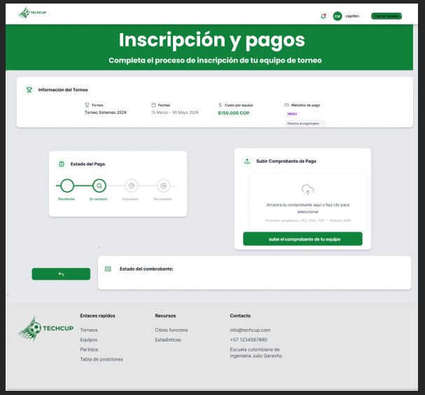

**REGLAS DE NEGOCIO**

| No. | Descripción |
|-----|------------|
| 1 | El pago lo realiza el capitán del equipo. |
| 2 | El comprobante se registra automáticamente con estado `PENDIENTE`. |
| 3 | No se permite registrar un nuevo comprobante para un equipo que ya tenga un pago aprobado. |

**HISTORIAL DE REVISIÓN**

| Elaborado por | Aprobado por | Fecha | Descripción y Justificación de Cambios |
|--------------|-------------|-------|----------------------------------------|
| Shawarma FC | Juan Manuel Lopez Barrera | 23/03/2026 | Adición de prototipo e historia de usuario a cada requerimiento |
| Shawarma FC | Jeyder Nicolay Leon Lancheros | 02/04/2026 | Ajuste del comprobante de pago a la referencia textual registrada por el backend y al estado inicial `PENDIENTE`. |
 
---

## RF_13 — Verificar pago

| | |
|---|---|
| **FUNCIONALIDAD:** | |
| **Código:** | RF_13 |
| **Nombre:** | Verificar pago |

| | |
|---|---|
| **Descripción:** | El organizador consulta pagos pendientes y ejecuta operaciones de aprobación o rechazo sobre pagos registrados. |
| **Cómo se ejecutará:** | Mediante las operaciones de consulta de pagos pendientes y cambio de estado del pago. |
| **Actor principal:** | Organizador |
| **Precondiciones:** | Debe existir un pago registrado para el equipo. |

**DATOS DE ENTRADA**

| Nombre | Descripción | Tipo de campo | Reglas / Aplicación | Obligatorio |
|--------|------------|---------------|---------------------|-------------|
| Decisión | Aprobar o rechazar el comprobante | Enum / Operación | La decisión se determina por el endpoint invocado | Sí |
| Observaciones | Dato no gestionado por la operación actual | No aplica     | No se recibe en la solicitud | No |

**DATOS DE SALIDA**

| Nombre | Descripción | Tipo de campo | Reglas / Aplicación | Obligatorio |
|--------|------------|---------------|---------------------|-------------|
| Estado actualizado | El sistema retorna el pago con su estado resultante | Objeto Pago   | Estados posibles: `PENDIENTE`, `EN_REVISION`, `APROBADO`, `RECHAZADO` | Sí |

**FLUJO BÁSICO:**

| Paso | Actor | Descripción | Excepciones |
|------|-------|-------------|-------------|
| 1 | Organizador | Consulta la lista de pagos pendientes o selecciona un pago específico | |
| 2 | Organizador | Invoca la operación de aprobar o rechazar el pago | |
| 3 | Sistema | Recupera el pago y ejecuta la transición de estado definida para la operación | Pago no encontrado o transición inválida |
| 4 | Sistema | Retorna el pago con el estado actualizado | |

**FLUJO ALTERNO:**

| Paso | Actor | Descripción | Excepciones |
|------|-------|-------------|-------------|
| 3 | Sistema | Si el pago no se encuentra en un estado compatible con la operación, responde con error | |

| | |
|---|---|
| **Notas y comentarios:** | La aprobación implementada por el backend avanza el pago desde `PENDIENTE` hasta `APROBADO` pasando internamente por `EN_REVISION`. |

**Diagrama casos de uso**

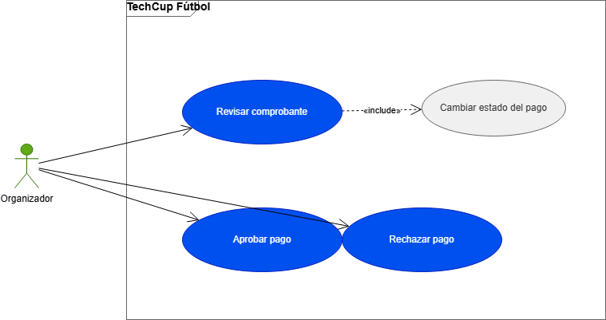

**Prototipo**

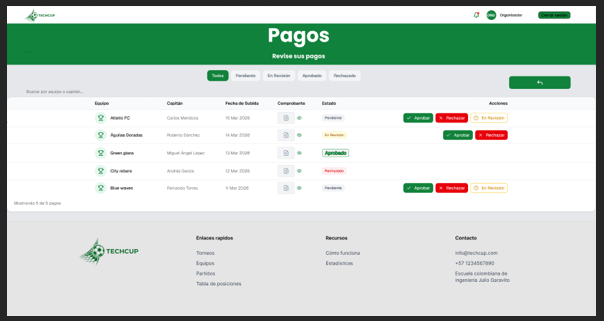

**REGLAS DE NEGOCIO**

| No. | Descripción |
|-----|------------|
| 1 | Los estados válidos del pago son: `PENDIENTE`, `EN_REVISION`, `APROBADO` y `RECHAZADO`. |
| 2 | La operación de aprobación avanza el pago hasta `APROBADO`. |
| 3 | La operación de rechazo solo es válida cuando el pago se encuentra en `EN_REVISION`. |

**HISTORIAL DE REVISIÓN**

| Elaborado por | Aprobado por | Fecha | Descripción y Justificación de Cambios |
|--------------|-------------|-------|----------------------------------------|
| Shawarma FC | Juan Manuel Lopez Barrera | 23/03/2026 | Adición de prototipo e historia de usuario a cada requerimiento |
| Shawarma FC | Jeyder Nicolay Leon Lancheros | 02/04/2026 | Ajuste de verificación de pago a las transiciones reales de aprobación y rechazo implementadas por el backend. |
 
---

## RF_14 — Configurar torneo

| | |
|---|---|
| **FUNCIONALIDAD:** | |
| **Código:** | RF_14 |
| **Nombre:** | Configurar torneo |

| | |
|---|---|
| **Descripción:** | El organizador actualiza la configuración de su torneo actual mediante una operación de actualización parcial. |
| **Cómo se ejecutará:** | Mediante la operación de configuración del torneo asociada al organizador. |
| **Actor principal:** | Organizador |
| **Precondiciones:** | El organizador debe existir y tener un torneo actual asociado. |

**DATOS DE ENTRADA**

| Nombre | Descripción | Tipo de campo   | Reglas / Aplicación | Obligatorio |
|--------|------------|-----------------|---------------------|-------------|
| Reglamento | Reglas del torneo | String          | Campo opcional en la actualización parcial | No |
| Fechas importantes | Dato no gestionado por la operación actual | No aplica       | No se recibe en la solicitud | No |
| Cierre de inscripciones | Fecha límite para inscripción | LocalDateTime   | Si se envía, debe ser anterior a la fecha de inicio del torneo | No |
| Horarios de partidos | Horarios disponibles para los partidos | String          | Campo opcional en la actualización parcial | No |
| Canchas | Canchas disponibles para los partidos | String          | Campo opcional en la actualización parcial | No |
| Sanciones | Definición de sanciones aplicables | String          | Campo opcional en la actualización parcial | No |

**DATOS DE SALIDA**

| Nombre | Descripción | Tipo de campo | Reglas / Aplicación | Obligatorio |
|--------|------------|---------------|---------------------|-------------|
| Configuración guardada | El sistema retorna el torneo con la configuración actualizada | Objeto Torneo | | Sí |

**FLUJO BÁSICO:**

| Paso | Actor | Descripción | Excepciones |
|------|-------|-------------|-------------|
| 1 | Organizador | Invoca la operación de configuración de su torneo actual | |
| 2 | Organizador | Envía uno o varios campos de configuración a actualizar | |
| 3 | Sistema | Verifica que exista el organizador, que tenga un torneo actual y valida el cierre de inscripciones cuando se envía | Organizador no encontrado, sin torneo actual o cierre inválido |
| 4 | Sistema | Guarda los cambios permitidos y retorna el torneo actualizado | Torneo en curso o finalizado |

**FLUJO ALTERNO:**

| Paso | Actor | Descripción | Excepciones |
|------|-------|-------------|-------------|
| 4 | Sistema | Si el torneo está `EN_CURSO` o `FINALIZADO`, responde con error y no aplica cambios | |

| | |
|---|---|
| **Notas y comentarios:** | La configuración es parcial: solo se actualizan los campos enviados con contenido no vacío. |

**Diagrama casos de uso**

**Prototipo**

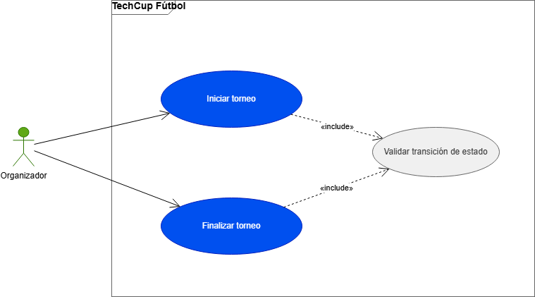

**REGLAS DE NEGOCIO**

| No. | Descripción |
|-----|------------|
| 1 | El cierre de inscripciones debe ser anterior a la fecha inicial del torneo. |
| 2 | No se puede configurar un torneo que ya esté en `EN_CURSO` o `FINALIZADO`. |

**HISTORIAL DE REVISIÓN**

| Elaborado por | Aprobado por | Fecha | Descripción y Justificación de Cambios |
|--------------|-------------|-------|----------------------------------------|
| Shawarma FC | Juan Manuel Lopez Barrera | 23/03/2026 | Adición de prototipo e historia de usuario a cada requerimiento |
| Shawarma FC | Jeyder Nicolay Leon Lancheros | 02/04/2026 | Ajuste de configuración de torneo a actualización parcial, validación de cierre de inscripciones y restricciones por estado. |
 
---

## RF_15 — Gestionar alineación

| | |
|---|---|
| **FUNCIONALIDAD:** | |
| **Código:** | RF_15 |
| **Nombre:** | Gestionar alineación |

| | |
|---|---|
| **Descripción:** | El capitán define la lista de titulares enviada al backend para preparar la alineación del equipo. |
| **Cómo se ejecutará:** | Mediante la operación de definición de alineación expuesta para capitanes. |
| **Actor principal:** | Capitán |
| **Precondiciones:** | El capitán debe existir en el sistema. |

**DATOS DE ENTRADA**

| Nombre | Descripción | Tipo de campo            | Reglas / Aplicación | Obligatorio |
|--------|------------|--------------------------|---------------------|-------------|
| Titulares | Jugadores enviados para la alineación | List(Jugador)           | Debe contener al menos 7 jugadores | Sí |
| Reservas | Dato no gestionado por la operación actual | No aplica               | No se recibe en la solicitud | No |
| Formación | Dato no gestionado por la operación actual | No aplica               | No se recibe en la solicitud | No |
| Posiciones en cancha | Dato no gestionado por la operación actual | No aplica               | No se recibe en la solicitud | No |

**DATOS DE SALIDA**

| Nombre | Descripción | Tipo de campo | Reglas / Aplicación | Obligatorio |
|--------|------------|---------------|---------------------|-------------|
| Alineación guardada | El sistema confirma textualmente que la alineación fue procesada | String        | La respuesta no persiste una entidad de alineación en esta operación | Sí |

**FLUJO BÁSICO:**

| Paso | Actor | Descripción | Excepciones |
|------|-------|-------------|-------------|
| 1 | Capitán | Invoca la operación de alineación de su equipo | |
| 2 | Capitán | Envía la lista de jugadores titulares | |
| 3 | Sistema | Verifica que el capitán exista y que se hayan enviado al menos 7 titulares | Capitán no encontrado o cantidad insuficiente |
| 4 | Sistema | Retorna la confirmación textual de la operación | |

**FLUJO ALTERNO:**

| Paso | Actor | Descripción | Excepciones |
|------|-------|-------------|-------------|
| 3 | Sistema | Si se envían menos de 7 titulares, responde con error y no procesa la alineación | |

| | |
|---|---|
| **Notas y comentarios:** | La operación implementada valida únicamente la cantidad mínima de titulares enviada por el capitán. |

**Diagrama casos de uso**

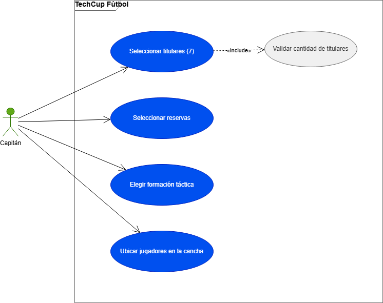

**Prototipo**

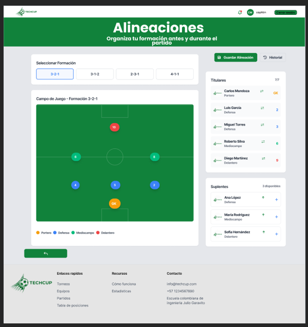

**REGLAS DE NEGOCIO**

| No. | Descripción |
|-----|------------|
| 1 | La alineación debe incluir al menos 7 titulares. |

**HISTORIAL DE REVISIÓN**

| Elaborado por | Aprobado por | Fecha | Descripción y Justificación de Cambios |
|--------------|-------------|-------|----------------------------------------|
| Shawarma FC | Juan Manuel Lopez Barrera | 23/03/2026 | Adición de prototipo e historia de usuario a cada requerimiento |
| Shawarma FC | Jeyder Nicolay Leon Lancheros | 02/04/2026 | Ajuste de alineación al envío real de titulares mínimos requerido por el backend, sin formación ni reservas persistidas en esta operación. |
 
---

## RF_16 — Consultar alineación rival

| | |
|---|---|
| **FUNCIONALIDAD:** | |
| **Código:** | RF_16 |
| **Nombre:** | Consultar alineación rival |

| | |
|---|---|
| **Descripción:** | Los usuarios autenticados pueden consultar una alineación registrada por su identificador, lo que permite revisar la alineación rival cuando esta ya existe en el sistema. |
| **Cómo se ejecutará:** | Mediante la consulta por identificador de alineación o el listado general de alineaciones. |
| **Actor principal:** | Capitán, Estudiante, Graduado, Profesor, Personal Administrativo, Familiares |
| **Precondiciones:** | El usuario debe estar autenticado y la alineación debe existir para la consulta individual. |

**DATOS DE ENTRADA**

| Nombre | Descripción | Tipo de campo                        | Reglas / Aplicación | Obligatorio |
|--------|------------|--------------------------------------|---------------------|-------------|
| Partido | Identificador de la alineación a consultar | String / Automático | Requerido para la consulta individual | Sí |

**DATOS DE SALIDA**

| Nombre | Descripción | Tipo de campo     | Reglas / Aplicación | Obligatorio |
|--------|------------|-------------------|---------------------|-------------|
| Alineación rival | Identificador de equipo, identificador de partido, formación, titulares y reservas de la alineación consultada | Objeto Alineacion | | Sí |

**FLUJO BÁSICO:**

| Paso | Actor | Descripción | Excepciones |
|------|-------|-------------|-------------|
| 1 | Usuario | Invoca la consulta de alineación por identificador o el listado general | |
| 2 | Sistema | Recupera y retorna la alineación registrada solicitada | Alineación no encontrada |

**FLUJO ALTERNO:**

| Paso | Actor | Descripción | Excepciones |
|------|-------|-------------|-------------|
| 2 | Sistema | Si la alineación no existe, responde con error; si se consulta el listado general, retorna la colección disponible | |

| | |
|---|---|
| **Notas y comentarios:** | La consulta implementada por el backend no filtra automáticamente la alineación rival por partido o por equipo. |

**Diagrama casos de uso**

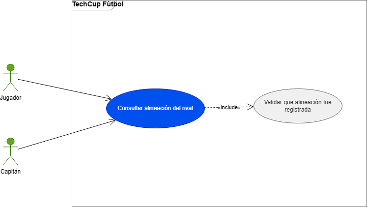

**Prototipo**

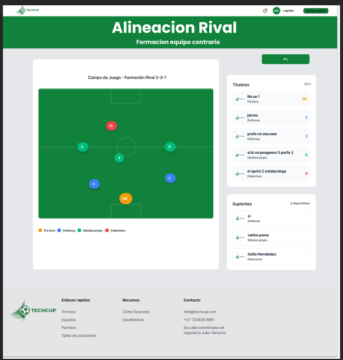

**REGLAS DE NEGOCIO**

| No. | Descripción |
|-----|------------|
| 1 | La alineación rival solo es visible una vez que el capitán contrario la haya registrado. |

**HISTORIAL DE REVISIÓN**

| Elaborado por | Aprobado por | Fecha | Descripción y Justificación de Cambios |
|--------------|-------------|-------|----------------------------------------|
| Shawarma FC | Juan Manuel Lopez Barrera | 23/03/2026 | Adición de prototipo e historia de usuario a cada requerimiento |
| Shawarma FC | Jeyder Nicolay Leon Lancheros | 02/04/2026 | Ajuste de consulta de alineación al acceso real por identificador y listado general de alineaciones registradas. |
 
---

## RF_17 — Registrar partido

| | |
|---|---|
| **FUNCIONALIDAD:** | |
| **Código:** | RF_17 |
| **Nombre:** | Registrar partido |

| | |
|---|---|
| **Descripción:** | El backend permite registrar operativamente un partido en dos momentos: el organizador crea el partido programado y el árbitro gestiona su inicio, resultado, goleadores, sanciones y finalización. |
| **Cómo se ejecutará:** | Mediante las operaciones de creación de partido para organizadores y de gestión de partido para árbitros. |
| **Actor principal:** | Organizador, Árbitro |
| **Precondiciones:** | Para crear el partido deben existir el torneo y los dos equipos. Para registrar resultado, goleadores o sanciones, el partido debe existir y estar en curso. |

**DATOS DE ENTRADA**

| Nombre                    | Descripción                       | Tipo de campo | Reglas / Aplicación | Obligatorio |
|---------------------------|-----------------------------------|---------------|---------------------|-------------|
| ID del torneo             | Identificador del torneo          | String        | Obligatorio para crear el partido | Sí |
| ID equipo local           | Identificador del equipo local    | String        | No puede ser igual al equipo visitante | Sí |
| ID equipo visitante       | Identificador del equipo visitante | String       | No puede ser igual al equipo local | Sí |
| Fecha del partido         | Fecha programada del partido      | LocalDateTime | Obligatoria para crear el partido | Sí |
| Cancha                    | Cancha asignada al partido        | String        | Obligatoria para crear el partido | Sí |
| Marcador equipo local     | Goles del equipo local            | Int           | Número entero ≥ 0 | Sí |
| Marcador equipo visitante | Goles del equipo visitante        | Int           | Número entero ≥ 0 | Sí |
| Goleadores                | Registro de goles por jugador y minuto | Datos compuestos | Se registra durante el partido en curso | No |
| Sanciones                 | Registro de sanciones por jugador | Datos compuestos | Incluye jugador, tipo de sanción y descripción | No |

**DATOS DE SALIDA**

| Nombre | Descripción | Tipo de campo | Reglas / Aplicación | Obligatorio |
|--------|------------|---------------|---------------------|-------------|
| Resultado registrado | El sistema retorna el objeto partido creado o actualizado | Objeto Partido | Estado inicial del partido: `PROGRAMADO` | Sí |

**FLUJO BÁSICO:**

| Paso | Actor | Descripción | Excepciones |
|------|-------|-------------|-------------|
| 1 | Organizador | Crea el partido enviando torneo, equipos, fecha y cancha | Torneo o equipos no encontrados |
| 2 | Sistema | Registra el partido con estado `PROGRAMADO` | Equipo local y visitante iguales |
| 3 | Árbitro | Inicia el partido y registra resultado, goleadores o sanciones según corresponda | Partido no encontrado o no iniciado |
| 4 | Sistema | Actualiza el partido y permite finalizarlo cuando el árbitro lo indique | Marcador inválido o partido fuera de estado |

**FLUJO ALTERNO:**

| Paso | Actor | Descripción | Excepciones |
|------|-------|-------------|-------------|
| 3 | Sistema | Si el partido no está en `EN_CURSO`, responde con error para el registro de resultado, goles o sanciones | |
| 4 | Sistema | Si el marcador es negativo o los equipos son iguales al crear, responde con error y no procesa la operación | |

| | |
|---|---|
| **Notas y comentarios:** | La tabla de posiciones y las estadísticas se calculan al consultar los endpoints del torneo a partir de los partidos almacenados. |

**Diagrama casos de uso**

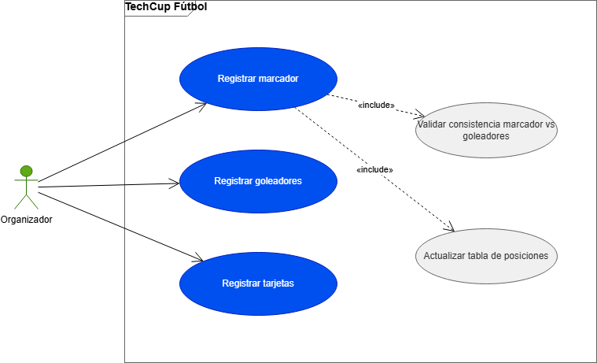

**Prototipo**

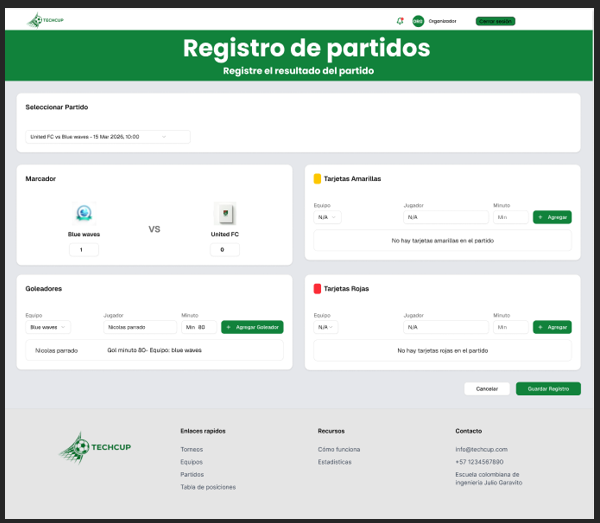

**REGLAS DE NEGOCIO**

| No. | Descripción |
|-----|------------|
| 1 | El equipo local y el visitante no pueden ser el mismo. |
| 2 | El marcador no puede contener valores negativos. |
| 3 | El resultado, los goles y las sanciones solo pueden registrarse cuando el partido está en `EN_CURSO`. |

**HISTORIAL DE REVISIÓN**

| Elaborado por | Aprobado por | Fecha | Descripción y Justificación de Cambios |
|--------------|-------------|-------|----------------------------------------|
| Shawarma FC | Juan Manuel Lopez Barrera | 23/03/2026 | Adición de prototipo e historia de usuario a cada requerimiento |
| Shawarma FC | Jeyder Nicolay Leon Lancheros | 02/04/2026 | Ajuste del registro de partido al flujo real: creación por organizador y gestión operativa por árbitro. |
 
---

## RF_18 — Consultar partido (árbitro)

| | |
|---|---|
| **FUNCIONALIDAD:** | |
| **Código:** | RF_18 |
| **Nombre:** | Consultar partido (árbitro) |

| | |
|---|---|
| **Descripción:** | El árbitro consulta la información de los partidos que debe arbitrar. |
| **Cómo se ejecutará:** | Mediante una vista de partidos asignados en la plataforma. |
| **Actor principal:** | Árbitro |
| **Precondiciones:** | El árbitro debe estar autenticado. |

**DATOS DE ENTRADA**

| Nombre | Descripción | Tipo de campo | Reglas / Aplicación | Obligatorio |
|--------|------------|---------------|---------------------|-------------|
| — | No requiere entrada, se muestran los partidos asignados | — | | — |

**DATOS DE SALIDA**

| Nombre  | Descripción | Tipo de campo | Reglas / Aplicación | Obligatorio |
|---------|------------|---------------|---------------------|-------------|
| Hora    | Fecha y hora del partido | LocalTime          | | Sí |
| Fecha   | Fecha y hora del partido | Date          | | Sí |
| Cancha  | Cancha donde se juega | String          | | Sí |
| Equipos | Equipos que disputarán el partido | Objeto Partido / Equipos asociados  | Incluye equipo local y visitante | Sí |

**FLUJO BÁSICO:**

| Paso | Actor | Descripción | Excepciones |
|------|-------|-------------|-------------|
| 1 | Árbitro | Accede a su panel de partidos | |
| 2 | Sistema | Muestra los partidos asignados con fecha, hora, cancha, estado y equipos | Sin partidos asignados |

**FLUJO ALTERNO:**

| Paso | Actor | Descripción | Excepciones |
|------|-------|-------------|-------------|
| 2 | Sistema | Si no tiene partidos asignados, muestra mensaje informativo | |

| | |
|---|---|
| **Notas y comentarios:** | El backend retorna la colección de partidos asignados al árbitro; si no existen asignaciones, la respuesta es una lista vacía. |

**Diagrama casos de uso**

**Prototipo**

**REGLAS DE NEGOCIO**

| No. | Descripción |
|-----|------------|
| 1 | El árbitro solo puede ver los partidos que le han sido asignados. |

**HISTORIAL DE REVISIÓN**

| Elaborado por | Aprobado por | Fecha | Descripción y Justificación de Cambios |
|--------------|-------------|-------|----------------------------------------|
| Shawarma FC | Juan Manuel Lopez Barrera | 23/03/2026 | Adición de prototipo e historia de usuario a cada requerimiento |
| Shawarma FC | Jeyder Nicolay Leon Lancheros | 02/04/2026 | Ajuste de consulta de partidos del árbitro a los datos realmente retornados para encuentros asignados. |
 
---

## RF_19 — Tabla de posiciones

| | |
|---|---|
| **FUNCIONALIDAD:** | |
| **Código:** | RF_19 |
| **Nombre:** | Tabla de posiciones |

| | |
|---|---|
| **Descripción:** | El sistema calcula y retorna la tabla de posiciones de un torneo a partir de los partidos finalizados. |
| **Cómo se ejecutará:** | Mediante la consulta de la tabla de posiciones por identificador del torneo. |
| **Actor principal:** | Sistema (consulta: todos los usuarios) |
| **Precondiciones:** | El usuario debe estar autenticado. |

**DATOS DE ENTRADA**

| Nombre | Descripción | Tipo de campo | Reglas / Aplicación | Obligatorio |
|--------|------------|---------------|---------------------|-------------|
| ID del torneo | Identificador del torneo a consultar | String | Obligatorio para calcular la tabla | Sí |

**DATOS DE SALIDA**

| Nombre | Descripción | Tipo de campo | Reglas / Aplicación | Obligatorio |
|--------|------------|---------------|---------------------|-------------|
| Equipo | Nombre del equipo | String        | | Sí |
| Partidos jugados | Total de partidos por equipo | Int           | | Sí |
| Partidos ganados | Partidos ganados por equipo | Int           | | Sí |
| Partidos empatados | Partidos empatados por equipo | Int           | | Sí |
| Partidos perdidos | Partidos perdidos por equipo | Int           | | Sí |
| Goles a favor | Goles anotados por equipo | Int           | | Sí |
| Goles en contra | Goles recibidos por equipo | Int           | | Sí |
| Diferencia de gol | Dato no retornado explícitamente por el endpoint | No aplica     | Puede inferirse a partir de goles a favor y en contra | No |
| Puntos | Puntos acumulados por equipo | Int           | Victoria: 3 pts, Empate: 1 pt, Derrota: 0 pts | Sí |

**FLUJO BÁSICO:**

| Paso | Actor | Descripción | Excepciones |
|------|-------|-------------|-------------|
| 1 | Usuario | Accede a la sección de tabla de posiciones | |
| 2 | Sistema | Calcula y muestra la tabla ordenada por puntos usando solo partidos finalizados | |

**FLUJO ALTERNO:**

| Paso | Actor | Descripción | Excepciones |
|------|-------|-------------|-------------|
| 2 | Sistema | Si no hay partidos registrados, muestra tabla vacía | |

| | |
|---|---|
| **Notas y comentarios:** | La tabla se genera en tiempo de consulta a partir de los partidos almacenados del torneo. |

**Diagrama casos de uso**

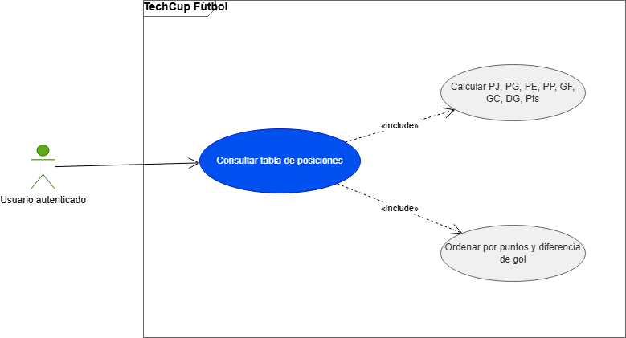

**Prototipo**

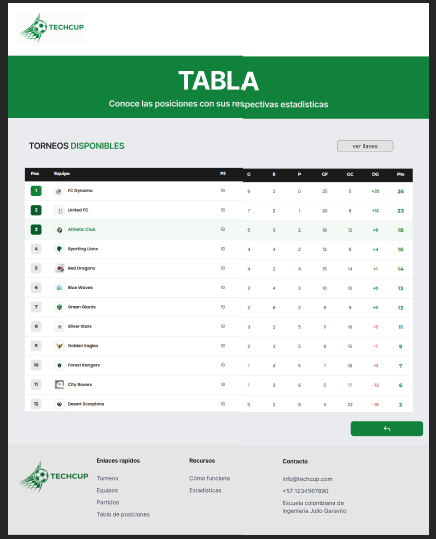

**REGLAS DE NEGOCIO**

| No. | Descripción |
|-----|------------|
| 1 | Victoria = 3 puntos, Empate = 1 punto, Derrota = 0 puntos. |
| 2 | La tabla se ordena por puntos en orden descendente. |

**HISTORIAL DE REVISIÓN**

| Elaborado por | Aprobado por | Fecha | Descripción y Justificación de Cambios |
|--------------|-------------|-------|----------------------------------------|
| Shawarma FC | Juan Manuel Lopez Barrera | 23/03/2026 | Adición de prototipo e historia de usuario a cada requerimiento |
| Shawarma FC | Jeyder Nicolay Leon Lancheros | 02/04/2026 | Ajuste de tabla de posiciones al cálculo real con partidos finalizados y orden descendente por puntos. |
 
---

## RF_20 — Llaves eliminatorias

| | |
|---|---|
| **FUNCIONALIDAD:** | |
| **Código:** | RF_20 |
| **Nombre:** | Llaves eliminatorias |

| | |
|---|---|
| **Descripción:** | El sistema retorna la información de los partidos de un torneo para representar visualmente sus llaves o bracket. |
| **Cómo se ejecutará:** | Mediante la consulta del bracket por identificador del torneo. |
| **Actor principal:** | Sistema (consulta: todos los usuarios) |
| **Precondiciones:** | El usuario debe estar autenticado. |

**DATOS DE ENTRADA**

| Nombre | Descripción | Tipo de campo | Reglas / Aplicación | Obligatorio |
|--------|------------|---------------|---------------------|-------------|
| ID del torneo | Identificador del torneo a consultar | String | Obligatorio para consultar el bracket | Sí |

**DATOS DE SALIDA**

| Nombre | Descripción | Tipo de campo | Reglas / Aplicación | Obligatorio |
|--------|------------|---------------|---------------------|-------------|
| Partido ID | Identificador del partido | String | | Sí |
| Local | Nombre del equipo local | String | Si el equipo no existe en el dato, se retorna `TBD` | Sí |
| Visitante | Nombre del equipo visitante | String | Si el equipo no existe en el dato, se retorna `TBD` | Sí |
| Marcador | Marcador actual del partido | String | Formato `golesLocal - golesVisitante` | Sí |
| Estado | Estado del partido | Enum | `PROGRAMADO`, `EN_CURSO` o `FINALIZADO` | Sí |
| Fecha | Fecha del partido | LocalDateTime | | Sí |

**FLUJO BÁSICO:**

| Paso | Actor | Descripción | Excepciones |
|------|-------|-------------|-------------|
| 1 | Usuario | Consulta el bracket del torneo por su identificador | |
| 2 | Sistema | Recupera los partidos asociados al torneo y construye la respuesta del bracket | |
| 3 | Sistema | Retorna la lista de encuentros con local, visitante, marcador, estado y fecha | |

**FLUJO ALTERNO:**

| Paso | Actor | Descripción | Excepciones |
|------|-------|-------------|-------------|
| 2 | Sistema | Si el torneo no tiene partidos registrados, retorna una lista vacía | |

| | |
|---|---|
| **Notas y comentarios:** | El backend no genera rondas eliminatorias automáticamente; expone la colección de partidos existentes del torneo. |

**Diagrama casos de uso**

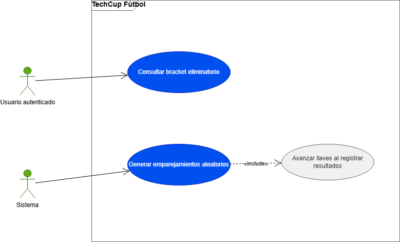

**Prototipo**

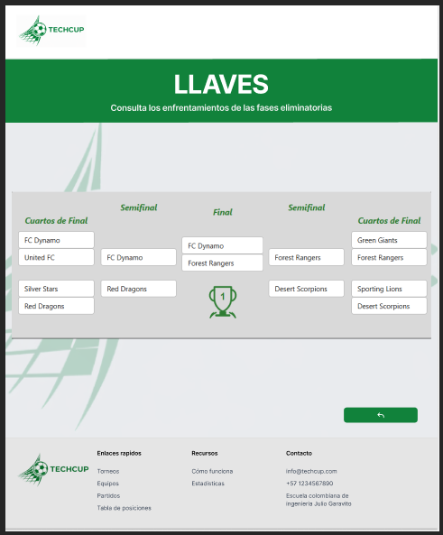

**REGLAS DE NEGOCIO**

| No. | Descripción |
|-----|------------|
| 1 | El bracket se construye con los partidos ya registrados del torneo. |

**HISTORIAL DE REVISIÓN**

| Elaborado por | Aprobado por | Fecha | Descripción y Justificación de Cambios |
|--------------|-------------|-------|----------------------------------------|
| Shawarma FC | Juan Manuel Lopez Barrera | 23/03/2026 | Adición de prototipo e historia de usuario a cada requerimiento |
| Shawarma FC | Jeyder Nicolay Leon Lancheros | 02/04/2026 | Ajuste de llaves eliminatorias para documentar el bracket construido con partidos registrados, sin generación automática de rondas. |
 
---

## RF_21 — Estadísticas

| | |
|---|---|
| **FUNCIONALIDAD:** | |
| **Código:** | RF_21 |
| **Nombre:** | Estadísticas |

| | |
|---|---|
| **Descripción:** | El sistema permite consultar estadísticas generales del torneo basadas en la cantidad de partidos y goles registrados. |
| **Cómo se ejecutará:** | Mediante la consulta de estadísticas por identificador del torneo. |
| **Actor principal:** | Todos los usuarios autenticados |
| **Precondiciones:** | El usuario debe estar autenticado. |

**DATOS DE ENTRADA**

| Nombre | Descripción | Tipo de campo | Reglas / Aplicación | Obligatorio |
|--------|------------|---------------|---------------------|-------------|
| Filtro por equipo | Filtro no implementado en la operación actual | No aplica     | No se recibe en la solicitud | No |
| ID del torneo | Identificador del torneo a consultar | String | Obligatorio para calcular estadísticas | Sí |

**DATOS DE SALIDA**

| Nombre | Descripción | Tipo de campo | Reglas / Aplicación | Obligatorio |
|--------|------------|---------------|---------------------|-------------|
| Total de partidos | Cantidad total de partidos registrados | Int | | Sí |
| Finalizados | Cantidad de partidos finalizados | Int | | Sí |
| En curso | Cantidad de partidos en curso | Int | | Sí |
| Programados | Cantidad de partidos programados | Int | | Sí |
| Total de goles | Suma de goles registrados en los partidos del torneo | Int | | Sí |
| Promedio de goles por partido | Promedio de goles usando partidos finalizados | Double | Si no hay partidos finalizados, el promedio es 0 | Sí |

**FLUJO BÁSICO:**

| Paso | Actor | Descripción | Excepciones |
|------|-------|-------------|-------------|
| 1 | Usuario | Consulta las estadísticas del torneo por su identificador | |
| 2 | Sistema | Calcula totales de partidos, estados y goles del torneo | |
| 3 | Sistema | Retorna el resumen estadístico calculado | Sin datos disponibles |

**FLUJO ALTERNO:**

| Paso | Actor | Descripción | Excepciones |
|------|-------|-------------|-------------|
| 3 | Sistema | Si no hay partidos registrados, retorna estadísticas con valores en 0 | |

| | |
|---|---|
| **Notas y comentarios:** | El promedio de goles se calcula únicamente con los partidos finalizados. |

**Diagrama casos de uso**

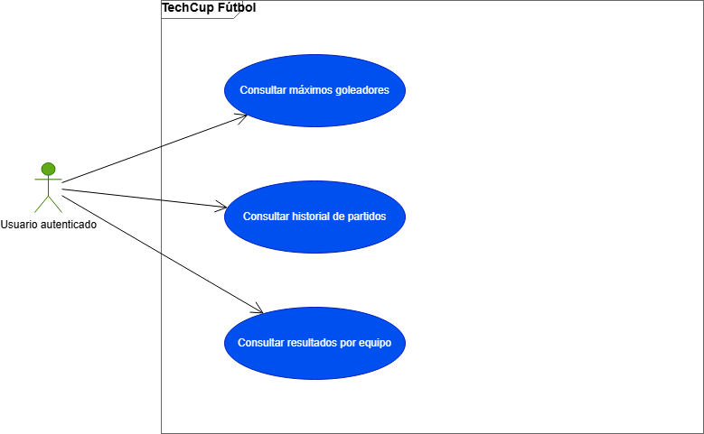

**Prototipo**

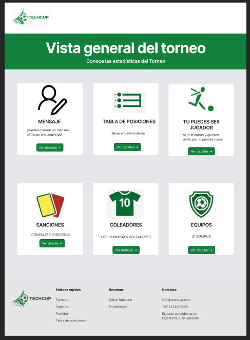

**REGLAS DE NEGOCIO**

| No. | Descripción |
|-----|------------|
| 1 | Las estadísticas se calculan en tiempo real a partir de los datos registrados. |

**HISTORIAL DE REVISIÓN**

| Elaborado por | Aprobado por | Fecha | Descripción y Justificación de Cambios |
|--------------|-------------|-------|----------------------------------------|
| Shawarma FC | Juan Manuel Lopez Barrera | 23/03/2026 | Adición de prototipo e historia de usuario a cada requerimiento |
| Shawarma FC | Jeyder Nicolay Leon Lancheros | 02/04/2026 | Ajuste de estadísticas al resumen real de partidos, estados, goles y promedio calculado por el backend. |
 
---

## RF_22 — Registrar organizadores y árbitros

| | |
|---|---|
| **FUNCIONALIDAD:** | |
| **Código:** | RF_22 |
| **Nombre:** | Registrar organizadores y árbitros |

| | |
|---|---|
| **Descripción:** | El administrador registra manualmente usuarios con rol de organizador o árbitro mediante el servicio administrativo del backend. |
| **Cómo se ejecutará:** | Mediante el endpoint administrativo de registro, usando encabezados de sesión válidos del administrador. |
| **Actor principal:** | Administrador |
| **Precondiciones:** | El administrador debe haber iniciado sesión, contar con una sesión válida y el correo del usuario a registrar no debe existir previamente. |

**DATOS DE ENTRADA**

| Nombre | Descripción | Tipo de campo | Reglas / Aplicación                  | Obligatorio |
|--------|------------|---------------|--------------------------------------|-------------|
| Nombre completo | Nombre del usuario a registrar | String        |                                      | Sí |
| Correo electrónico | Correo del organizador o árbitro | String        | No debe estar registrado previamente | Sí |
| Tipo de usuario | Tipo de usuario base del nuevo registro | Enum        | Debe enviarse y el correo debe corresponder con ese tipo | Sí |
| Rol | Tipo de rol a asignar | Selector      | Solo se permiten `ORGANIZADOR` o `ARBITRO` | Sí |
| Contraseña temporal | Contraseña inicial de acceso | String        | Debe cumplir requisitos de seguridad | Sí |

**DATOS DE SALIDA**

| Nombre | Descripción | Tipo de campo | Reglas / Aplicación | Obligatorio |
|--------|------------|---------------|---------------------|-------------|
| Cuenta creada | El sistema confirma el registro del nuevo usuario con su rol asignado | String        | Mensaje: `Usuario registrado correctamente.` | Sí |

**FLUJO BÁSICO:**

| Paso | Actor | Descripción | Excepciones |
|------|-------|-------------|-------------|
| 1 | Administrador | Accede al panel de gestión de usuarios | |
| 2 | Administrador | Envía nombre, correo, tipo de usuario, rol y contraseña temporal junto con sus encabezados de sesión | |
| 3 | Sistema | Valida sesión del administrador, formato de datos, dominio del correo, unicidad del correo y rol permitido | Correo duplicado, sesión inválida, rol no permitido o datos inválidos |
| 4 | Sistema | Crea la cuenta con el rol asignado y registra el evento en auditoría | |

**FLUJO ALTERNO:**

| Paso | Actor | Descripción | Excepciones |
|------|-------|-------------|-------------|
| 3 | Sistema | Si el correo ya existe o los datos son inválidos, muestra mensaje de error y permite corregir | |

| | |
|---|---|
| **Notas y comentarios:** | El registro administrativo genera un evento de auditoría para organizadores y árbitros creados por el administrador. |

**Diagrama casos de uso**

**Prototipo**

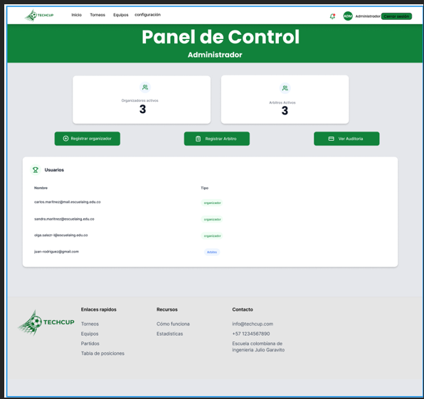

**REGLAS DE NEGOCIO**

| No. | Descripción |
|-----|------------|
| 1 | Solo el administrador puede registrar usuarios con rol de Organizador o Árbitro. |
| 2 | No se permiten cuentas duplicadas con el mismo correo. |
| 3 | La contraseña debe tener mínimo 8 caracteres. |
| 4 | Solo se permiten los roles `ORGANIZADOR` y `ARBITRO`. |

**HISTORIAL DE REVISIÓN**

| Elaborado por | Aprobado por | Fecha | Descripción y Justificación de Cambios |
|--------------|-------------|-------|----------------------------------------|
| Shawarma FC | Juan Manuel Lopez Barrera | 23/03/2026 | Adición de prototipo e historia de usuario a cada requerimiento |
| Shawarma FC | Jeyder Nicolay Leon Lancheros | 02/04/2026 | Ajuste del registro administrativo a sesión válida de administrador, roles permitidos y evento de auditoría generado. |
 
---

## RF_23 — Consulta Auditoría

| | |
|---|---|
| **Código:** | RF_23 |
| **Nombre:** | Consulta Auditoría |

| | |
|---|---|
| **Descripción:** | El administrador puede consultar el historial de acciones administrativas registradas por el backend. |
| **Cómo se ejecutará:** | Mediante la operación de consulta de auditoría con filtros opcionales y encabezados de sesión del administrador. |
| **Actor principal:** | Administrador |
| **Precondiciones:** | El administrador debe haber iniciado sesión y contar con un identificador y token de sesión válidos. |

**DATOS DE ENTRADA**

| Nombre | Descripción | Tipo de campo | Reglas / Aplicación | Obligatorio |
|--------|------------|---------------|---------------------|-------------|
| Filtrar por usuario | Filtrar movimientos por usuario específico | String | Coincidencia parcial opcional | No |
| Tipo de acción | Filtrar movimientos por tipo de acción realizada | Enum | Valores válidos: `LOGIN_ADMIN`, `REGISTRO_ORGANIZADOR`, `REGISTRO_ARBITRO` | No |
| Rango de fechas | Filtrar movimientos por periodo de tiempo | LocalDate | Se envía como `fechaDesde` y `fechaHasta` | No |

**DATOS DE SALIDA**

| Nombre | Descripción | Tipo de campo | Reglas / Aplicación | Obligatorio |
|--------|------------|---------------|---------------------|-------------|
| Fecha y hora | Fecha y hora en que ocurrió la acción | LocalDateTime | | Sí |
| Acción | Descripción textual del evento registrado | String | Corresponde al campo `descripcion` del registro | Sí |
| Usuario | Usuario asociado al evento | String | | Sí |
| Tipo | Tipo de acción auditada | Enum | `LOGIN_ADMIN`, `REGISTRO_ORGANIZADOR`, `REGISTRO_ARBITRO` | Sí |

**FLUJO BÁSICO:**

| Paso | Actor | Descripción | Excepciones |
|------|-------|-------------|-------------|
| 1 | Administrador | Accede al panel de auditoría | |
| 2 | Administrador | Envía filtros opcionales de usuario, tipo de acción y rango de fechas | |
| 3 | Sistema | Valida la sesión del administrador y la consistencia de los filtros enviados | Sesión inválida o filtros inválidos |
| 4 | Sistema | Retorna el historial de acciones que coinciden con los filtros en orden descendente por fecha | Sin resultados |

**FLUJO ALTERNO:**

| Paso | Actor | Descripción | Excepciones |
|------|-------|-------------|-------------|
| 4 | Sistema | Si no hay registros, retorna el mensaje `No se encontraron registros para los filtros indicados.` | |

| | |
|---|---|
| **Notas y comentarios:** | Los eventos auditados por el backend actual corresponden al inicio de sesión del administrador y al registro administrativo de organizadores y árbitros. |

**Diagrama casos de uso**

**Prototipo**

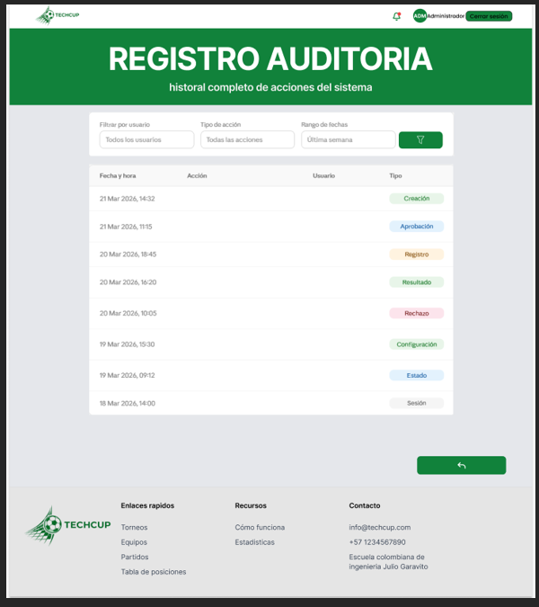

**REGLAS DE NEGOCIO**

| No. | Descripción |
|-----|------------|
| 1 | Solo el administrador puede consultar la auditoría. |
| 2 | El historial se ordena por fecha descendente. |
| 3 | El rango de fechas debe ser consistente: `fechaDesde` no puede ser posterior a `fechaHasta`. |

**HISTORIAL DE REVISIÓN**

| Elaborado por | Aprobado por | Fecha | Descripción y Justificación de Cambios |
|--------------|-------------|-------|----------------------------------------|
| Shawarma FC | Juan Manuel Lopez Barrera | 23/03/2026 | Adición de prototipo e historia de usuario a cada requerimiento |
| Shawarma FC | Jeyder Nicolay Leon Lancheros | 02/04/2026 | Ajuste de auditoría a los filtros, tipos de acción y reglas realmente soportados por el backend. |

# Requerimientos No Funcionales

| Código | Nombre | Descripción                                                                           |
|--------|--------|---------------------------------------------------------------------------------------|
| RNF_01 | Paleta de colores | La interfaz debe usar en su mayoria blanco, verde y negro (y sus tonalidades).        |
| RNF_02 | Diseño responsive | La plataforma debe adaptarse a móvil, tablet y escritorio (desde 320px hasta 1920px). |
| RNF_03 | Tiempo de respuesta | Todas las páginas y operaciones deben responder en menos de 3 segundos.               |
| RNF_04 | Cifrado de contraseñas | Las contraseñas deben almacenarse cifradas con bcrypt o equivalente.                  |
| RNF_05 | Límite de archivos | Soporte para carga de archivos de hasta 5 MB (JPG, PNG, PDF).                         |
| RNF_06 | Disponibilidad del sistema | Disponibilidad mínima del 95% durante el periodo activo del torneo.                   |
| RNF_07 | Compatibilidad de navegadores | Debe funcionar correctamente en Chrome, Firefox, Edge y Safari (últimas 2 versiones). |
