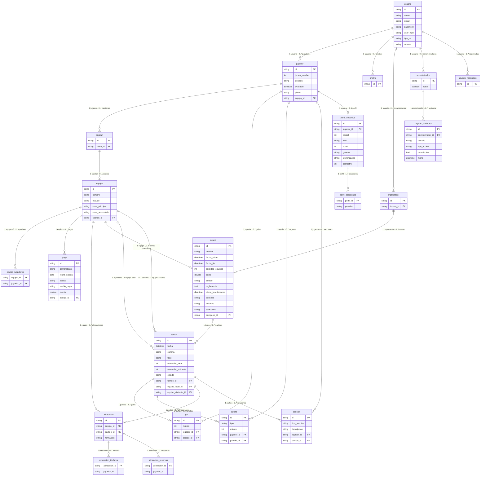

# Diagrama de Entidad-Relación

Este diagrama muestra cómo se organiza toda la información del torneo en la base de datos. Cada bloque es una tabla donde se guardan datos, y las líneas entre ellas muestran cómo se conectan. Por ejemplo, un partido siempre pertenece a un torneo, y un gol siempre pertenece a un partido.

---

## ¿Qué significa cada tabla?

- **usuario** — Guarda la información básica de todas las personas del sistema: nombre, correo y contraseña. De aquí parten todos los demás tipos de usuario.
- **jugador** — Es un usuario que además tiene número de camiseta, posición y foto.
- **capitan** — Es un jugador que además lidera un equipo.
- **arbitro** — Es un usuario que dirige los partidos.
- **organizador** — Es un usuario que crea y gestiona el torneo.
- **administrador** — Es quien registra a los organizadores y árbitros, y tiene acceso al historial de acciones.
- **usuario_registrado** — Es quien se registra directamente en la plataforma o con Google.
- **equipo** — Agrupa a los jugadores bajo un capitán, con nombre, escudo y colores.
- **torneo** — Tiene toda la información de la competencia: fechas, costo, reglamento, canchas y horarios.
- **partido** — Es cada enfrentamiento entre dos equipos dentro del torneo.
- **gol** — Registra cada gol: en qué minuto fue y quién lo hizo.
- **tarjeta** — Registra cada tarjeta (amarilla o roja): en qué minuto y a quién.
- **sancion** — Registra sanciones más graves como agresiones verbales o físicas.
- **pago** — Es el comprobante que sube el capitán para inscribir a su equipo.
- **alineacion** — Es la formación táctica que define el capitán antes de cada partido.
- **perfil_deportivo** — Guarda información deportiva detallada del jugador: edad, dorsal, género y semestre.
- **registro_auditoria** — Guarda un historial de todas las acciones importantes que hace el administrador.

---

