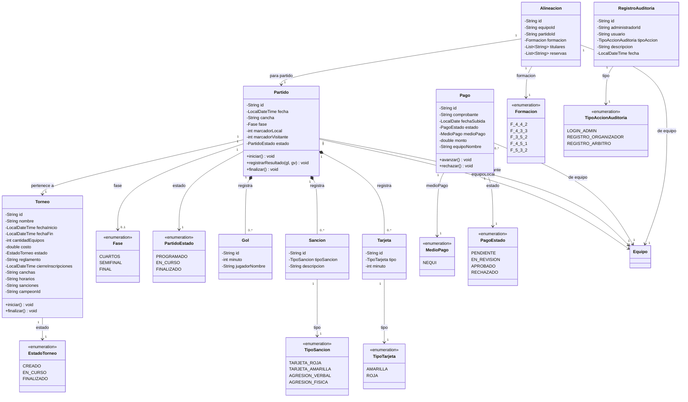

# Clases — Parte 2: Torneo, Partido, Pago y Alineacion

Aca se muestra el corazon del torneo: como se organiza la competencia, como se juegan los partidos, como se manejan los pagos y como se registran las alineaciones.

Un `Torneo` puede estar en tres momentos: recien creado, en curso o finalizado. Dentro del torneo se juegan `Partido`s, cada uno entre dos equipos (local y visitante). Durante un partido se pueden registrar `Gol`es, `Sancion`es y `Tarjeta`s. Un partido tambien pasa por estados: programado, en curso y finalizado.

El `Pago` es el comprobante que sube el capitan para inscribir a su equipo. Empieza como pendiente, pasa a revision y termina aprobado o rechazado. La `Alineacion` es la formacion tactica que define el capitan antes de cada partido, con los jugadores titulares y reservas.

El `RegistroAuditoria` guarda un historial de las acciones importantes que hace el administrador, como registrar un organizador o un arbitro.

---

