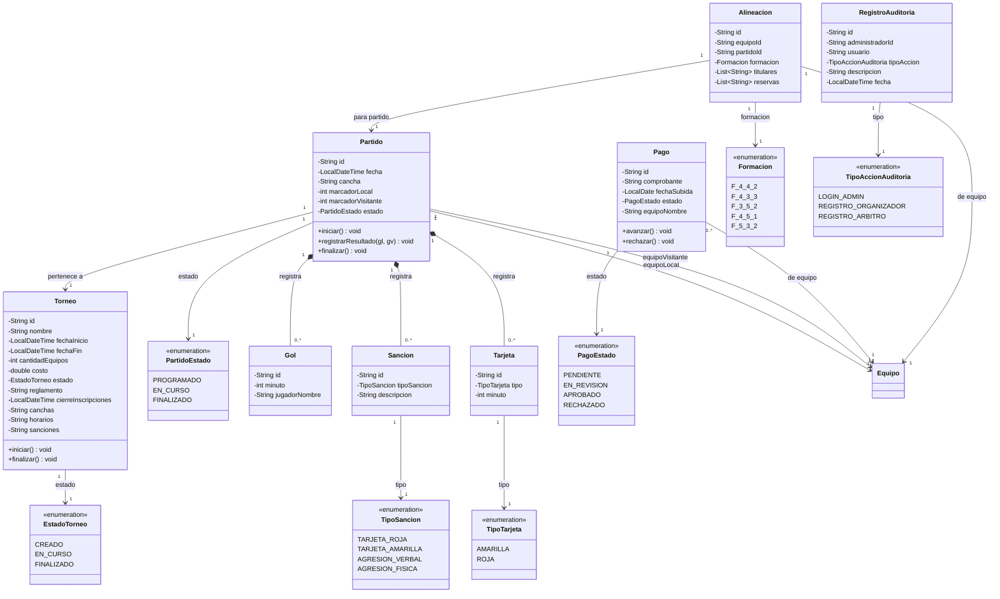

# Clases — Parte 2: Torneo, Partido, Pago y Alineación

Acá se muestra el corazón del torneo: cómo se organiza la competencia, cómo se juegan los partidos, cómo se manejan los pagos y cómo se registran las alineaciones.

Un `Torneo` puede estar en tres momentos: recién creado, en curso o finalizado. Dentro del torneo se juegan `Partido`s, cada uno entre dos equipos (local y visitante). Durante un partido se pueden registrar `Gol`es, `Sancion`es y `Tarjeta`s. Un partido también pasa por estados: programado, en curso y finalizado.

El `Pago` es el comprobante que sube el capitán para inscribir a su equipo. Empieza como pendiente, pasa a revisión y termina aprobado o rechazado. La `Alineacion` es la formación táctica que define el capitán antes de cada partido, con los jugadores titulares y reservas.

---

