# Clases — Parte 3: Patrones de Diseño y Seguridad

Acá se muestra cómo el sistema maneja dos cosas importantes: los cambios de estado y las notificaciones, y cómo protege el acceso.

**Patrón State** — En lugar de tener un montón de condiciones `if` para saber qué se puede hacer en cada momento, cada objeto sabe en qué estado está y qué acciones permite. Por ejemplo, un partido en estado `PROGRAMADO` no puede registrar goles, pero uno `EN_CURSO` sí. Lo mismo pasa con los pagos y los torneos.

**Patrón Observer** — Cuando pasa algo importante en el sistema (como que se crea un torneo o inicia un partido), el `Subject` avisa automáticamente a todos los que están escuchando. `NotificadorTorneo` y `LoggerObserver` son los que reciben esos avisos.

**Seguridad** — El `JwtService` genera y valida los tokens JWT que identifican a cada usuario. El `JwtFilter` revisa en cada petición que el token sea válido antes de dejar pasar. El `OAuth2Service` maneja el login con Google y devuelve solo el token, sin exponer datos personales.

---

```mermaid
classDiagram

    class PartidoState {
        <<interface>>
        +iniciar(partido) void
        +registrarResultado(partido, gl, gv) void
        +finalizar(partido) void
    }

    class ProgramadoState {
        +iniciar(partido) void
        +registrarResultado(partido, gl, gv) void
        +finalizar(partido) void
    }

    class EnCursoState {
        +iniciar(partido) void
        +registrarResultado(partido, gl, gv) void
        +finalizar(partido) void
    }

    class FinalizadoPartidoState {
        +iniciar(partido) void
        +registrarResultado(partido, gl, gv) void
        +finalizar(partido) void
    }

    class PagoState {
        <<interface>>
        +avanzar(pago) void
        +rechazar(pago) void
    }

    class PendienteState {
        +avanzar(pago) void
        +rechazar(pago) void
    }

    class EnRevisionState {
        +avanzar(pago) void
        +rechazar(pago) void
    }

    class AprobadoState {
        +avanzar(pago) void
        +rechazar(pago) void
    }

    class RechazadoState {
        +avanzar(pago) void
        +rechazar(pago) void
    }

    class EstadoTorneoInterface {
        <<interface>>
        +iniciar(torneo) EstadoTorneoInterface
        +finalizar(torneo) EstadoTorneoInterface
    }

    class TorneoCreado {
        +iniciar(torneo) EstadoTorneoInterface
        +finalizar(torneo) EstadoTorneoInterface
    }

    class TorneoEnCurso {
        +iniciar(torneo) EstadoTorneoInterface
        +finalizar(torneo) EstadoTorneoInterface
    }

    class TorneoFinalizado {
        +iniciar(torneo) EstadoTorneoInterface
        +finalizar(torneo) EstadoTorneoInterface
    }

    class Subject {
        <<abstract>>
        -List~Observer~ observers
        +agregarObserver(observer) void
        +removerObserver(observer) void
        +notificar(evento, datos) void
    }

    class Observer {
        <<interface>>
        +actualizar(evento, datos) void
    }

    class NotificadorTorneo {
        +actualizar(evento, datos) void
    }

    class LoggerObserver {
        +actualizar(evento, datos) void
    }

    class JwtService {
        -Key key
        -long TTL_MS
        +generarToken(email, rol) String
        +extraerEmail(token) String
        +extraerRol(token) String
        +esValido(token) boolean
    }

    class JwtFilter {
        +doFilterInternal(request, response, chain) void
    }

    class OAuth2Service {
        +procesarCallback(authentication) OAuth2Response
    }

    class OAuth2Response {
        -String token
        +getToken() String
    }

    class RolFuncional {
        <<enumeration>>
        ADMINISTRADOR
        ORGANIZADOR
        ARBITRO
        CAPITAN
        JUGADOR
    }

    PartidoState <|.. ProgramadoState : implements
    PartidoState <|.. EnCursoState : implements
    PartidoState <|.. FinalizadoPartidoState : implements

    PagoState <|.. PendienteState : implements
    PagoState <|.. EnRevisionState : implements
    PagoState <|.. AprobadoState : implements
    PagoState <|.. RechazadoState : implements

    EstadoTorneoInterface <|.. TorneoCreado : implements
    EstadoTorneoInterface <|.. TorneoEnCurso : implements
    EstadoTorneoInterface <|.. TorneoFinalizado : implements

    Subject "1" o-- "0..*" Observer : notifica a
    Observer <|.. NotificadorTorneo : implements
    Observer <|.. LoggerObserver : implements

    JwtFilter "1" --> "1" JwtService : valida con
    OAuth2Service "1" --> "1" JwtService : genera token con
    OAuth2Service "1" --> "1" OAuth2Response : retorna
    JwtService "1" --> "1" RolFuncional : usa en token
```

