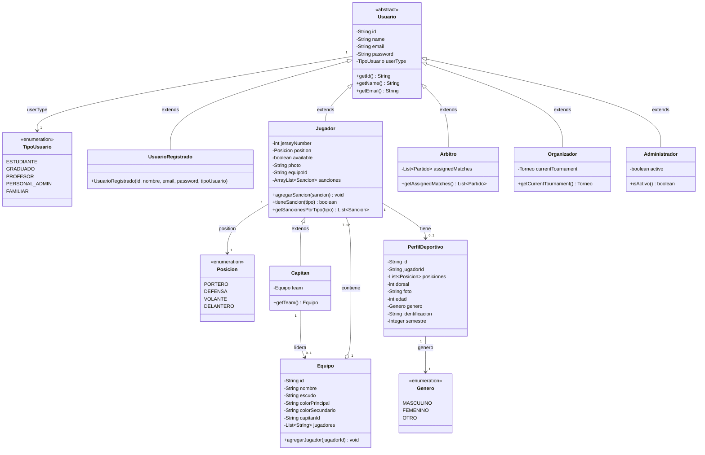

# Clases — Parte 1: Usuarios y Equipos

Acá se muestra quiénes pueden usar el sistema y cómo están organizados. Todos los actores del sistema — jugadores, capitanes, árbitros, organizadores y administradores — comparten una base común llamada `Usuario`, que tiene los datos básicos como nombre, correo y contraseña. Cada uno agrega sus propias características encima de esa base.

Por ejemplo, un `Jugador` tiene número de camiseta y posición en la cancha. Un `Capitán` es un jugador especial que además lidera un equipo. Un `Organizador` gestiona un torneo. Un `Árbitro` tiene asignados los partidos que va a dirigir.

El `Equipo` agrupa entre 7 y 12 jugadores bajo un capitán, y tiene nombre, escudo y colores. Cada jugador puede tener un `PerfilDeportivo` con información más detallada como edad, dorsal, género y semestre.

---

