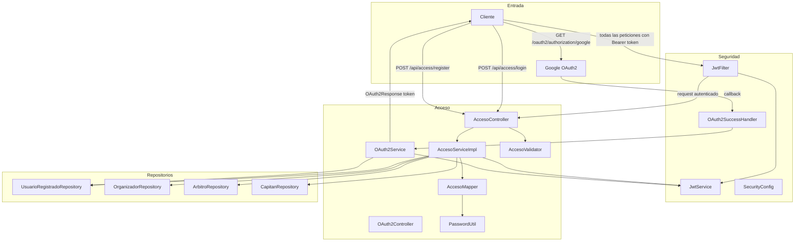

# Componentes — Acceso y Seguridad

Acá se muestra cómo entra un usuario al sistema. Hay dos formas: con correo y contraseña, o con Google. En ambos casos el sistema devuelve un token JWT que el usuario debe usar en todas las peticiones siguientes.

Cuando alguien se registra, el `AccesoValidator` verifica que el correo sea válido y que la contraseña cumpla los requisitos. La contraseña se guarda cifrada con BCrypt gracias a `PasswordUtil`. Cuando alguien hace login, el sistema detecta automáticamente si es organizador, árbitro, capitán o jugador y genera el token con el rol correcto.

Para el login con Google, el `OAuth2SuccessHandler` recibe el callback de Google, el `OAuth2Service` registra al usuario si es nuevo y devuelve solo el token, sin exponer datos personales.

---

