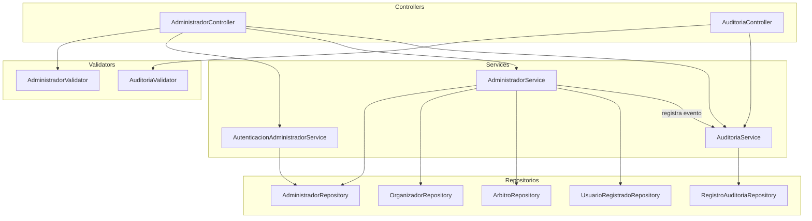

# Componentes — Administracion y Auditoria

Aca se muestra como funciona la parte administrativa del sistema. El administrador es el unico que puede registrar organizadores y arbitros, y tiene acceso al historial de auditoria.

El `AutenticacionAdministradorService` maneja la sesion del administrador con un token propio diferente al JWT de los demas usuarios. Cada accion importante que hace el administrador, como registrar un organizador o un arbitro, queda registrada automaticamente en el `RegistroAuditoria` gracias al `AuditoriaService`. El `AuditoriaValidator` verifica que los filtros de busqueda del historial sean validos.

---

