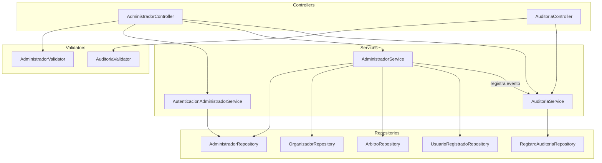

# Componentes — Administración y Auditoría

Acá se muestra cómo funciona la parte administrativa del sistema. El administrador es el único que puede registrar organizadores y árbitros, y tiene acceso al historial de auditoría.

El `AutenticacionAdministradorService` maneja la sesión del administrador con un token propio (diferente al JWT de los demás usuarios). Cada acción importante que hace el administrador — como registrar un organizador o un árbitro — queda registrada automáticamente en el `RegistroAuditoria` gracias al `AuditoriaService`. El `AuditoriaValidator` verifica que los filtros de búsqueda del historial sean válidos.

---

