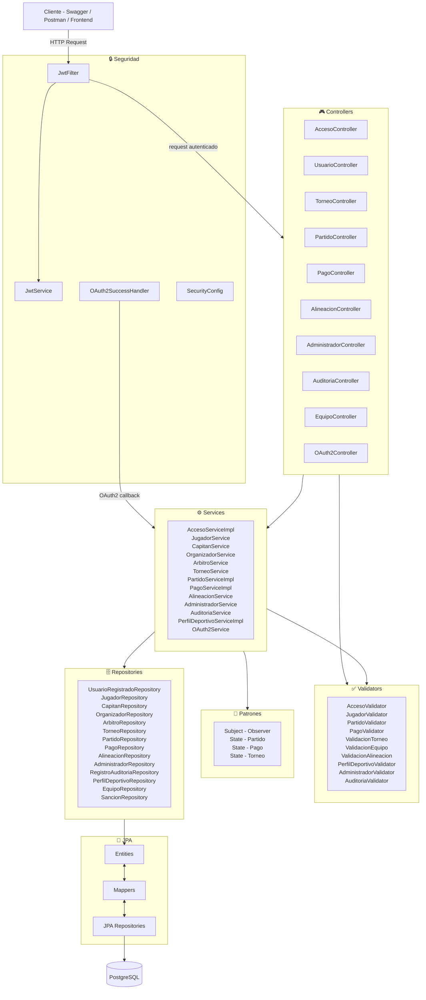

# Componentes — Arquitectura General

Acá se ve el sistema completo de un vistazo. Toda petición que llega del cliente pasa primero por el filtro JWT que verifica que el usuario tenga un token válido. Si lo tiene, la petición llega al controlador correspondiente. El controlador le pasa el trabajo al servicio, que contiene la lógica del negocio. El servicio usa los validadores para verificar que los datos estén bien, los patrones de diseño para manejar estados y notificaciones, y los repositorios para acceder a la base de datos PostgreSQL a través de la capa de persistencia JPA.

---

