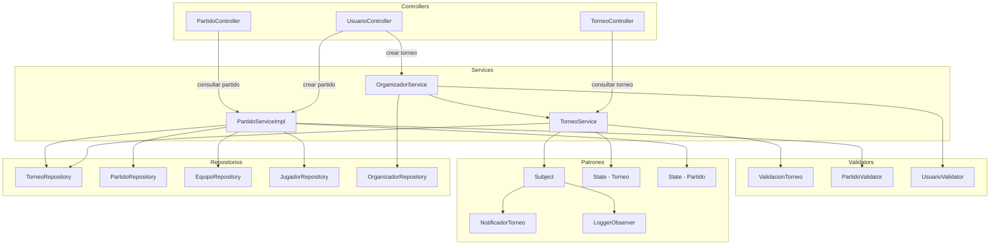

# Componentes — Torneo y Partido

Acá se muestra cómo funciona la gestión del torneo y los partidos. El organizador crea y gestiona el torneo, y el árbitro maneja los partidos.

Cuando se crea un torneo, el `TorneoService` lo guarda y notifica a los observers (como `NotificadorTorneo`) usando el patrón Observer. El torneo pasa por estados: creado → en curso → finalizado, controlados por el patrón State. Lo mismo pasa con los partidos: programado → en curso → finalizado. El `PartidoValidator` se asegura de que los datos sean correctos antes de crear o modificar un partido.

---

