# Componentes — Usuarios, Equipos y Pagos

Acá se muestra cómo se gestionan los jugadores, capitanes, árbitros, equipos, pagos y alineaciones.

El capitán puede crear su equipo, invitar jugadores y subir el comprobante de pago. El `JugadorValidator` verifica que el jugador esté disponible antes de ser invitado. El `PagoServiceImpl` maneja el ciclo de vida del pago usando el patrón State: pendiente → en revisión → aprobado o rechazado. El `PerfilDeportivoServiceImpl` gestiona la información deportiva de cada jugador.

---

```mermaid
graph TD
    subgraph Controllers["Controllers"]
        UC[UsuarioController]
        EC[EquipoController]
        PAC[PagoController]
        ALC[AlineacionController]
    end

    subgraph Services["Services"]
        JS[JugadorService]
        CS[CapitanService]
        ARS[ArbitroService]
        ES[EquipoService]
        PAS[PagoServiceImpl]
        ALS[AlineacionService]
        PDS[PerfilDeportivoServiceImpl]
    end

    subgraph Validators["Validators"]
        JV[JugadorValidator]
        PAV[PagoValidator]
        ALV[ValidacionAlineacion]
        EV[ValidacionEquipo]
        PDV[PerfilDeportivoValidator]
    end

    subgraph Patterns["Patrones"]
        SP[State - Pago]
        SA[Subject - Alineacion]
    end

    subgraph Repos["Repositorios"]
        JR[JugadorRepository]
        CR[CapitanRepository]
        ARR[ArbitroRepository]
        ER[EquipoRepository]
        PAR[PagoRepository]
        ALR[AlineacionRepository]
        PDR[PerfilDeportivoRepository]
    end

    UC --> JS
    UC --> CS
    UC --> ARS
    UC --> PAS
    UC --> ALS
    UC --> PDS
    EC --> ES
    PAC --> PAS
    PAC --> PAV
    ALC --> ALS
    JS --> JR
    JS --> JV
    CS --> CR
    CS --> JV
    ARS --> ARR
    ES --> ER
    ES --> EV
    PAS --> PAR
    PAS --> ER
    PAS --> PAV
    PAS --> SP
    ALS --> ALR
    ALS --> ALV
    ALS --> SA
    PDS --> PDR
    PDS --> JR
    PDS --> PDV
```

