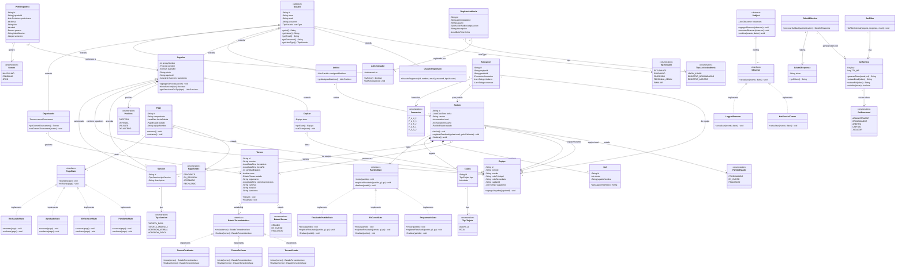

# Diagrama de Clases

Organización completa de las clases del sistema, sus atributos, métodos y relaciones con multiplicidades.

---

```mermaid
classDiagram

    %% ── Jerarquía de usuarios ──────────────────────────────────────────────

    class Usuario {
        <<abstract>>
        -String id
        -String name
        -String email
        -String password
        -TipoUsuario userType
        +getId() String
        +getName() String
        +getEmail() String
        +getPassword() String
        +getUserType() TipoUsuario
    }

    class TipoUsuario {
        <<enumeration>>
        ESTUDIANTE
        GRADUADO
        PROFESOR
        PERSONAL_ADMIN
        FAMILIAR
    }

    class UsuarioRegistrado {
        +UsuarioRegistrado(id, nombre, email, password, tipoUsuario)
    }

    class Jugador {
        -int jerseyNumber
        -Posicion position
        -boolean available
        -String photo
        -String equipoId
        -ArrayList~Sancion~ sanciones
        +agregarSancion(sancion) void
        +tieneSancion(tipo) boolean
        +getSancionesPorTipo(tipo) List~Sancion~
    }

    class Posicion {
        <<enumeration>>
        PORTERO
        DEFENSA
        VOLANTE
        DELANTERO
    }

    class Capitan {
        -Equipo team
        +getTeam() Equipo
        +setTeam(team) void
    }

    class Arbitro {
        -List~Partido~ assignedMatches
        +getAssignedMatches() List~Partido~
    }

    class Organizador {
        -Torneo currentTournament
        +getCurrentTournament() Torneo
        +setCurrentTournament(torneo) void
    }

    class Administrador {
        -boolean activo
        +isActivo() boolean
        +setActivo(activo) void
    }

    Usuario "1" --> "1" TipoUsuario : userType
    Usuario <|-- UsuarioRegistrado : extends
    Usuario <|-- Jugador : extends
    Usuario <|-- Arbitro : extends
    Usuario <|-- Organizador : extends
    Usuario <|-- Administrador : extends
    Jugador <|-- Capitan : extends
    Jugador "1" --> "1" Posicion : position

    %% ── Equipo ─────────────────────────────────────────────────────────────

    class Equipo {
        -String id
        -String nombre
        -String escudo
        -String colorPrincipal
        -String colorSecundario
        -String capitanId
        -List~String~ jugadores
        +agregarJugador(jugadorId) void
    }

    Capitan "1" --> "0..1" Equipo : lidera
    Equipo "1" o-- "7..12" Jugador : contiene jugadores

    %% ── Torneo ─────────────────────────────────────────────────────────────

    class Torneo {
        -String id
        -String nombre
        -LocalDateTime fechaInicio
        -LocalDateTime fechaFin
        -int cantidadEquipos
        -double costo
        -EstadoTorneo estado
        -String reglamento
        -LocalDateTime cierreInscripciones
        -String canchas
        -String horarios
        -String sanciones
        +iniciar() void
        +finalizar() void
    }

    class EstadoTorneo {
        <<enumeration>>
        CREADO
        EN_CURSO
        FINALIZADO
    }

    Torneo "1" --> "1" EstadoTorneo : estado
    Organizador "1" --> "0..1" Torneo : gestiona

    %% ── Perfil Deportivo ───────────────────────────────────────────────────

    class PerfilDeportivo {
        -String id
        -String jugadorId
        -List~Posicion~ posiciones
        -int dorsal
        -String foto
        -int edad
        -Genero genero
        -String identificacion
        -Integer semestre
    }

    class Genero {
        <<enumeration>>
        MASCULINO
        FEMENINO
        OTRO
    }

    PerfilDeportivo "0..1" --> "1" Jugador : pertenece a
    PerfilDeportivo "1" --> "1" Genero : genero

    %% ── Partido ────────────────────────────────────────────────────────────

    class Partido {
        -String id
        -LocalDateTime fecha
        -String cancha
        -int marcadorLocal
        -int marcadorVisitante
        -PartidoEstado estado
        +iniciar() void
        +registrarResultado(golesLocal, golesVisitante) void
        +finalizar() void
    }

    class PartidoEstado {
        <<enumeration>>
        PROGRAMADO
        EN_CURSO
        FINALIZADO
    }

    class Gol {
        -String id
        -int minuto
        -String jugadorNombre
        +getJugadorNombre() String
    }

    class Tarjeta {
        -String id
        -TipoTarjeta tipo
        -int minuto
    }

    class TipoTarjeta {
        <<enumeration>>
        AMARILLA
        ROJA
    }

    Partido "1" --> "1" PartidoEstado : estado
    Partido "1" --> "1" Equipo : equipoLocal
    Partido "1" --> "1" Equipo : equipoVisitante
    Partido "1" --> "1" Torneo : pertenece a
    Partido "1" *-- "0..*" Gol : contiene
    Partido "1" *-- "0..*" Sancion : registra
    Partido "1" *-- "0..*" Tarjeta : registra
    Tarjeta "1" --> "1" TipoTarjeta : tipo
    Arbitro "1" --> "0..*" Partido : arbitra

    %% ── Sancion ────────────────────────────────────────────────────────────

    class Sancion {
        -String id
        -TipoSancion tipoSancion
        -String descripcion
    }

    class TipoSancion {
        <<enumeration>>
        TARJETA_ROJA
        TARJETA_AMARILLA
        AGRESION_VERBAL
        AGRESION_FISICA
    }

    Sancion "1" --> "1" TipoSancion : tipo
    Sancion "1" --> "1" Jugador : sancionado
    Jugador "1" *-- "0..*" Sancion : acumula

    %% ── Alineacion ─────────────────────────────────────────────────────────

    class Alineacion {
        -String id
        -String equipoId
        -String partidoId
        -Formacion formacion
        -List~String~ titulares
        -List~String~ reservas
    }

    class Formacion {
        <<enumeration>>
        F_4_4_2
        F_4_3_3
        F_3_5_2
        F_4_5_1
        F_5_3_2
    }

    Alineacion "1" --> "1" Equipo : de equipo
    Alineacion "1" --> "1" Partido : para partido
    Alineacion "1" --> "1" Formacion : formacion

    %% ── Pago ───────────────────────────────────────────────────────────────

    class Pago {
        -String id
        -String comprobante
        -LocalDate fechaSubida
        -PagoEstado estado
        -String equipoNombre
        +avanzar() void
        +rechazar() void
    }

    class PagoEstado {
        <<enumeration>>
        PENDIENTE
        EN_REVISION
        APROBADO
        RECHAZADO
    }

    Pago "1" --> "1" PagoEstado : estado
    Pago "0..*" --> "1" Equipo : de equipo

    %% ── Auditoría ──────────────────────────────────────────────────────────

    class RegistroAuditoria {
        -String id
        -String administradorId
        -String usuario
        -TipoAccionAuditoria tipoAccion
        -String descripcion
        -LocalDateTime fecha
    }

    class TipoAccionAuditoria {
        <<enumeration>>
        LOGIN_ADMIN
        REGISTRO_ORGANIZADOR
        REGISTRO_ARBITRO
    }

    RegistroAuditoria "0..*" --> "1" Administrador : registrada por
    RegistroAuditoria "1" --> "1" TipoAccionAuditoria : tipo

    %% ── Patrones State ─────────────────────────────────────────────────────

    class PartidoState {
        <<interface>>
        +iniciar(partido) void
        +registrarResultado(partido, gl, gv) void
        +finalizar(partido) void
    }

    class ProgramadoState {
        +iniciar(partido) void
        +registrarResultado(partido, gl, gv) void
        +finalizar(partido) void
    }

    class EnCursoState {
        +iniciar(partido) void
        +registrarResultado(partido, gl, gv) void
        +finalizar(partido) void
    }

    class FinalizadoPartidoState {
        +iniciar(partido) void
        +registrarResultado(partido, gl, gv) void
        +finalizar(partido) void
    }

    class PagoState {
        <<interface>>
        +avanzar(pago) void
        +rechazar(pago) void
    }

    class PendienteState {
        +avanzar(pago) void
        +rechazar(pago) void
    }

    class EnRevisionState {
        +avanzar(pago) void
        +rechazar(pago) void
    }

    class AprobadoState {
        +avanzar(pago) void
        +rechazar(pago) void
    }

    class RechazadoState {
        +avanzar(pago) void
        +rechazar(pago) void
    }

    class EstadoTorneoInterface {
        <<interface>>
        +iniciar(torneo) EstadoTorneoInterface
        +finalizar(torneo) EstadoTorneoInterface
    }

    class TorneoCreado {
        +iniciar(torneo) EstadoTorneoInterface
        +finalizar(torneo) EstadoTorneoInterface
    }

    class TorneoEnCurso {
        +iniciar(torneo) EstadoTorneoInterface
        +finalizar(torneo) EstadoTorneoInterface
    }

    class TorneoFinalizado {
        +iniciar(torneo) EstadoTorneoInterface
        +finalizar(torneo) EstadoTorneoInterface
    }

    PartidoState <|.. ProgramadoState : implements
    PartidoState <|.. EnCursoState : implements
    PartidoState <|.. FinalizadoPartidoState : implements
    Partido "1" --> "1" PartidoState : state

    PagoState <|.. PendienteState : implements
    PagoState <|.. EnRevisionState : implements
    PagoState <|.. AprobadoState : implements
    PagoState <|.. RechazadoState : implements
    Pago "1" --> "1" PagoState : state

    EstadoTorneoInterface <|.. TorneoCreado : implements
    EstadoTorneoInterface <|.. TorneoEnCurso : implements
    EstadoTorneoInterface <|.. TorneoFinalizado : implements
    Torneo "1" --> "1" EstadoTorneoInterface : estadoObj

    %% ── Patrón Observer ────────────────────────────────────────────────────

    class Subject {
        <<abstract>>
        -List~Observer~ observers
        +agregarObserver(observer) void
        +removerObserver(observer) void
        +notificar(evento, datos) void
    }

    class Observer {
        <<interface>>
        +actualizar(evento, datos) void
    }

    class NotificadorTorneo {
        +actualizar(evento, datos) void
    }

    class LoggerObserver {
        +actualizar(evento, datos) void
    }

    Subject "1" o-- "0..*" Observer : notifica
    Observer <|.. NotificadorTorneo : implements
    Observer <|.. LoggerObserver : implements

    %% ── Seguridad ──────────────────────────────────────────────────────────

    class JwtService {
        -Key key
        -long TTL_MS
        +generarToken(email, rol) String
        +extraerEmail(token) String
        +extraerRol(token) String
        +esValido(token) boolean
    }

    class JwtFilter {
        +doFilterInternal(request, response, chain) void
    }

    class OAuth2Service {
        +procesarCallback(authentication) OAuth2Response
    }

    class OAuth2Response {
        -String token
        +getToken() String
    }

    class RolFuncional {
        <<enumeration>>
        ADMINISTRADOR
        ORGANIZADOR
        ARBITRO
        CAPITAN
        JUGADOR
    }

    JwtFilter "1" --> "1" JwtService : usa
    OAuth2Service "1" --> "1" JwtService : genera token con
    OAuth2Service "1" --> "1" OAuth2Response : retorna
    JwtService "1" --> "1" RolFuncional : usa en token
```
