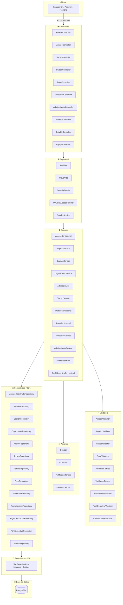

# Diagrama de Componentes

Arquitectura interna del sistema por capas y módulos.

---

```mermaid
graph TD
    subgraph Cliente
        SW[Swagger UI / Postman / Frontend]
    end

    subgraph Controllers["🎮 Controllers"]
        AC[AccesoController]
        UC[UsuarioController]
        TC[TorneoController]
        PC[PartidoController]
        PAC[PagoController]
        ALC[AlineacionController]
        ADC[AdministradorController]
        AUC[AuditoriaController]
        OC[OAuth2Controller]
        EC[EquipoController]
    end

    subgraph Security["🔒 Seguridad"]
        JF[JwtFilter]
        JS[JwtService]
        SC[SecurityConfig]
        OH[OAuth2SuccessHandler]
        O2[OAuth2Service]
    end

    subgraph Services["⚙️ Services"]
        AS[AccesoServiceImpl]
        JS2[JugadorService]
        CS[CapitanService]
        OS[OrganizadorService]
        ARS[ArbitroService]
        TS[TorneoService]
        PS[PartidoServiceImpl]
        PAS[PagoServiceImpl]
        ALS[AlineacionService]
        ADS[AdministradorService]
        AUS[AuditoriaService]
        PDS[PerfilDeportivoServiceImpl]
    end

    subgraph Validators["✅ Validators"]
        AV[AccesoValidator]
        JV[JugadorValidator]
        PV[PartidoValidator]
        PAV[PagoValidator]
        TV[ValidacionTorneo]
        EV[ValidacionEquipo]
        ALV[ValidacionAlineacion]
        PDV[PerfilDeportivoValidator]
        ADV[AdministradorValidator]
    end

    subgraph Patterns["🔄 Patrones"]
        SUB[Subject]
        OBS[Observer]
        NT[NotificadorTorneo]
        LO[LoggerObserver]
    end

    subgraph Repositories["🗄️ Repositories - Core"]
        UR[UsuarioRegistradoRepository]
        JR[JugadorRepository]
        CR[CapitanRepository]
        OR[OrganizadorRepository]
        ARR[ArbitroRepository]
        TR[TorneoRepository]
        PR[PartidoRepository]
        PAR[PagoRepository]
        ALR[AlineacionRepository]
        ADR[AdministradorRepository]
        AUR[RegistroAuditoriaRepository]
        PDR[PerfilDeportivoRepository]
        ER[EquipoRepository]
    end

    subgraph Persistence["💾 Persistence - JPA"]
        JPA[JPA Repositories + Mappers + Entities]
    end

    subgraph DB["🐘 Base de Datos"]
        PG[(PostgreSQL)]
    end

    SW -->|HTTP Request| Controllers
    Controllers --> Security
    Security --> Services
    Services --> Validators
    Services --> Patterns
    Services --> Repositories
    Repositories --> Persistence
    Persistence --> DB
```
