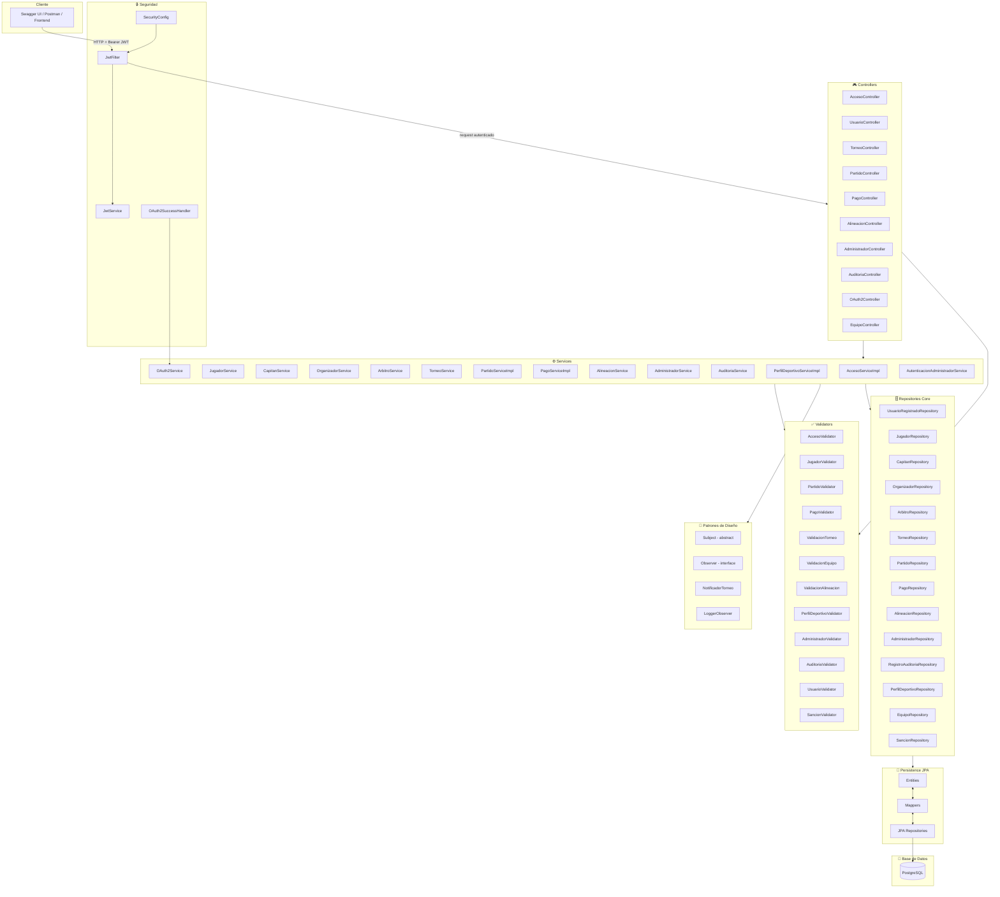
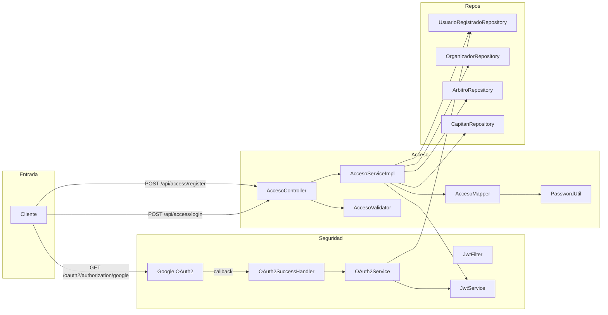
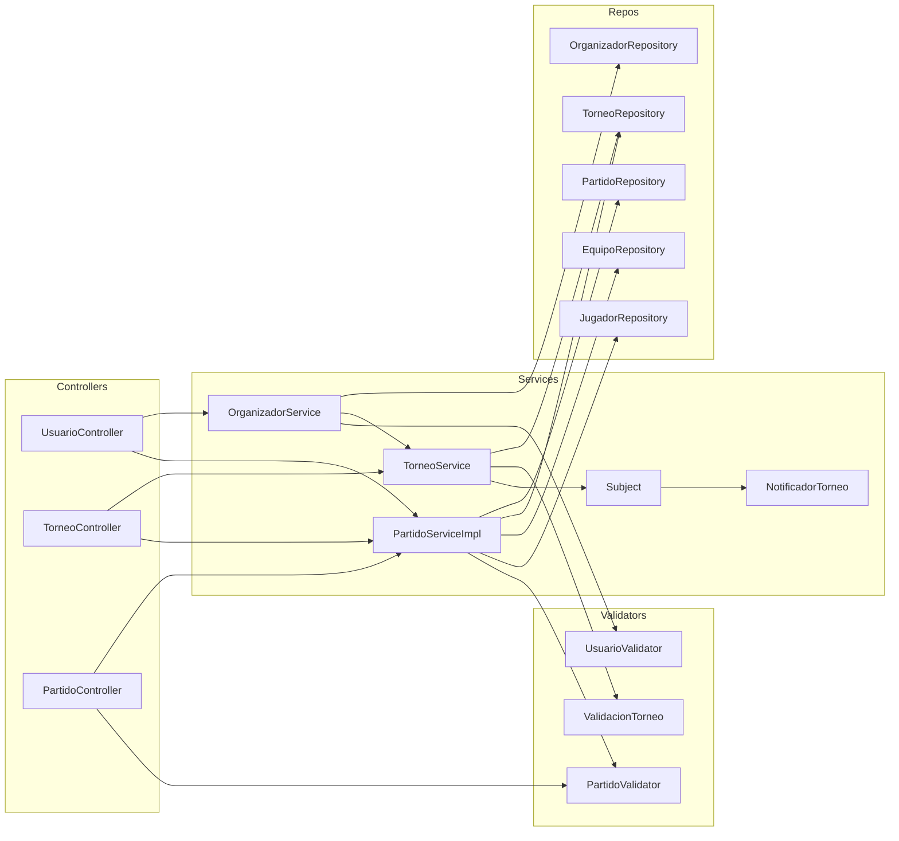
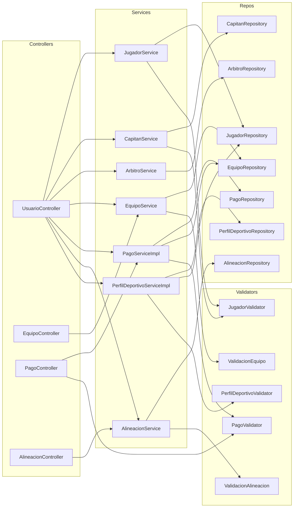
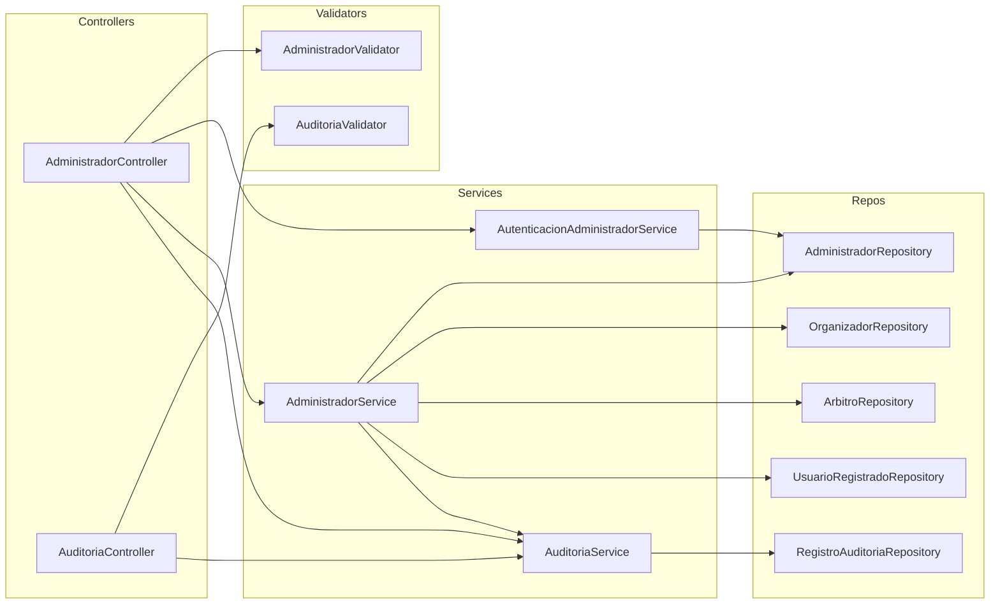

# Diagrama de Componentes

Arquitectura interna del sistema por capas, mostrando las dependencias entre componentes.

---

## Arquitectura general por capas

---

## Módulo de Acceso y Seguridad

---

## Módulo de Torneo y Partido

---

## Módulo de Usuarios, Equipos y Pagos

---

## Módulo de Administración y Auditoría

