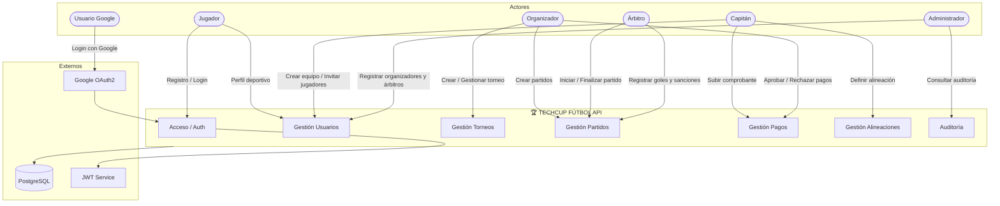

# Diagrama de Contexto

Muestra cómo el sistema TECHCUP FÚTBOL se relaciona con los actores externos.

---

```mermaid
graph TD
    subgraph Actores
        J([Jugador])
        C([Capitán])
        O([Organizador])
        A([Árbitro])
        AD([Administrador])
        G([Usuario Google])
    end

    subgraph TECHCUP_FUTBOL["🏆 TECHCUP FÚTBOL API"]
        ACC[Acceso / Auth]
        USR[Gestión Usuarios]
        TOR[Gestión Torneos]
        PAR[Gestión Partidos]
        PAG[Gestión Pagos]
        ALI[Gestión Alineaciones]
        AUD[Auditoría]
    end

    subgraph Externos
        PG[(PostgreSQL)]
        GG[Google OAuth2]
        JWT[JWT Service]
    end

    J -->|Registro / Login| ACC
    J -->|Perfil deportivo| USR
    C -->|Crear equipo / Invitar jugadores| USR
    C -->|Subir comprobante| PAG
    C -->|Definir alineación| ALI
    O -->|Crear / Gestionar torneo| TOR
    O -->|Crear partidos| PAR
    O -->|Aprobar / Rechazar pagos| PAG
    A -->|Iniciar / Finalizar partido| PAR
    A -->|Registrar goles y sanciones| PAR
    AD -->|Registrar organizadores y árbitros| USR
    AD -->|Consultar auditoría| AUD
    G -->|Login con Google| GG

    ACC --> JWT
    GG --> ACC
    TECHCUP_FUTBOL --> PG
```
