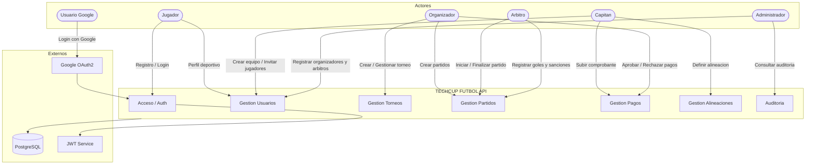

# Diagrama de Contexto

Este diagrama muestra el sistema completo de un vistazo: quiénes lo usan y cómo interactúan con él.

Hay seis tipos de personas que usan el sistema. El jugador se registra, crea su perfil deportivo y espera que lo inviten a un equipo. El capitán crea el equipo, invita jugadores, sube el comprobante de pago y define la alineación antes de cada partido. El organizador crea y gestiona el torneo, programa los partidos y aprueba o rechaza los pagos. El árbitro inicia y finaliza los partidos, y registra los goles y sanciones. El administrador es quien registra a los organizadores y árbitros en el sistema, y puede consultar el historial de auditoría. El usuario Google es cualquier persona que entra con su cuenta de Gmail en vez de registrarse manualmente.

Por fuera del sistema hay tres piezas clave: PostgreSQL es la base de datos donde se guarda todo, Google OAuth2 es el servicio de Google que maneja el login con Gmail, y JWT Service es el que genera y valida los tokens de seguridad que identifican a cada usuario en cada petición.

---

