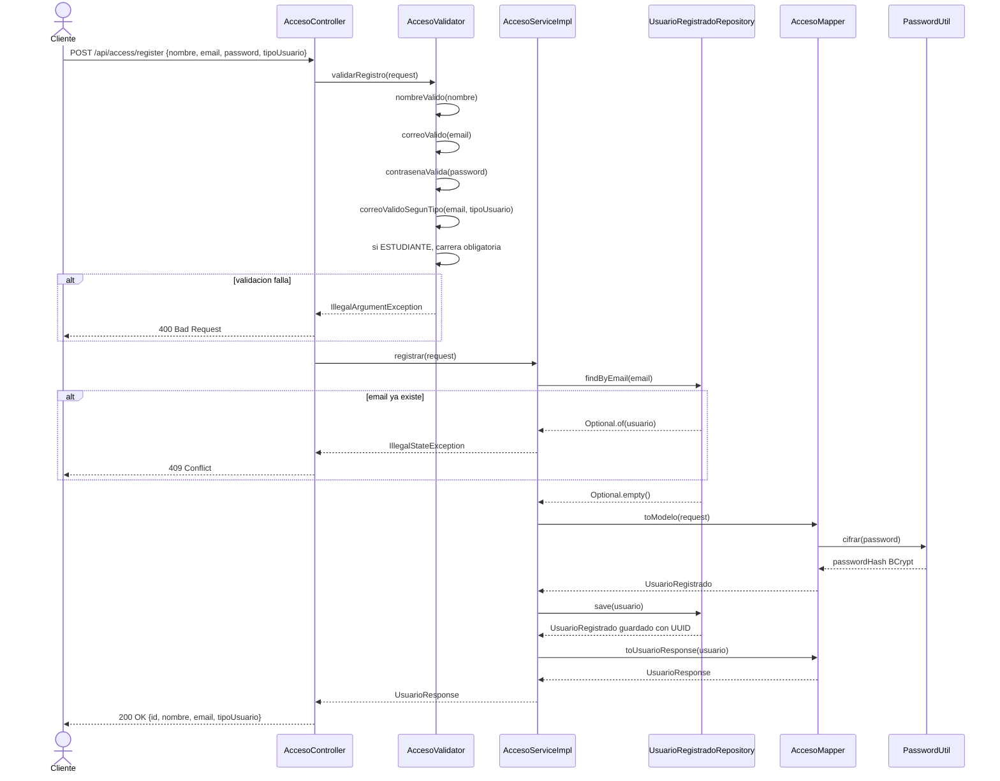

# Diagrama de Secuencia — Registro de Usuario

Aca se muestra paso a paso como se registra un usuario nuevo. El cliente manda el nombre, correo, contrasena y tipo de usuario. Primero se validan los datos: que el nombre no este vacio, que el correo sea valido segun el tipo de usuario (institucional o Gmail), y que la contrasena cumpla los requisitos. Si algo falla, se devuelve un error 400. Si todo esta bien, se verifica que el correo no este ya registrado. Si no existe, se cifra la contrasena con BCrypt y se guarda el usuario con un UUID generado automaticamente.

---

