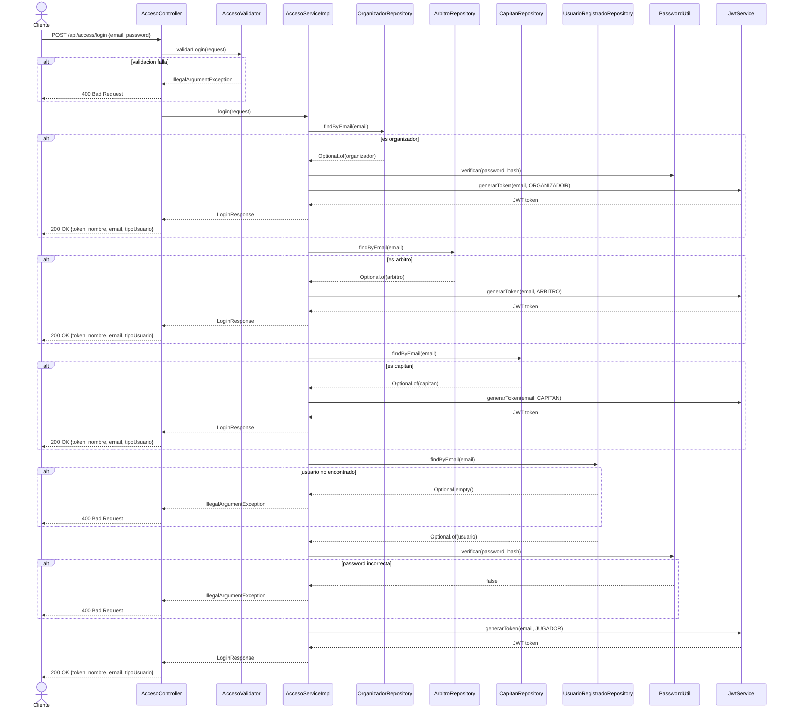

# Diagrama de Secuencia — Login

Aca se muestra como entra un usuario al sistema. El cliente manda el correo y la contrasena. El sistema busca al usuario en orden: primero verifica si es organizador, luego arbitro, luego capitan, y por ultimo jugador registrado. Segun quien sea, genera un token JWT con el rol correspondiente. Si el correo no existe en ninguna tabla o la contrasena es incorrecta, devuelve un error 400.

---

