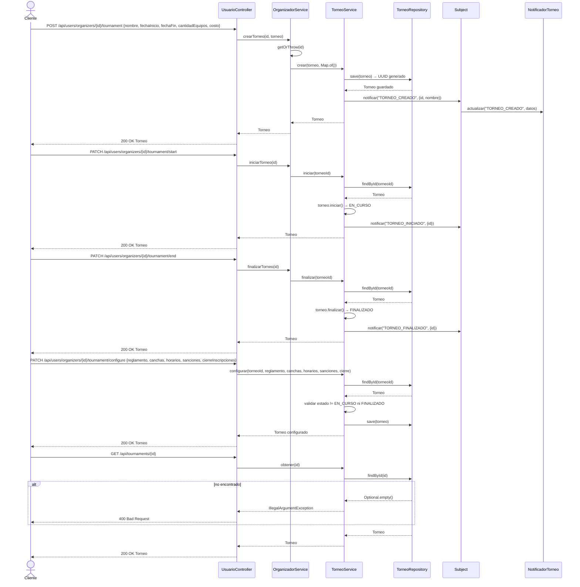

# Diagrama de Secuencia — Torneos

```mermaid
sequenceDiagram
    actor Cliente
    participant UsuarioController
    participant OrganizadorService
    participant TorneoService
    participant TorneoRepository
    participant Subject
    participant NotificadorTorneo

    %% Crear torneo via organizador
    Cliente->>UsuarioController: POST /api/users/organizers/{id}/tournament {nombre, fechaInicio, fechaFin, cantidadEquipos, costo}
    UsuarioController->>OrganizadorService: crearTorneo(id, torneo)
    OrganizadorService->>OrganizadorService: getOrThrow(id)
    OrganizadorService->>TorneoService: crear(torneo, Map.of())
    TorneoService->>TorneoRepository: save(torneo) → UUID generado
    TorneoRepository-->>TorneoService: Torneo guardado
    TorneoService->>Subject: notificar("TORNEO_CREADO", {id, nombre})
    Subject->>NotificadorTorneo: actualizar("TORNEO_CREADO", datos)
    TorneoService-->>OrganizadorService: Torneo
    OrganizadorService-->>UsuarioController: Torneo
    UsuarioController-->>Cliente: 200 OK Torneo

    %% Iniciar torneo
    Cliente->>UsuarioController: PATCH /api/users/organizers/{id}/tournament/start
    UsuarioController->>OrganizadorService: iniciarTorneo(id)
    OrganizadorService->>TorneoService: iniciar(torneoId)
    TorneoService->>TorneoRepository: findById(torneoId)
    TorneoRepository-->>TorneoService: Torneo
    TorneoService->>TorneoService: torneo.iniciar() → EN_CURSO
    TorneoService->>Subject: notificar("TORNEO_INICIADO", {id})
    TorneoService-->>UsuarioController: Torneo
    UsuarioController-->>Cliente: 200 OK Torneo

    %% Finalizar torneo
    Cliente->>UsuarioController: PATCH /api/users/organizers/{id}/tournament/end
    UsuarioController->>OrganizadorService: finalizarTorneo(id)
    OrganizadorService->>TorneoService: finalizar(torneoId)
    TorneoService->>TorneoRepository: findById(torneoId)
    TorneoRepository-->>TorneoService: Torneo
    TorneoService->>TorneoService: torneo.finalizar() → FINALIZADO
    TorneoService->>Subject: notificar("TORNEO_FINALIZADO", {id})
    TorneoService-->>UsuarioController: Torneo
    UsuarioController-->>Cliente: 200 OK Torneo

    %% Configurar torneo
    Cliente->>UsuarioController: PATCH /api/users/organizers/{id}/tournament/configure {reglamento, canchas, horarios, sanciones, cierreInscripciones}
    UsuarioController->>TorneoService: configurar(torneoId, reglamento, canchas, horarios, sanciones, cierre)
    TorneoService->>TorneoRepository: findById(torneoId)
    TorneoRepository-->>TorneoService: Torneo
    TorneoService->>TorneoService: validar estado != EN_CURSO ni FINALIZADO
    TorneoService->>TorneoRepository: save(torneo)
    TorneoService-->>UsuarioController: Torneo configurado
    UsuarioController-->>Cliente: 200 OK Torneo

    %% Consultar torneo
    Cliente->>UsuarioController: GET /api/tournaments/{id}
    UsuarioController->>TorneoService: obtener(id)
    TorneoService->>TorneoRepository: findById(id)
    alt no encontrado
        TorneoRepository-->>TorneoService: Optional.empty()
        TorneoService-->>UsuarioController: IllegalArgumentException
        UsuarioController-->>Cliente: 400 Bad Request
    end
    TorneoRepository-->>TorneoService: Torneo
    TorneoService-->>UsuarioController: Torneo
    UsuarioController-->>Cliente: 200 OK Torneo
```
