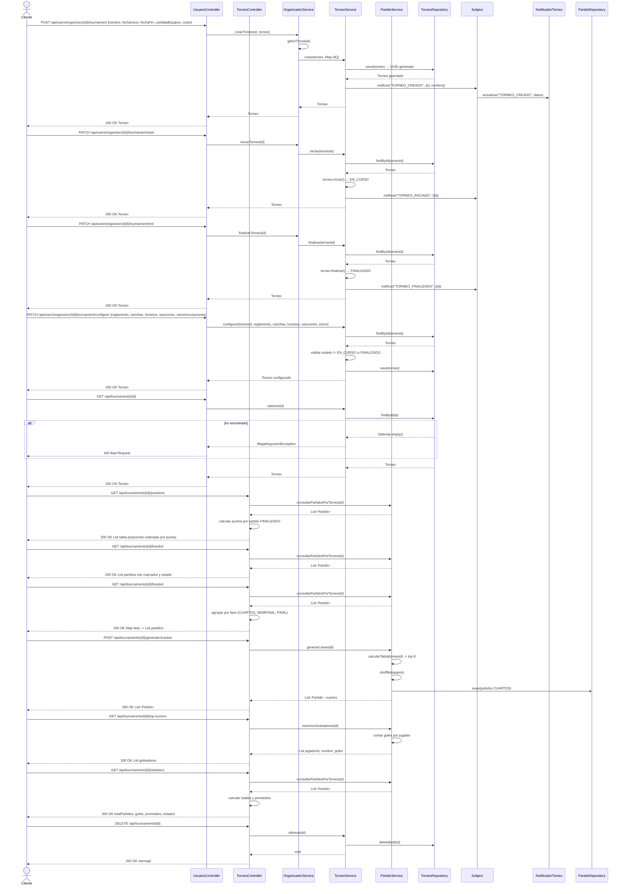

# Diagrama de Secuencia — Torneos

Aca se muestra todo el ciclo de vida de un torneo. El organizador lo crea con nombre, fechas, cantidad de equipos y costo. Al crearlo, el sistema notifica a los observers. Luego puede iniciarlo (pasa a EN_CURSO) o finalizarlo (pasa a FINALIZADO), y en cada cambio se notifica tambien. Ademas puede configurar el reglamento, canchas, horarios y cierre de inscripciones mientras el torneo no este en curso ni finalizado. Cualquier usuario autenticado puede consultar un torneo, ver la tabla de posiciones calculada con los partidos finalizados, ver la llave eliminatoria con todos los partidos y sus marcadores, y ver estadisticas generales del torneo.

---

