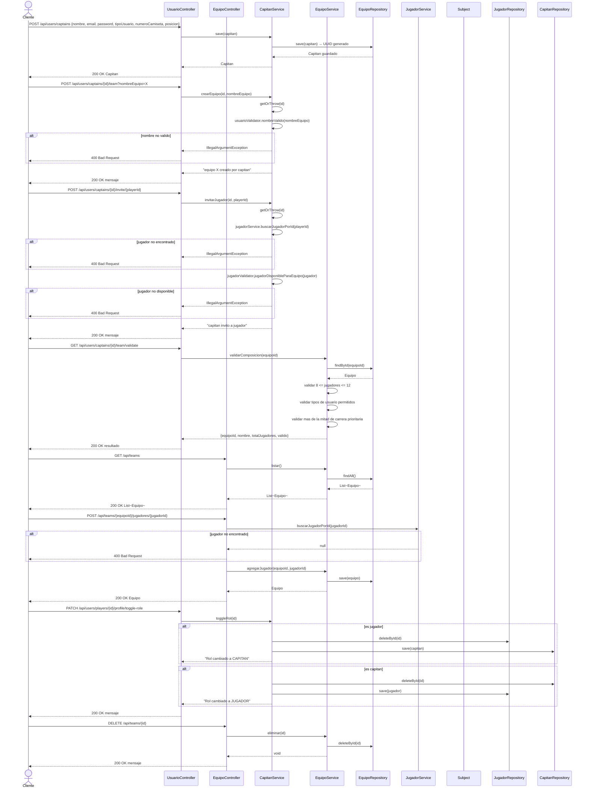

# Diagrama de Secuencia — Equipos

Aca se muestra como se gestionan los equipos. El capitan puede crear su equipo con nombre, escudo y colores. Puede invitar jugadores verificando que esten disponibles. Puede validar que su equipo tenga entre 7 y 12 jugadores. Tambien se puede agregar un jugador directamente a un equipo por su ID, y eliminar un equipo si se tiene el rol de organizador o administrador.

---

