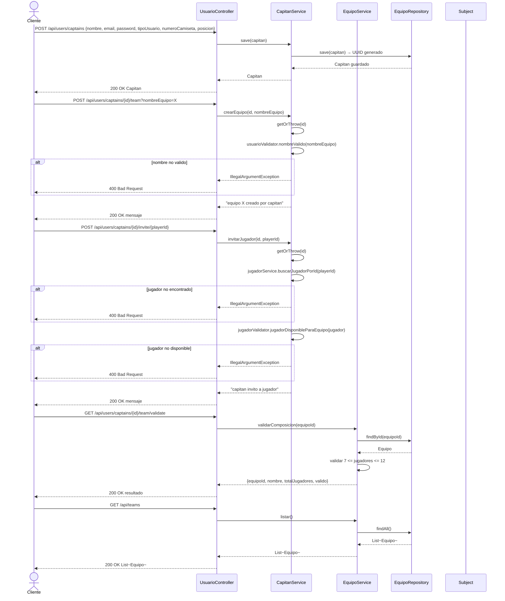

# Diagrama de Secuencia — Equipos

```mermaid
sequenceDiagram
    actor Cliente
    participant UsuarioController
    participant CapitanService
    participant EquipoService
    participant EquipoRepository
    participant Subject

    %% Crear capitan
    Cliente->>UsuarioController: POST /api/users/captains {nombre, email, password, tipoUsuario, numeroCamiseta, posicion}
    UsuarioController->>CapitanService: save(capitan)
    CapitanService->>EquipoRepository: save(capitan) → UUID generado
    EquipoRepository-->>CapitanService: Capitan guardado
    CapitanService-->>UsuarioController: Capitan
    UsuarioController-->>Cliente: 200 OK Capitan

    %% Crear equipo
    Cliente->>UsuarioController: POST /api/users/captains/{id}/team?nombreEquipo=X
    UsuarioController->>CapitanService: crearEquipo(id, nombreEquipo)
    CapitanService->>CapitanService: getOrThrow(id)
    CapitanService->>CapitanService: usuarioValidator.nombreValido(nombreEquipo)
    alt nombre no valido
        CapitanService-->>UsuarioController: IllegalArgumentException
        UsuarioController-->>Cliente: 400 Bad Request
    end
    CapitanService-->>UsuarioController: "equipo X creado por capitan"
    UsuarioController-->>Cliente: 200 OK mensaje

    %% Invitar jugador
    Cliente->>UsuarioController: POST /api/users/captains/{id}/invite/{playerId}
    UsuarioController->>CapitanService: invitarJugador(id, playerId)
    CapitanService->>CapitanService: getOrThrow(id)
    CapitanService->>CapitanService: jugadorService.buscarJugadorPorId(playerId)
    alt jugador no encontrado
        CapitanService-->>UsuarioController: IllegalArgumentException
        UsuarioController-->>Cliente: 400 Bad Request
    end
    CapitanService->>CapitanService: jugadorValidator.jugadorDisponibleParaEquipo(jugador)
    alt jugador no disponible
        CapitanService-->>UsuarioController: IllegalArgumentException
        UsuarioController-->>Cliente: 400 Bad Request
    end
    CapitanService-->>UsuarioController: "capitan invito a jugador"
    UsuarioController-->>Cliente: 200 OK mensaje

    %% Validar composicion equipo
    Cliente->>UsuarioController: GET /api/users/captains/{id}/team/validate
    UsuarioController->>EquipoService: validarComposicion(equipoId)
    EquipoService->>EquipoRepository: findById(equipoId)
    EquipoRepository-->>EquipoService: Equipo
    EquipoService->>EquipoService: validar 7 <= jugadores <= 12
    EquipoService-->>UsuarioController: {equipoId, nombre, totalJugadores, valido}
    UsuarioController-->>Cliente: 200 OK resultado

    %% Listar equipos
    Cliente->>UsuarioController: GET /api/teams
    UsuarioController->>EquipoService: listar()
    EquipoService->>EquipoRepository: findAll()
    EquipoRepository-->>EquipoService: List~Equipo~
    EquipoService-->>UsuarioController: List~Equipo~
    UsuarioController-->>Cliente: 200 OK List~Equipo~
```
