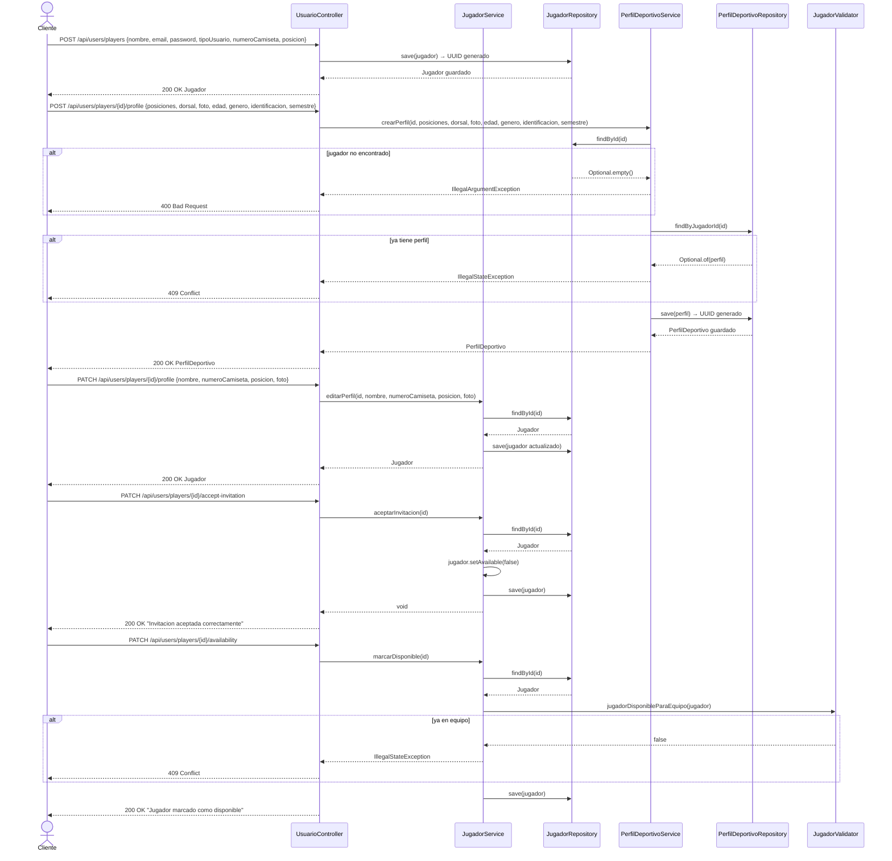

# Diagrama de Secuencia — Jugadores

```mermaid
sequenceDiagram
    actor Cliente
    participant UsuarioController
    participant JugadorService
    participant JugadorRepository
    participant PerfilDeportivoService
    participant PerfilDeportivoRepository
    participant JugadorValidator

    %% Crear jugador
    Cliente->>UsuarioController: POST /api/users/players {nombre, email, password, tipoUsuario, numeroCamiseta, posicion}
    UsuarioController->>JugadorRepository: save(jugador) → UUID generado
    JugadorRepository-->>UsuarioController: Jugador guardado
    UsuarioController-->>Cliente: 200 OK Jugador

    %% Crear perfil deportivo
    Cliente->>UsuarioController: POST /api/users/players/{id}/profile {posiciones, dorsal, foto, edad, genero, identificacion, semestre}
    UsuarioController->>PerfilDeportivoService: crearPerfil(id, posiciones, dorsal, foto, edad, genero, identificacion, semestre)
    PerfilDeportivoService->>JugadorRepository: findById(id)
    alt jugador no encontrado
        JugadorRepository-->>PerfilDeportivoService: Optional.empty()
        PerfilDeportivoService-->>UsuarioController: IllegalArgumentException
        UsuarioController-->>Cliente: 400 Bad Request
    end
    PerfilDeportivoService->>PerfilDeportivoRepository: findByJugadorId(id)
    alt ya tiene perfil
        PerfilDeportivoRepository-->>PerfilDeportivoService: Optional.of(perfil)
        PerfilDeportivoService-->>UsuarioController: IllegalStateException
        UsuarioController-->>Cliente: 409 Conflict
    end
    PerfilDeportivoService->>PerfilDeportivoRepository: save(perfil) → UUID generado
    PerfilDeportivoRepository-->>PerfilDeportivoService: PerfilDeportivo guardado
    PerfilDeportivoService-->>UsuarioController: PerfilDeportivo
    UsuarioController-->>Cliente: 200 OK PerfilDeportivo

    %% Editar perfil
    Cliente->>UsuarioController: PATCH /api/users/players/{id}/profile {nombre, numeroCamiseta, posicion, foto}
    UsuarioController->>JugadorService: editarPerfil(id, nombre, numeroCamiseta, posicion, foto)
    JugadorService->>JugadorRepository: findById(id)
    JugadorRepository-->>JugadorService: Jugador
    JugadorService->>JugadorRepository: save(jugador actualizado)
    JugadorService-->>UsuarioController: Jugador
    UsuarioController-->>Cliente: 200 OK Jugador

    %% Aceptar invitacion
    Cliente->>UsuarioController: PATCH /api/users/players/{id}/accept-invitation
    UsuarioController->>JugadorService: aceptarInvitacion(id)
    JugadorService->>JugadorRepository: findById(id)
    JugadorRepository-->>JugadorService: Jugador
    JugadorService->>JugadorService: jugador.setAvailable(false)
    JugadorService->>JugadorRepository: save(jugador)
    JugadorService-->>UsuarioController: void
    UsuarioController-->>Cliente: 200 OK "Invitacion aceptada correctamente"

    %% Marcar disponible
    Cliente->>UsuarioController: PATCH /api/users/players/{id}/availability
    UsuarioController->>JugadorService: marcarDisponible(id)
    JugadorService->>JugadorRepository: findById(id)
    JugadorRepository-->>JugadorService: Jugador
    JugadorService->>JugadorValidator: jugadorDisponibleParaEquipo(jugador)
    alt ya en equipo
        JugadorValidator-->>JugadorService: false
        JugadorService-->>UsuarioController: IllegalStateException
        UsuarioController-->>Cliente: 409 Conflict
    end
    JugadorService->>JugadorRepository: save(jugador)
    UsuarioController-->>Cliente: 200 OK "Jugador marcado como disponible"
```
