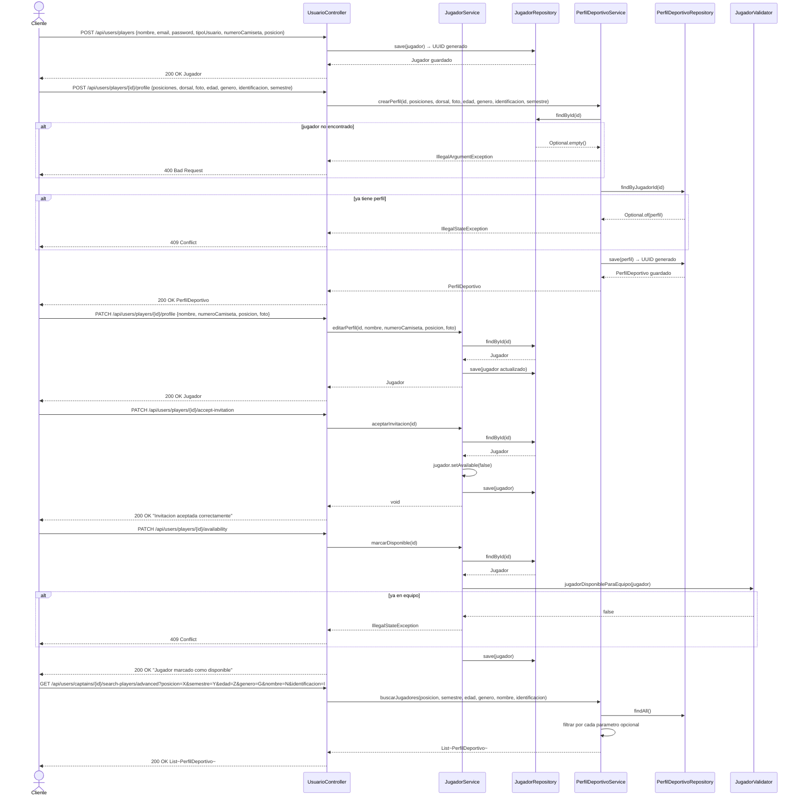

# Diagrama de Secuencia — Jugadores

Aca se muestra como se gestionan los jugadores. Un jugador se registra con sus datos basicos. Luego puede crear su perfil deportivo con posiciones, dorsal, edad, genero e identificacion. Puede editar su perfil en cualquier momento. Cuando un capitan lo invita, el jugador puede aceptar la invitacion, lo que lo marca como no disponible. Si quiere volver a estar disponible para otro equipo, puede marcarse como disponible siempre que no este ya en un equipo.

---

