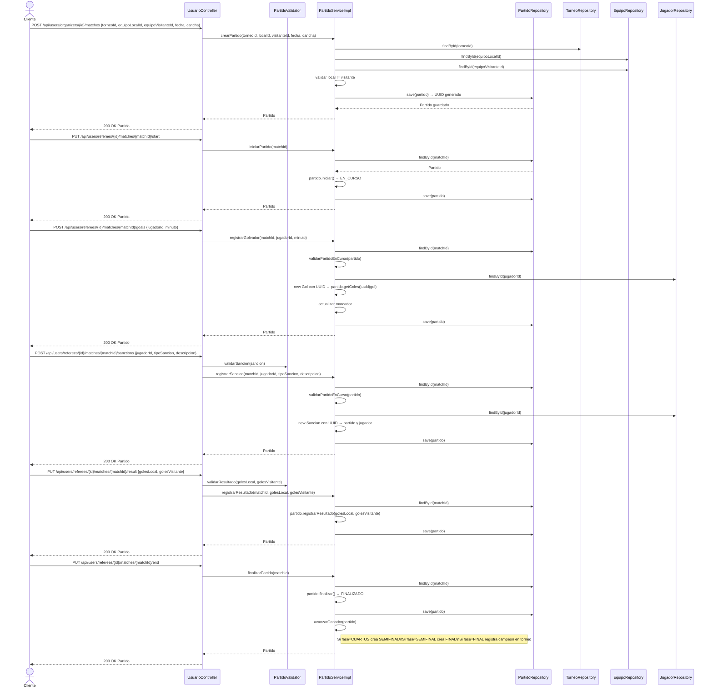

# Diagrama de Secuencia — Partidos

Aca se muestra el ciclo de vida de un partido. El organizador lo crea asignando torneo, equipos, fecha y cancha. El arbitro lo inicia (pasa a EN_CURSO), registra goles con el jugador y el minuto, registra sanciones con el tipo y descripcion, registra el resultado final con los goles de cada equipo, y lo finaliza (pasa a FINALIZADO). Solo se pueden registrar goles y sanciones en partidos que esten EN_CURSO.

---

