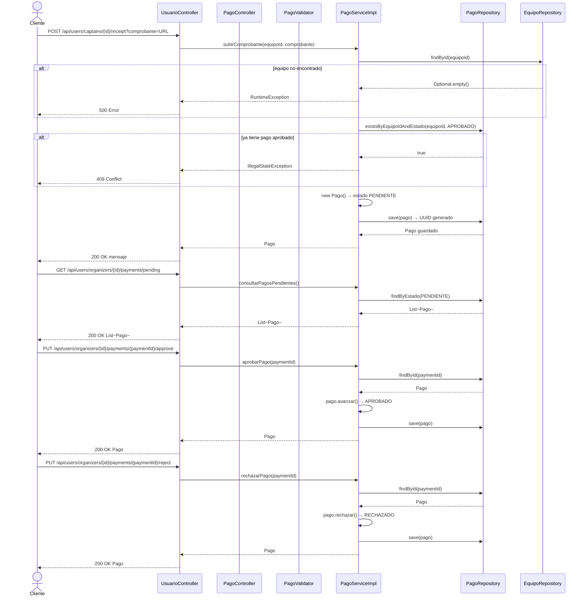

# Diagrama de Secuencia — Pagos

```mermaid
sequenceDiagram
    actor Cliente
    participant UsuarioController
    participant PagoController
    participant PagoValidator
    participant PagoServiceImpl
    participant PagoRepository
    participant EquipoRepository

    %% Subir comprobante via capitan
    Cliente->>UsuarioController: POST /api/users/captains/{id}/receipt?comprobante=URL
    UsuarioController->>PagoServiceImpl: subirComprobante(equipoId, comprobante)
    PagoServiceImpl->>EquipoRepository: findById(equipoId)
    alt equipo no encontrado
        EquipoRepository-->>PagoServiceImpl: Optional.empty()
        PagoServiceImpl-->>UsuarioController: RuntimeException
        UsuarioController-->>Cliente: 500 Error
    end
    PagoServiceImpl->>PagoRepository: existsByEquipoIdAndEstado(equipoId, APROBADO)
    alt ya tiene pago aprobado
        PagoRepository-->>PagoServiceImpl: true
        PagoServiceImpl-->>UsuarioController: IllegalStateException
        UsuarioController-->>Cliente: 409 Conflict
    end
    PagoServiceImpl->>PagoServiceImpl: new Pago() → estado PENDIENTE
    PagoServiceImpl->>PagoRepository: save(pago) → UUID generado
    PagoRepository-->>PagoServiceImpl: Pago guardado
    PagoServiceImpl-->>UsuarioController: Pago
    UsuarioController-->>Cliente: 200 OK mensaje

    %% Consultar pagos pendientes
    Cliente->>UsuarioController: GET /api/users/organizers/{id}/payments/pending
    UsuarioController->>PagoServiceImpl: consultarPagosPendientes()
    PagoServiceImpl->>PagoRepository: findByEstado(PENDIENTE)
    PagoRepository-->>PagoServiceImpl: List~Pago~
    PagoServiceImpl-->>UsuarioController: List~Pago~
    UsuarioController-->>Cliente: 200 OK List~Pago~

    %% Aprobar pago
    Cliente->>UsuarioController: PUT /api/users/organizers/{id}/payments/{paymentId}/approve
    UsuarioController->>PagoServiceImpl: aprobarPago(paymentId)
    PagoServiceImpl->>PagoRepository: findById(paymentId)
    PagoRepository-->>PagoServiceImpl: Pago
    PagoServiceImpl->>PagoServiceImpl: pago.avanzar() → APROBADO
    PagoServiceImpl->>PagoRepository: save(pago)
    PagoServiceImpl-->>UsuarioController: Pago
    UsuarioController-->>Cliente: 200 OK Pago

    %% Rechazar pago
    Cliente->>UsuarioController: PUT /api/users/organizers/{id}/payments/{paymentId}/reject
    UsuarioController->>PagoServiceImpl: rechazarPago(paymentId)
    PagoServiceImpl->>PagoRepository: findById(paymentId)
    PagoRepository-->>PagoServiceImpl: Pago
    PagoServiceImpl->>PagoServiceImpl: pago.rechazar() → RECHAZADO
    PagoServiceImpl->>PagoRepository: save(pago)
    PagoServiceImpl-->>UsuarioController: Pago
    UsuarioController-->>Cliente: 200 OK Pago
```
