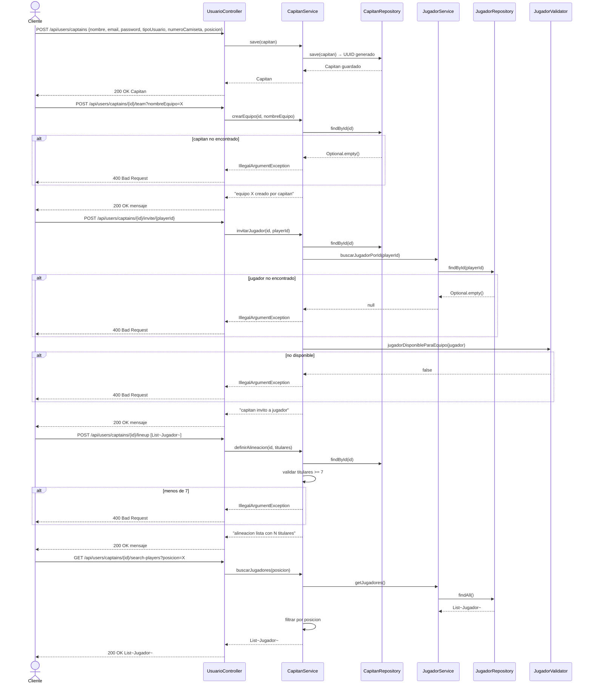

# Diagrama de Secuencia — Capitanes

```mermaid
sequenceDiagram
    actor Cliente
    participant UsuarioController
    participant CapitanService
    participant CapitanRepository
    participant JugadorService
    participant JugadorRepository
    participant JugadorValidator

    %% Crear capitan
    Cliente->>UsuarioController: POST /api/users/captains {nombre, email, password, tipoUsuario, numeroCamiseta, posicion}
    UsuarioController->>CapitanService: save(capitan)
    CapitanService->>CapitanRepository: save(capitan) → UUID generado
    CapitanRepository-->>CapitanService: Capitan guardado
    CapitanService-->>UsuarioController: Capitan
    UsuarioController-->>Cliente: 200 OK Capitan

    %% Crear equipo
    Cliente->>UsuarioController: POST /api/users/captains/{id}/team?nombreEquipo=X
    UsuarioController->>CapitanService: crearEquipo(id, nombreEquipo)
    CapitanService->>CapitanRepository: findById(id)
    alt capitan no encontrado
        CapitanRepository-->>CapitanService: Optional.empty()
        CapitanService-->>UsuarioController: IllegalArgumentException
        UsuarioController-->>Cliente: 400 Bad Request
    end
    CapitanService-->>UsuarioController: "equipo X creado por capitan"
    UsuarioController-->>Cliente: 200 OK mensaje

    %% Invitar jugador
    Cliente->>UsuarioController: POST /api/users/captains/{id}/invite/{playerId}
    UsuarioController->>CapitanService: invitarJugador(id, playerId)
    CapitanService->>CapitanRepository: findById(id)
    CapitanService->>JugadorService: buscarJugadorPorId(playerId)
    JugadorService->>JugadorRepository: findById(playerId)
    alt jugador no encontrado
        JugadorRepository-->>JugadorService: Optional.empty()
        JugadorService-->>CapitanService: null
        CapitanService-->>UsuarioController: IllegalArgumentException
        UsuarioController-->>Cliente: 400 Bad Request
    end
    CapitanService->>JugadorValidator: jugadorDisponibleParaEquipo(jugador)
    alt no disponible
        JugadorValidator-->>CapitanService: false
        CapitanService-->>UsuarioController: IllegalArgumentException
        UsuarioController-->>Cliente: 400 Bad Request
    end
    CapitanService-->>UsuarioController: "capitan invito a jugador"
    UsuarioController-->>Cliente: 200 OK mensaje

    %% Definir alineacion
    Cliente->>UsuarioController: POST /api/users/captains/{id}/lineup [List~Jugador~]
    UsuarioController->>CapitanService: definirAlineacion(id, titulares)
    CapitanService->>CapitanRepository: findById(id)
    CapitanService->>CapitanService: validar titulares >= 7
    alt menos de 7
        CapitanService-->>UsuarioController: IllegalArgumentException
        UsuarioController-->>Cliente: 400 Bad Request
    end
    CapitanService-->>UsuarioController: "alineacion lista con N titulares"
    UsuarioController-->>Cliente: 200 OK mensaje

    %% Buscar jugadores por posicion
    Cliente->>UsuarioController: GET /api/users/captains/{id}/search-players?posicion=X
    UsuarioController->>CapitanService: buscarJugadores(posicion)
    CapitanService->>JugadorService: getJugadores()
    JugadorService->>JugadorRepository: findAll()
    JugadorRepository-->>JugadorService: List~Jugador~
    CapitanService->>CapitanService: filtrar por posicion
    CapitanService-->>UsuarioController: List~Jugador~
    UsuarioController-->>Cliente: 200 OK List~Jugador~
```
