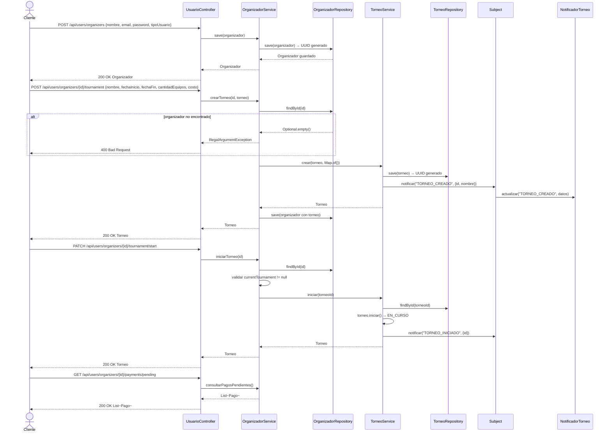

# Diagrama de Secuencia — Organizadores

```mermaid
sequenceDiagram
    actor Cliente
    participant UsuarioController
    participant OrganizadorService
    participant OrganizadorRepository
    participant TorneoService
    participant TorneoRepository
    participant Subject
    participant NotificadorTorneo

    %% Crear organizador
    Cliente->>UsuarioController: POST /api/users/organizers {nombre, email, password, tipoUsuario}
    UsuarioController->>OrganizadorService: save(organizador)
    OrganizadorService->>OrganizadorRepository: save(organizador) → UUID generado
    OrganizadorRepository-->>OrganizadorService: Organizador guardado
    OrganizadorService-->>UsuarioController: Organizador
    UsuarioController-->>Cliente: 200 OK Organizador

    %% Crear torneo
    Cliente->>UsuarioController: POST /api/users/organizers/{id}/tournament {nombre, fechaInicio, fechaFin, cantidadEquipos, costo}
    UsuarioController->>OrganizadorService: crearTorneo(id, torneo)
    OrganizadorService->>OrganizadorRepository: findById(id)
    alt organizador no encontrado
        OrganizadorRepository-->>OrganizadorService: Optional.empty()
        OrganizadorService-->>UsuarioController: IllegalArgumentException
        UsuarioController-->>Cliente: 400 Bad Request
    end
    OrganizadorService->>TorneoService: crear(torneo, Map.of())
    TorneoService->>TorneoRepository: save(torneo) → UUID generado
    TorneoService->>Subject: notificar("TORNEO_CREADO", {id, nombre})
    Subject->>NotificadorTorneo: actualizar("TORNEO_CREADO", datos)
    TorneoService-->>OrganizadorService: Torneo
    OrganizadorService->>OrganizadorRepository: save(organizador con torneo)
    OrganizadorService-->>UsuarioController: Torneo
    UsuarioController-->>Cliente: 200 OK Torneo

    %% Iniciar torneo
    Cliente->>UsuarioController: PATCH /api/users/organizers/{id}/tournament/start
    UsuarioController->>OrganizadorService: iniciarTorneo(id)
    OrganizadorService->>OrganizadorRepository: findById(id)
    OrganizadorService->>OrganizadorService: validar currentTournament != null
    OrganizadorService->>TorneoService: iniciar(torneoId)
    TorneoService->>TorneoRepository: findById(torneoId)
    TorneoService->>TorneoService: torneo.iniciar() → EN_CURSO
    TorneoService->>Subject: notificar("TORNEO_INICIADO", {id})
    TorneoService-->>OrganizadorService: Torneo
    OrganizadorService-->>UsuarioController: Torneo
    UsuarioController-->>Cliente: 200 OK Torneo

    %% Ver pagos pendientes
    Cliente->>UsuarioController: GET /api/users/organizers/{id}/payments/pending
    UsuarioController->>OrganizadorService: consultarPagosPendientes()
    OrganizadorService-->>UsuarioController: List~Pago~
    UsuarioController-->>Cliente: 200 OK List~Pago~
```
