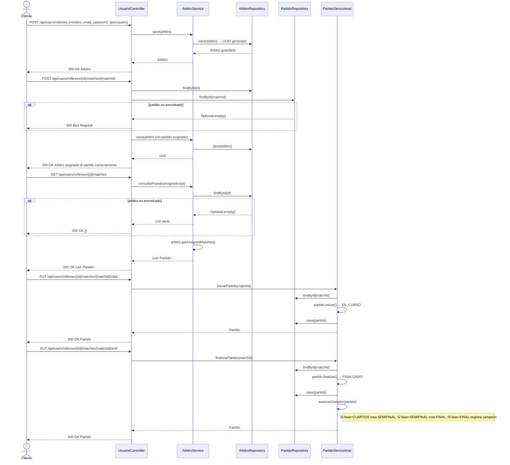

# Diagrama de Secuencia — Arbitros

Aca se muestra todo lo que puede hacer un arbitro. El administrador lo registra en el sistema. Luego se le puede asignar un partido. El arbitro puede consultar sus partidos asignados, iniciarlos y finalizarlos.

---

