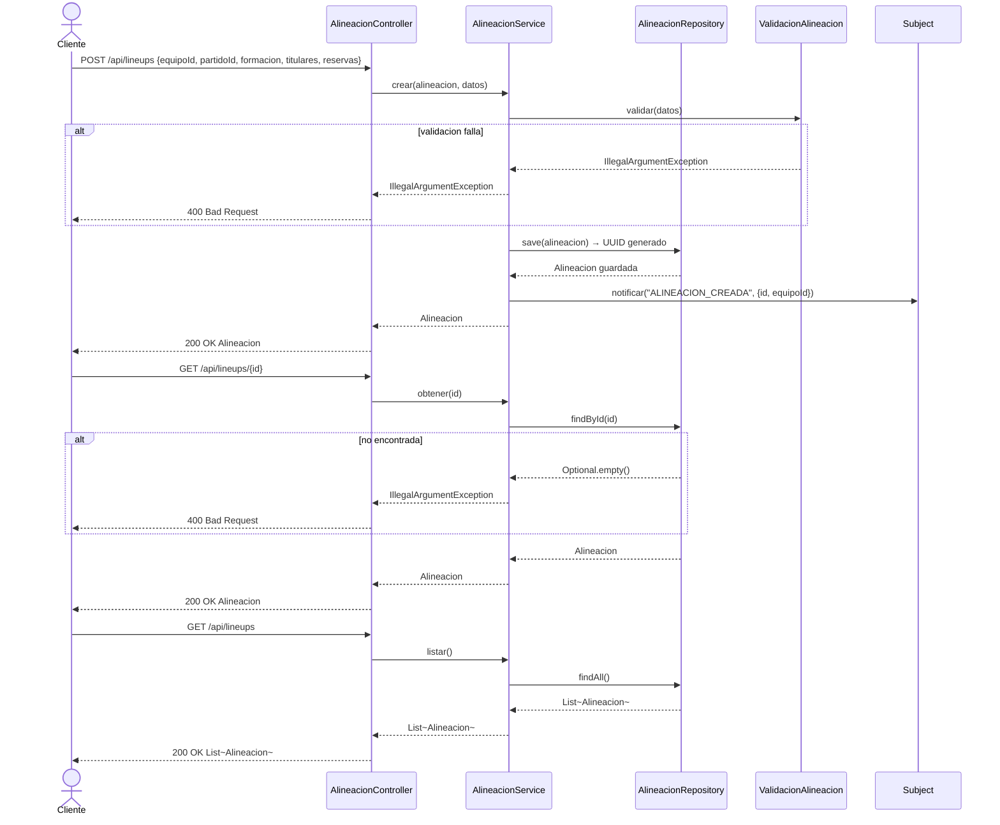

# Diagrama de Secuencia — Alineaciones

Aca se muestra como se gestionan las alineaciones. El capitan crea la alineacion para su equipo en un partido especifico, con la formacion tactica, los jugadores titulares y los reservas. El sistema valida los datos antes de guardarla y notifica a los observers al crearla. Tambien se puede consultar una alineacion por ID o listar todas.

---

