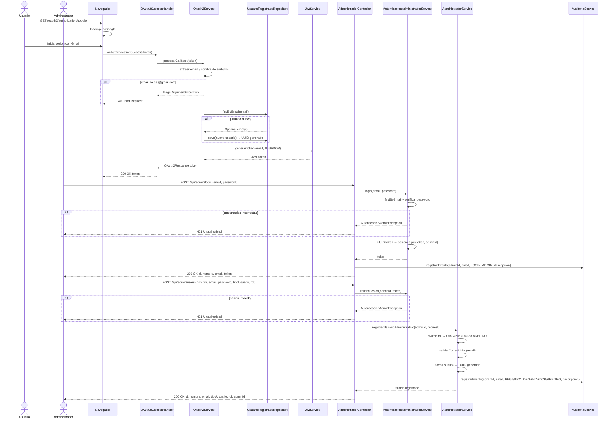

# Diagrama de Secuencia — OAuth2 y Administrador

Aca se muestran dos flujos. El primero es el login con Google: el usuario entra con su Gmail, Google redirige al sistema, se extrae el email, si es nuevo se registra automaticamente y se devuelve un token JWT con rol JUGADOR. El segundo es el flujo del administrador: hace login con su correo y contrasena propios, el sistema le genera un token de sesion UUID, y con ese token puede registrar organizadores y arbitros. Cada accion del administrador queda registrada en el historial de auditoria.

---

